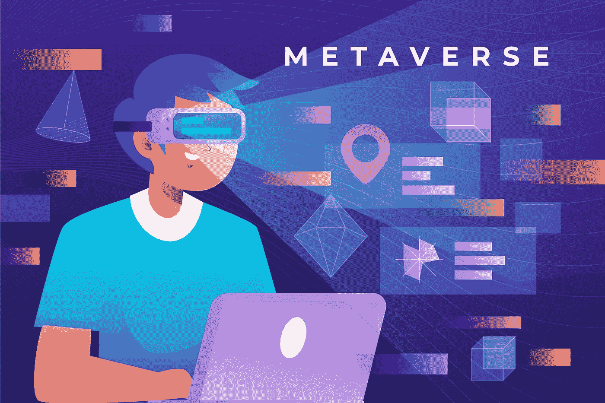

# NFTs 在元宇宙的重要作用

> 原文：<https://medium.com/geekculture/the-significant-role-of-nfts-in-metaverse-12a755e573dd?source=collection_archive---------21----------------------->

世界在以更快的速度前进，我们也是吗？嗯，30 年前，当有人说你可以进入数字世界时，你肯定会认为这是虚构的。自从引入数字技术以来，我们都想尝试至少一次。我们总是想或梦想进入我们玩的游戏，去见证那里到底发生了什么。今天，人们可以通过元宇宙见证数字世界，通过元宇宙·NFT 在这个数字世界中拥有自己的东西。这会改变我们今天使用技术和互联网的方式吗？答案是不可否认的，是的，这就是为什么人们渴望了解这项技术。

这是关于将成为未来的新技术的一切。让我们潜入元宇宙，真实体验数字世界！

# 踏足元宇宙！

电影《阿凡达》给了我们令人瞠目结舌的画面。一进入太空舱，人类就进入一个化身，这就是一切开始的地方。化身可以真实地体验一切，然而人类的身体却被限制在太空舱里。

进入元宇宙也是类似的事情，除了你不需要元宇宙胶囊。你只需要一个虚拟现实耳机就可以成为元宇宙的 3D 化身。在这个世界里，你可以在 3D 中做你自己，数字化地体验一切。

更清楚地定义这一点，元宇宙是一个数字世界，人们可以以数字化身的形式共存。这就像在元宇宙有两种生活，一个真实的，一个虚拟的。在元宇宙，你可以做任何正确的事情，从看电影、购物、运动、欣赏音乐会，甚至从学校学到东西。

有没有梦想过进入视频游戏自己玩游戏，而不通过按键和操纵杆操作角色？元宇宙在这里让你童年的梦想成真。元宇宙 NFT 游戏是一个你可以实时享受游戏的平台。你只需要一个虚拟现实耳机，你就可以踏上元宇宙了。

你可能会问什么是元宇宙 NFT，它们是如何进入这幅画面的。不可替代代币是区块链上的实体，提供数字资产的可交易所有权。因为它在区块链，它提供了交易的透明度，并且数字文件也不能被复制。它是完全分散的，非常适合作为元宇宙的经济基地。

## **元宇宙 NFT 小游戏！**

今天有许多元宇宙 NFT 游戏吸引了全球玩家的注意。不可否认，人们热爱新技术，当涉及到游戏时，人们会好奇的想看一眼。游戏平台是人们体验新技术的地方。虽然虚拟现实有很多教育应用，但 90%的人第一次体验虚拟现实是通过游戏。

同样，人们已经对元宇宙给予了压倒性的回应，因为它带来了前所未有的体验。不仅仅是游戏，还有在元宇宙举办活动和婚礼的项目。

在元宇宙，你可以和远隔重洋的人共享空间，共度时光。据说这将成为下一代的社交媒体，在这里你可以和不同国家的人一起看电影、购物、玩耍、学习和做任何事情。你做的聊天和面对面的时间可以很快变得数字化和真实。

回到元宇宙 [**NFT 游戏平台**](https://www.jump.trade/) ，分散土地、沙盒、地平线世界和许多其他游戏现在在游戏玩家中很受欢迎。虽然这些平台在图形和与区块链的集成方面需要改进，但它们仍然吸引着游戏玩家、区块链爱好者和技术爱好者的思想和心灵。

## **元宇宙经济**

由于元宇宙是一个数字世界，渴望在其中拥有自己的东西是人类的自然本能。无论是土地、财产、你头像的鞋子，甚至是你将去元宇宙的音乐会门票；如果你想在元宇宙拥有可交易的所有权，任何资产都需要 NFTs。另一方面，你购买或出售这些非金融交易将通过加密货币进行，因此你需要区块链来维持元宇宙经济。

今天，许多元宇宙平台使用以太坊区块链，一个基于区块链的游戏加密令牌。这样平台上就有了完全的去中心化，不受控制的发挥作用。

## **底线**

看到目前区块链技术的快速进步将有助于更好地建设元宇宙。由于区块链在元宇宙发展中发挥着重要作用，技术进步将把这些技术带给大众，就像互联网和智能手机一样。元宇宙 NFT 游戏 现在正处于鼎盛时期，人们纷纷涌向这些平台一睹科技的风采。的确，下一代游戏将一个接一个地改变这个行业的一切。