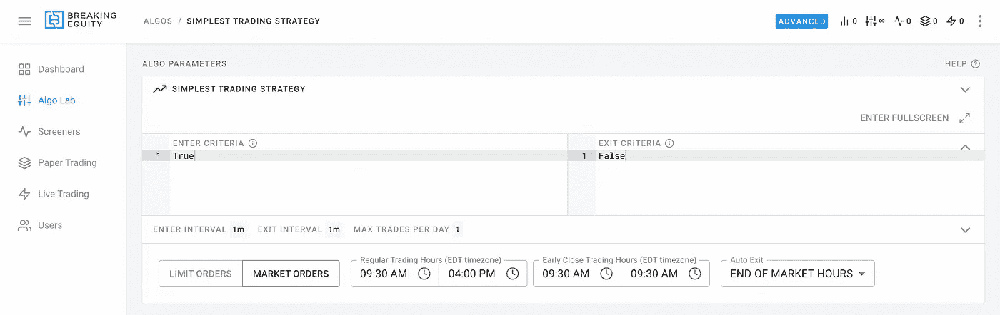
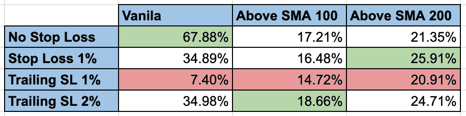
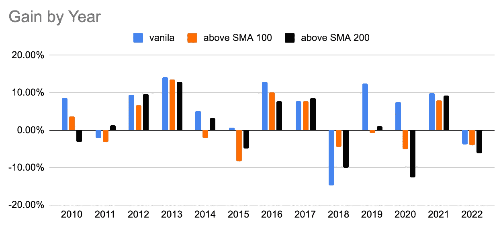

# 最简单的日内交易策略:定量研究

> 原文：<https://medium.com/geekculture/the-simplest-day-trading-strategy-a-quantitative-study-4d3370ec4cdc?source=collection_archive---------18----------------------->

日内交易没那么难。最终，我们将进入一个持久的牛市。让我们来看看…

# 为什么是最简单的交易策略？

要进行当日交易，你需要一个至少有 25，000 美元的账户，至少在美国是这样。人们通常会将资金投入到长期购买和持有中。然后开一个保证金账户，他们可以在那里借钱交易。如果所有头寸在当天结束前平仓，则无需支付任何费用。

我们处于牛市已经有一段时间了。这听起来不像免费的钱吗？？好吧…让我们根据一个简单的策略来量化一下，如果赚钱真的那么容易的话。

说到最简单的策略，我认为下面这个策略很有可能成为最简单的策略:“买入，开盘，最后卖出”。

# 设置

*   使用市价单在开盘价买入
*   使用市价单在收盘时卖出
*   每天交易 25，000 美元(这是我们分配给实验的金额)
*   仅交易$SPY
*   不要在收盘前交易

Strategy setup in [https://www.breakingequity.com/](https://www.breakingequity.com/)

为了更彻底一点，我还决定测试几个止损变量:

*   止损 1%
*   追踪止损 1%
*   追踪止损 2%

…以及进入的条件。仅在股票处于以下状态时交易:

*   每日 SMA 100 以上
*   每日 SMA 200 以上

# 结果呢

由于这项研究并不试图击败市场或提出如何进行日内交易的建议，所以我把结果公布出来，让你从中得出自己的结论。

Best and worst performers

Gain by year (no stop loss scenario)

*所有的计算都是用 https://www.breakingequity.com/***进行的。*[*Breaking Equity*](http://breakingequity.com/)*是散户用来建立、买卖策略的算法交易平台和市场。它通过让算法变得更加实惠和包容，确保散户投资者利用对冲基金的技术和数据，从而创造了公平的竞争环境。**