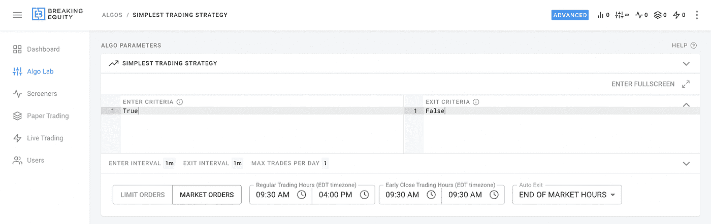
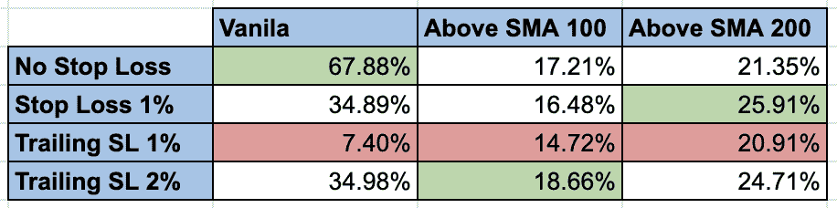
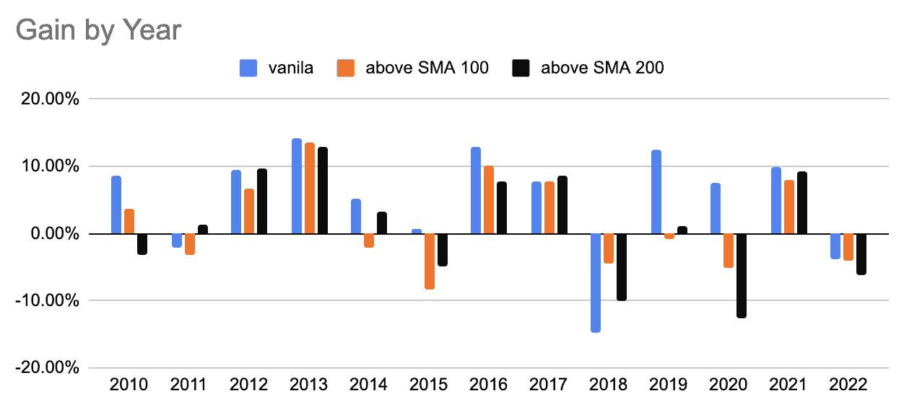

# 最简单的日内交易策略，以及为什么大多数交易者做不到

> 原文：<https://medium.com/geekculture/the-simplest-day-trading-strategy-and-why-most-of-traders-cant-make-it-6b2e0decacc8?source=collection_archive---------5----------------------->

“拿一个简单的想法，认真对待。”—查理·芒格

# 为什么大多数交易者失败了？

因为他们大部分人[开始这个游戏是为了赌博](/geekculture/obsessed-with-trading-stocks-options-you-may-have-addiction-9ee3c70a6bb5)。交易者凭直觉随机买卖股票，最终赢得一些现金。

这样交易的越多，赢的越少。

尝试随机的事情，从一种策略跳到另一种策略，你会得出结论，似乎没有什么是有效的。

我知道这一点，因为我失败了太多次。

你责怪策略、方法、工具、成功的交易者、命运和其他东西，因为你的交易没有成功。

等一下…

要达到拉面盈利(在我个人旅程的开始)，让交易成为职业(现在)，你需要一致性，不要感情用事。这是 80%的交易者在开始时的损失。

几年前，我转向了自动化交易(甚至推出了一个个人算法交易平台)，以下是我能说的:

大多数交易策略都是独立运作的。保持简单就好。

我决定证实这个论点，并回测了有史以来最简单的日内交易策略。

# **战略**

开市时买入，收盘时卖出。

我分析了 2010 年以来的市场，以下是我们所掌握的情况。

设置

*   每天交易 25，000 美元(假设你至少有 25，000 美元的保证金)
*   仅交易$SPY
*   使用市价单在开盘价买入
*   使用市价单在收盘时卖出
*   不要在收盘前交易

因为我们测试的是最简单的策略，所以我决定测试几个止损变化

*   止损 1%
*   追踪止损 1%
*   追踪止损 2%

…以及进入的条件。仅在股票处于以下状态时交易:

*   日线图上 SMA 100 以上
*   日线图上 SMA 200 以上

Strategy setup in [http://breakingequity.com/](http://breakingequity.com/)

# 结果呢

它工作了。尽管如此，它的表现不如买入并持有，但也显示出良好的业绩。我想我可以像那样用保证金交易。

交易任何策略总会有一定比例的失败和亏损。这是一种概率，不是对错。

交易的主要目标是确保你有适当的风险管理、一致性和良好的风险回报比。

[Breaking Equity](http://breakingequity.com/) 是一个自动化交易平台和市场，供散户投资者构建、购买和出售策略。它通过让算法变得更加实惠和包容，确保散户投资者利用对冲基金的技术和数据，从而创造了公平的竞争环境。

免责声明:不是财务/投资建议。在交易或投资前做好调查和尽职调查。