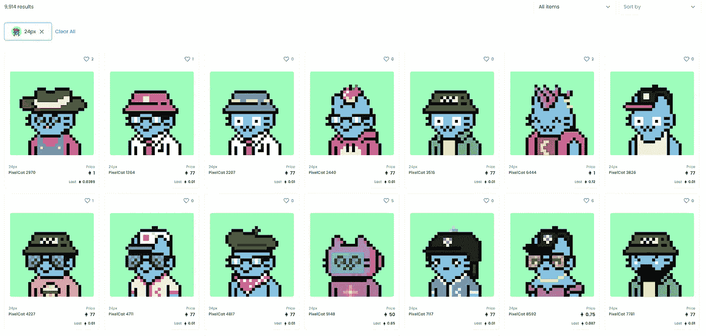
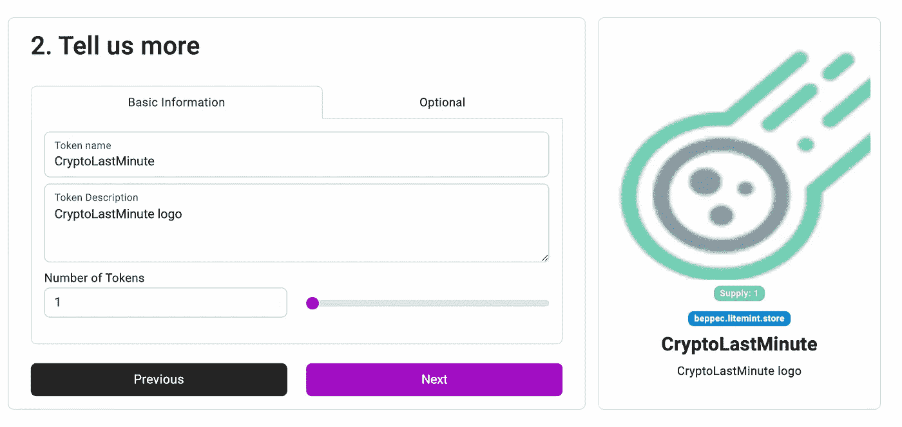
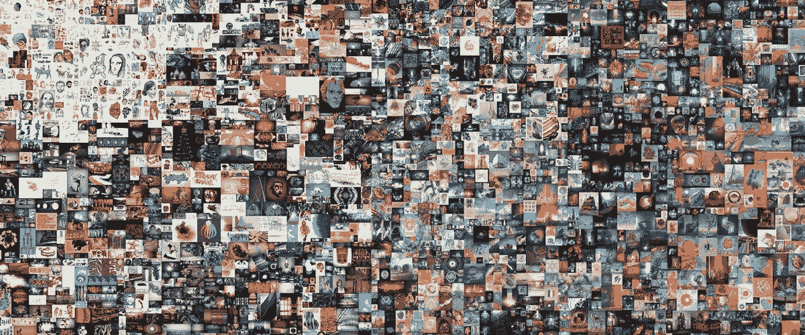
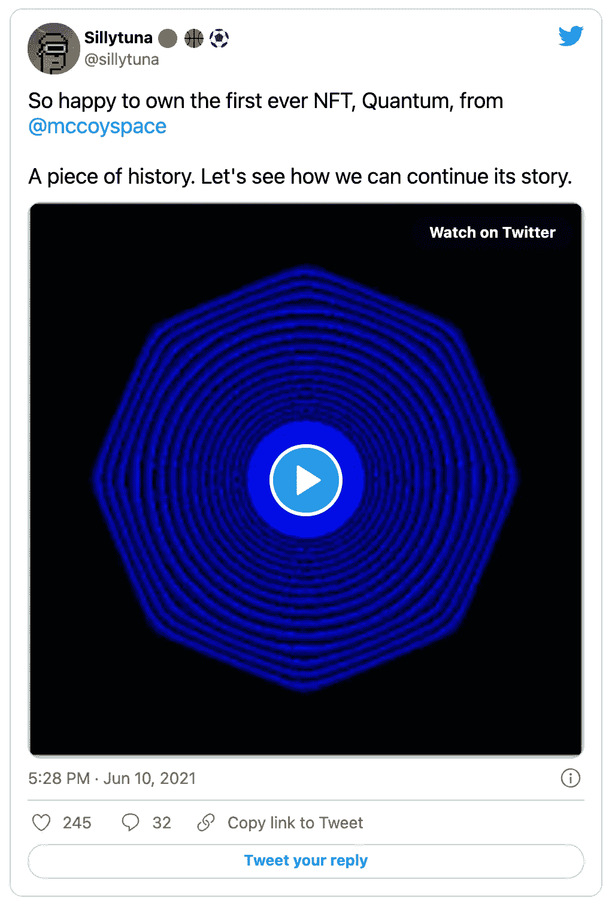
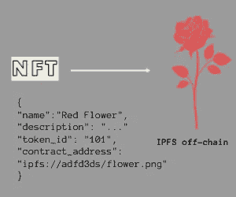
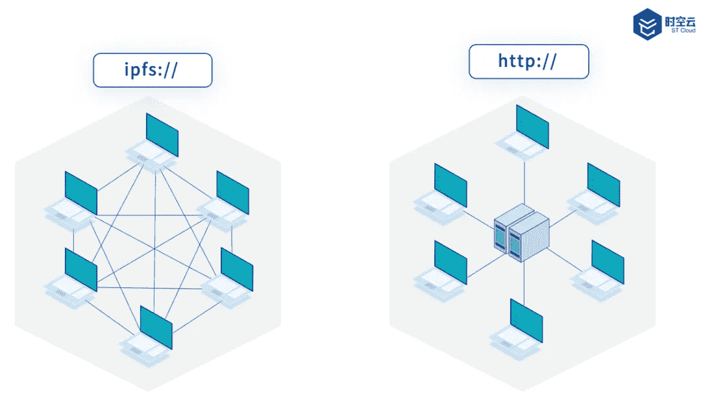

# NFTs 的最简单介绍

> 原文：<https://medium.com/geekculture/the-simplest-introduction-to-nfts-72c384e316cb?source=collection_archive---------7----------------------->

## 问题和答案，以了解是怎么回事

Photo by [Maximalfocus](https://unsplash.com/@maximalfocus?utm_source=unsplash&utm_medium=referral&utm_content=creditCopyText) on [Unsplash](https://unsplash.com/s/photos/digital-art?utm_source=unsplash&utm_medium=referral&utm_content=creditCopyText)

# 什么是 NFT？

> 不可替代令牌(NFT)是一种不可分割且唯一的加密货币令牌。

不可替换令牌是存储在区块链中的唯一且不可变的令牌。它通常与提供**所有权**证明的数字资产(如照片或媒体)相关联。

# 什么是可替代资产？

**可替换的**资产是指可以交换成相同类型或不同(但可比)的项目。货币、黄金、石油是可替代的资产。**比特币是一种可替代资产**。

# 什么是不可替代资产？

**不可替代**资产是其价值受其他品质和因素(稀缺性、独特性、不可分割性)影响的项目。一颗钻石、一幅画、一张口袋妖怪卡片都是不可替代的代币。

# 有多少种 NFT？

一个简单但不详尽的列表:

*   艺术
*   游戏项目
*   音乐、视频和其他媒体
*   收藏品(卡片)
*   文本(诗歌、领域、事迹)

# 我在哪里能买到 NFT？

支付预定的价格，或者(更受欢迎的)以拍卖为基础的模式，可以在 NFT 的市场上买到 NFT。你需要打开一个装有市场支持的加密货币的钱包并为其注入资金，以便出价。

NFT 市集景观欣欣向荣:[明海](https://opensea.io/)，[阿谢](https://marketplace.axieinfinity.com/)，[隐朋克](https://www.larvalabs.com/cryptopunks)，[稀有](https://rarible.com/)，[造币](https://litemint.com/)等..参见[decrypt.com](https://decrypt.co/80595/best-nft-marketplaces)上的列表。

OpenSea Collection

# 我如何创建 NFT？

你没有创造 NFT，你创造了它。

# 我如何铸造 NFT？

市场允许上传资产(即 JPG)并定义必要的元数据，如名称、描述和项目数量:NFT 的转换和发布称为铸造。

Minting my NTF — Image by Author

根据 NFT 和市场的性质，可能会有不同的流程，例如 [ChainText](https://chaintext.net/) 提供了一个用于编辑和设计文本的 web 表单。

# NFT 最贵的是什么？

The First 5000 Days, by Beeple

2021 年 3 月 11 日，数码艺术家[beepple](https://www.beeple-crap.com/)创作的“前 5000 天”JPEG 在佳士得拍卖会上以 6900 万美元成交。

这位艺术家在 5000 天(超过 13 年)里每天创作一幅画。顺便说一句，他继续前进。

# 哪一个是第一个 NFT？

NFT 创作的第一部动画是《量子》(2014 年)，当时没有人(除了艺术家和他的开发伙伴)理解正在发生的事情的伟大之处。

由凯文·麦考伊创作的这幅画最终(在 2021 年)拍出了 140 万美元。

Tweet by Sillytuna — screenshot

# 什么是汽油费？

**汽油费**是在区块链上执行交易的成本。是[以太坊](https://ethereum.org/en/)平台发明的一个术语，指的是处理交易奖励给矿工的金额。

铸造一个 NFT 基本上是在分类账上存储一个新的交易，因此会产生相关的汽油费。

# 铸造一个新的 NFT 需要多少钱？

区块链和区块链的汽油费不同。虽然以太坊仍然是最受欢迎的，但它的汽油费通常高于新的播放器和技术。

另一个要考虑的因素是市场:流行的高端平台可能收费更高，但拥有更大的用户群和市场。其他人不收取创作费(至少从你的第二个 NFT 开始)，但对每笔销售收取佣金。

# NFTS 存放在哪里？

NFT with IPFS off-chain pointer — Image by Author

NFT 是一个永久存在于区块链(**链上**)的不可变令牌，然而数字资产(艺术、音乐、媒体等..)通常保存在不同的位置(**链外**)，这是由于其尺寸和储存它所需的大量气体费用。

# 什么是 IPFS？

Photo by IPFS Malaysia Facebook Group

星际文件系统(IPFS)是一个**分布式协议**，用于存储和检索文件。它不是以服务器为中心的(如 HTTP ),而是一个分散的系统，数据在节点间共享，连接是对等的。

在 NFT 记录的元数据中使用 IPFS URL(即`ipfs://63xvivplfwhtpym/flower.png`)来链接相关联的资产。

# 外链有什么好处？

**离链存储**成为事实上的 NFTs 标准有几个原因:

*   **更便宜**:与区块链不同，费用是由提供商确定的(通常非常便宜，有时甚至免费)
*   **更快**:不像区块链，不需要使用网络呼叫来确认或证明操作
*   **私人**:公共区块链上看不到交通和细节。

# 有人能访问我的 NFT 吗？

**确定**。根据定义，NFT 链上令牌是公共的，但是它是不可变的，不能被篡改。

# 有人能偷我的 NFT 吗？

**也许是**。尽管在安全和区块链技术方面取得了进步，但秘密的“黑客攻击”始终是一种可能性:获得密钥或 12 个单词恢复短语的网络罪犯可以访问/恢复你的加密钱包并清除它，包括 NFT 令牌。

# NFT 是一个好的投资吗？

NFT 非常受欢迎，每天都有新的平台、市场和粉丝出现，然而这是一种**投机性投资**，必须了解并接受所有风险。

# 结论

这不是一个财务建议。

然而，我想**补充最后一点**:有越来越多的卓越项目和全球倡议旨在支持新艺术家和促进文化，利用区块链技术创造一个更好、更公平的机会世界。

感谢您的阅读，更多信息请点击 [Twitter](https://twitter.com/beppecatanese) 联系我。再见。👋