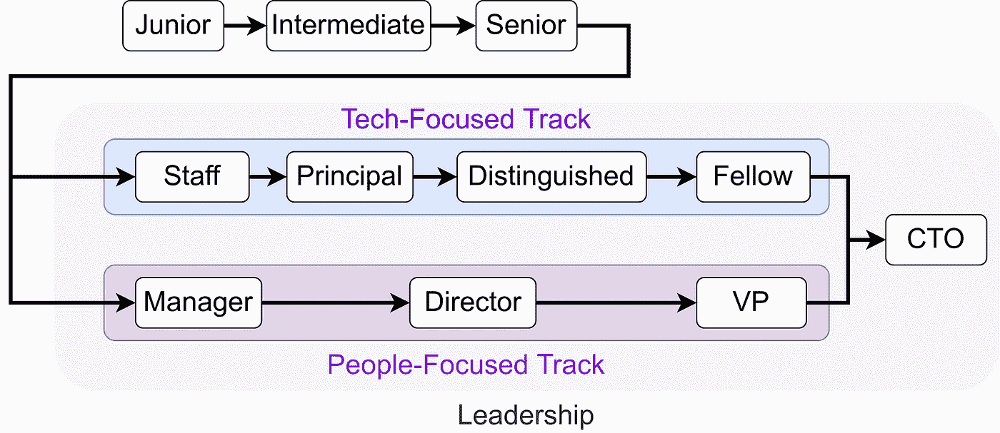

# 软件工程职业阶梯📈

> 原文：<https://medium.com/geekculture/the-software-engineering-career-ladder-3667282aeaa2?source=collection_archive---------0----------------------->

## 只在初级对高级的比赛中开始

One example for a software engineering career ladder

目前软件工程师的就业市场非常疯狂——如果你碰巧有一技之长，你就能拥有你梦想中的工作。

在这篇文章中，当你考虑选择哪份工作时，我想阐明一个相关的方面:职业阶梯。