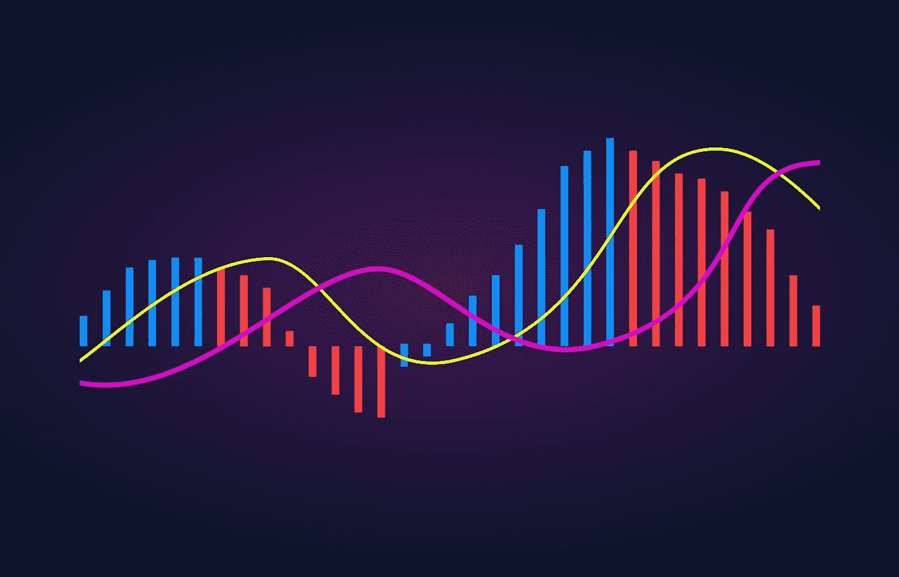

# 特殊的背离交易技术。

> 原文：<https://medium.com/geekculture/the-special-divergence-trading-technique-2e287d8fa754?source=collection_archive---------12----------------------->

## 编码 MACD 上的特殊散度。

最著名的指标之一是移动平均趋同背离——MACD。它是一个被大量跟踪的振荡指标，可用于趋势跟踪系统或反向策略。本文讨论特殊的背离技术，另一种交易背离的方法。