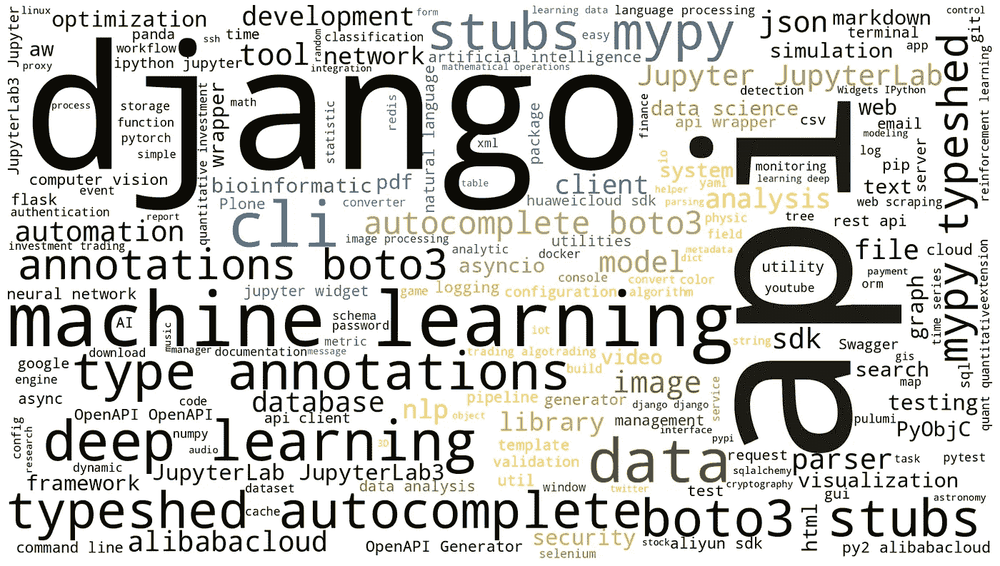

# PyPI 的状态— 2022 版

> 原文：<https://medium.com/geekculture/the-state-of-pypi-2022-edition-d8e2cba9de2c?source=collection_archive---------6----------------------->

## 让我们看看 Python 包索引在 2022 年是如何发展的

An overview of the keywords of Python packages. Created with [wordcloud](https://pypi.org/project/wordcloud/) by Martin Thoma.

python 包索引 PyPI 是 Python 的默认包存储库。它是完全开放的，任何人都可以免费使用。任何人都可以贡献包。PyPI 也是 Python 的默认包索引:当你运行`pip install flake8`时，包管理器通常会在 PyPI 的[上寻找 flake8。](https://pypi.org/)