# 熊猫文库的分步编码指南—第二部分

> 原文：<https://medium.com/geekculture/the-step-by-step-coding-guide-to-pandas-library-part-2-2d509348282d?source=collection_archive---------49----------------------->

## 你好，在本系列的上一篇文章中，我介绍了 Pandas 库的基础知识。请去看看第一部分，如果你还没有。由于这些文章本质上是连续的，浏览它们将有助于你理解和强化你的基础知识。

在您对您的数据做出任何决定之前，首先彻底检查它是至关重要的。检查数据可以得到更好的答案，在数据分析过程中，您还可以勾勒出细微差别。

> Y ***ou 欢迎下载我的*** [***代码文件***](https://github.com/Prashantoza/Data_wrangling) ***，跟随文章一起深入了解。***

For more awesome analytics cartoons, visit [https://timoelliott.com/blog/](https://timoelliott.com/blog/cartoons/more-analytics-cartoons)

开始把数据集当成你面前的拼图，把数据分析方法当成你提供的工具。工具的选择和使用取决于特定的难题，在数据分析中，所有的工具不能同时应用于一个数据集。

Photo by [Markus Spiske](https://unsplash.com/@markusspiske?utm_source=medium&utm_medium=referral) on [Unsplash](https://unsplash.com?utm_source=medium&utm_medium=referral)

你需要解决手头的问题，并根据所需的精确度选择你的方法。

如果您在日常生活中处理数据，开发数据分析例程是至关重要的，尽管在开始数据分析时没有单一的标准技术，但建议您在首次检查任何数据集时为自己开发一个例程

这将有助于增加您对数据集的熟悉程度；最好是一个动态的任务清单，随着你对熊猫和数据分析方法的熟悉程度而变化。

在这里，我分享我的数据**分析程序**，它可以帮助初学者从零开始建立自己的程序。

> ***我们将介绍以下内容:***

1.  *概述*
2.  减少数据集的内存占用
3.  选择方法—最大值中的最小值
4.  选择方法—每组中最大的一个
5.  选择方法—数据子集
6.  加快甄选过程
7.  用 iloc 或 loc 索引器切片行
8.  按字典顺序对行进行切片
9.  使用布尔索引器过滤数据
10.  沿着列寻找最常见的最大值

# 一.概述

我将探索数据分析方法，以及如何探索数据框架的过滤和选择——你不能一次处理整个数据集，你需要操纵数据以从中获得更多见解。

*   在这里，我将使用我在上一篇文章中使用的相同的网飞和 Spotify 数据集，让我们加载数据。

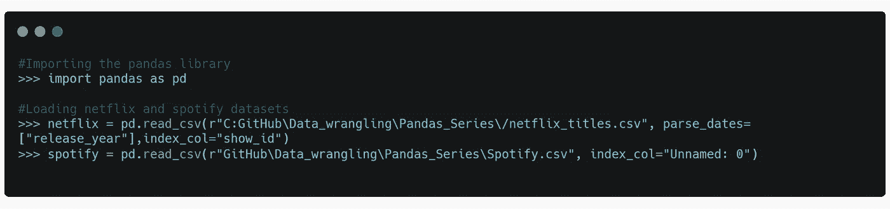

# 二。减少数据集的内存占用。

在 pandas 中，整数和浮点的默认大小是-64 位，不管特定数据帧的最大必要大小是多少。有两个技巧可以用来减少您正在处理的数据的大小，并使您的程序更快:

*   不要一次加载所有数据，而是使用数据的子集(我们将在后面详细介绍)。
*   更改数据的数据类型。

> *A* ***数据类型*** *或简称* ***类型*** *是数据的一种属性，它告诉编译器或解释器程序员打算如何使用数据。*

1.  **int8 / uint8:** 消耗 1 字节内存，范围在 128/127 或 0/2554 之间。
2.  **bool** :消耗 1 个字节，真或假。
3.  **float16 / int16 / uint16:** 消耗 2 字节内存，范围在-32768 和 32767 之间或 0/65535。
4.  **float32 / int32 / uint32 :** 消耗 4 字节内存，范围在-2147483648 和 2147483647 之间。
5.  **float64 / int64 / uint64:** 消耗 8 字节内存。

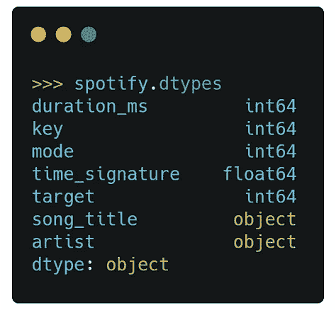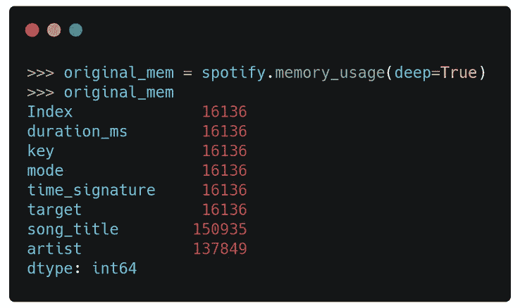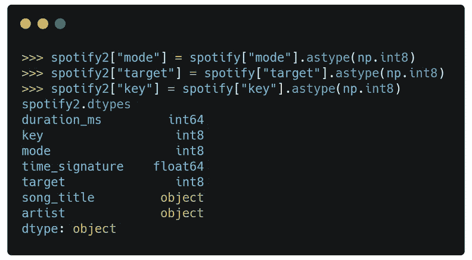

上述步骤从左至右依次解释如下:

1.  检查 Spotify 数据集的数据类型。
2.  检查 Spotify 数据集的内存使用情况
3.  列 mode、key 和 target 是分类变量，将它们的数据类型更改为 int8 并保存在新的数据集 Spotify2 中。
4.  检查新数据集的内存使用情况

**模式、键和目标值缩小到原来的 1/8**

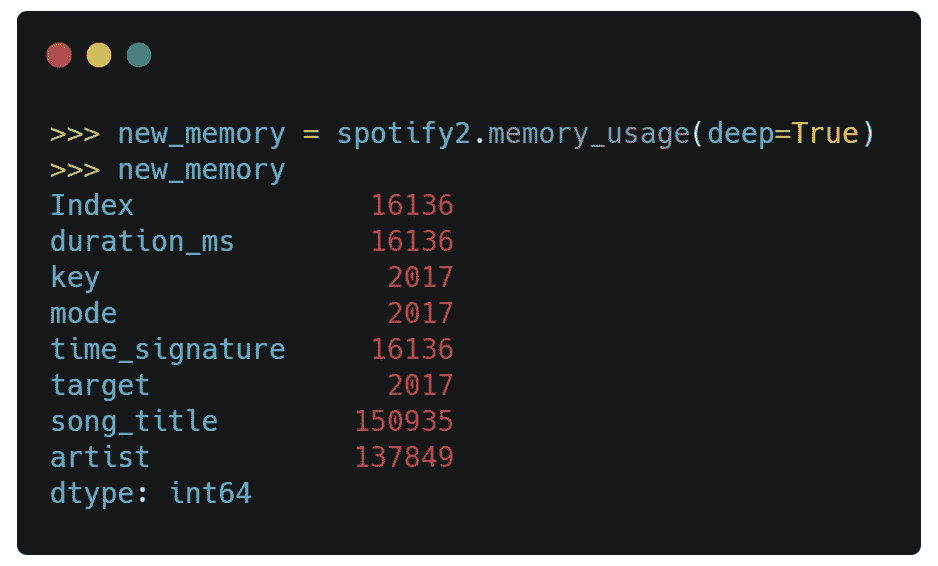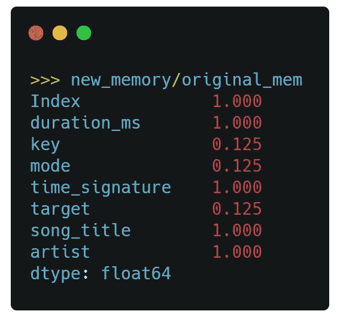

# 三。选择方法—最大值中的最小值

在分析过程中，您可能首先需要找到一组包含单个列中前 n 个值的数据，然后根据不同的列从该数据集中找到后 m 个值，或者您可能不需要完整的数据来进行分析，只需要前 100 个数据。

这个食谱可以用来回答你的“你能跟着跳舞的前 100 首歌？”或者“100 首高能歌曲”。

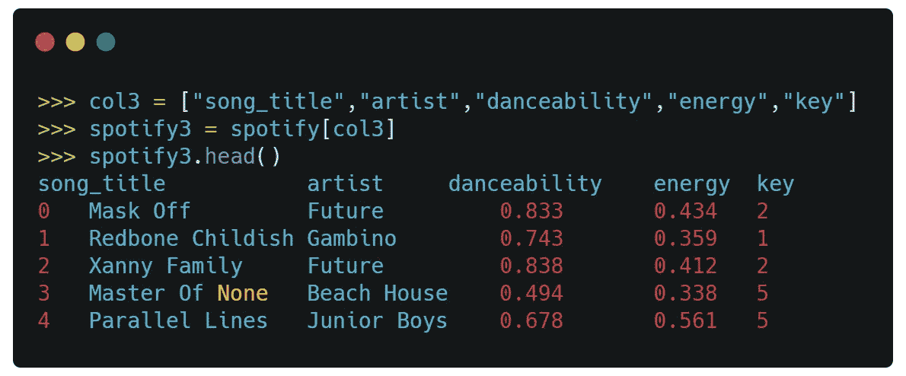

在这里，我首先创建了一个包含 3 个连续变量的数据集，链接 **nlargest** 方法创建了一个包含 50 首具有高跳舞度的热门歌曲的数据集，

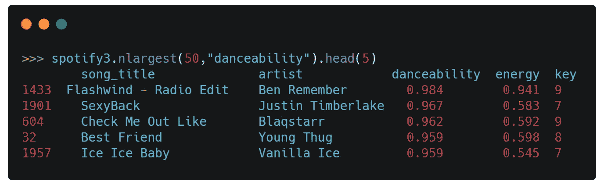

链接**n small**方法以返回前 50 名中最低的 5 首歌曲。

# 四。选择方法—每组中最大的一个

在数据分析期间执行的一个常见操作是选择列的最高值，这可以帮助您回答诸如“最高评级的网飞电影”、“年度最长歌曲”或“最高评级的电影导演/艺术家/演员/描述”等问题。

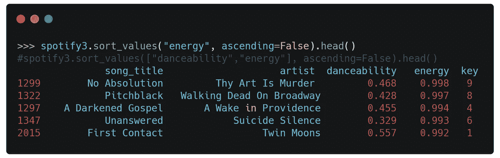

在三世。第一步展示了如何使用 **nlargest** 方法链接来选择前 50 首歌曲，我们可以使用 sort_values()方法实现同样的效果

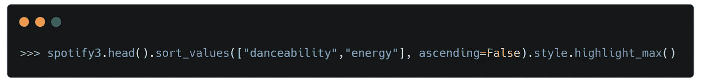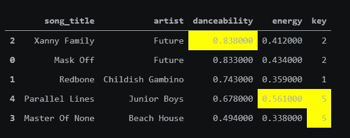

您也可以使用**style . highlight**方法高亮显示最大值、最小值和空值:

**drop_duplicates** 方法的默认行为是保留第一次出现的

每个唯一的行，因为每个行都是唯一的，所以不会删除任何行。但是，subset 参数改变了它，只考虑提供给它的列(或列列表)。在本例中，每个键只返回一行。

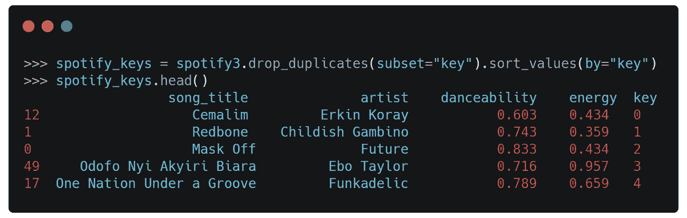

# 动词 （verb 的缩写）选择方法-数据集的子集

如上所述，减少任何函数内存占用的另一种方法是不处理整个数据集，而是处理子集。序列或数据帧中的每一维数据都通过索引对象来标记。正是这个索引将 pandas 数据结构从 NumPy 的 n 维数组中分离出来。

Pandas 允许用户通过行和列的整数位置来选择数据。这种双重选择功能，一个使用标签，另一个使用整数位置，为选择数据子集提供了强大但令人困惑的语法。

**I .使用 loc 和 iloc 索引器的串行子集选择:**

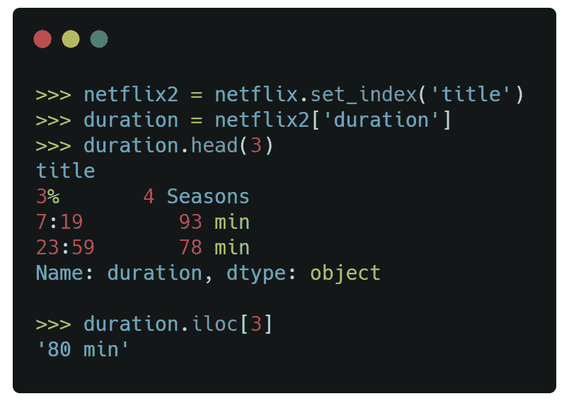

读取以标题为索引的网飞数据集，并使用索引运算符选择单个列持续时间作为序列:

为了选择几个不同的整数位置，我向. iloc 传递了一个列表。这将返回一个序列:

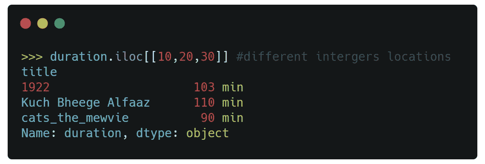

为了选择等间距的数据分区，我使用了切片符号:

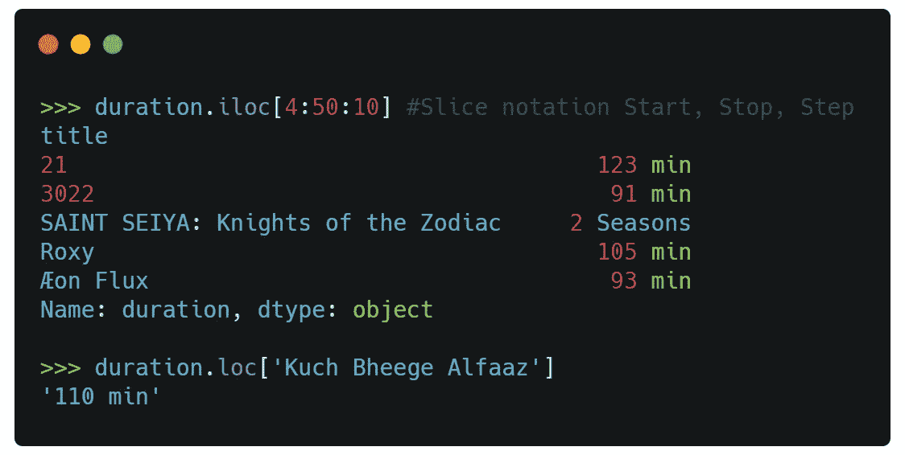

为了选择几个不相交的标签，我使用了一个列表:

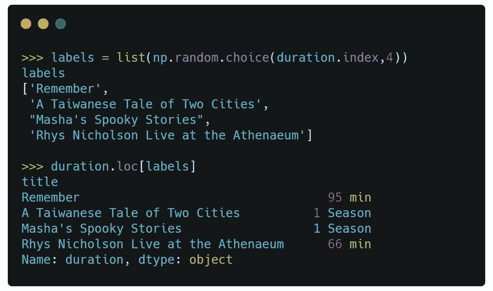

**二世。使用 loc 和 iloc 索引器在数据帧中选择子集:**

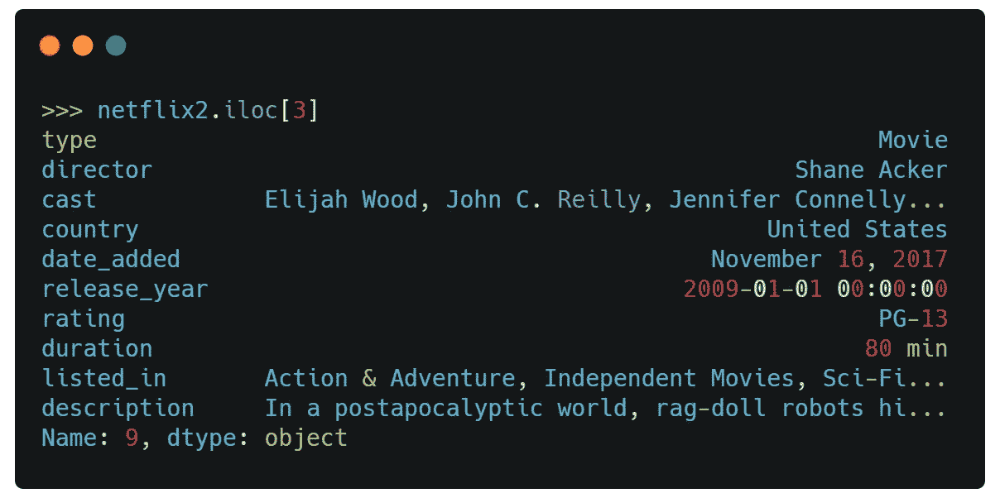

选择数据帧行的最明确和首选的方法是使用。iloc 和。锁定索引器。它们能够独立并同时选择行或列。

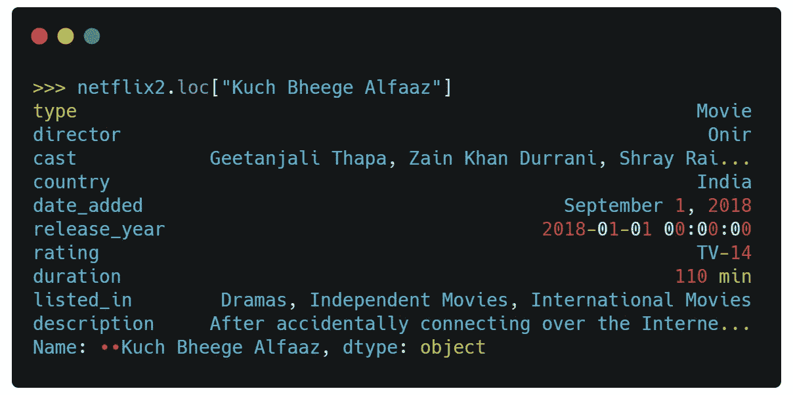

将一个整数传递给。iloc 索引器在该位置选择整行。

我可以用 loc。索引，以获得与上一步相同的行。

为了选择一组不连续的行作为数据帧，我向。iloc 索引器，可直接从数据框中选择索引标签列表。

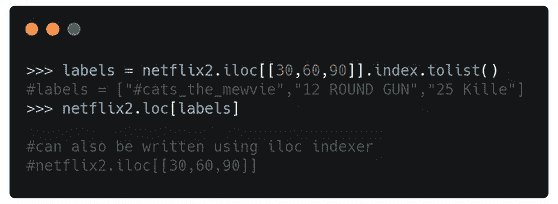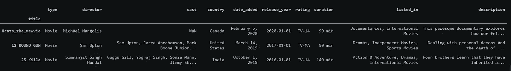

**三世。同时选择行和列**

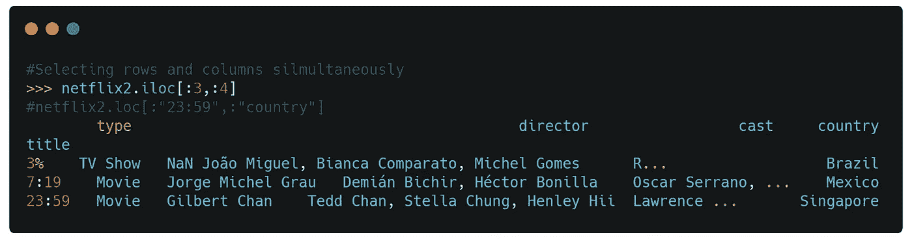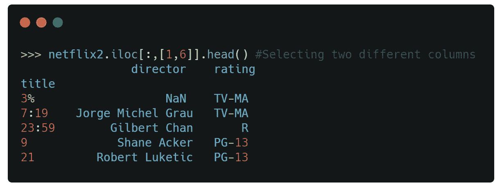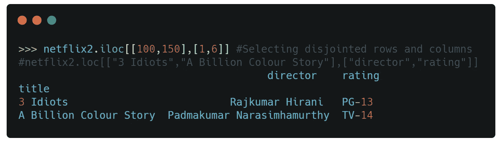

直接使用索引运算符是从数据帧中选择一列或多列的正确方法。但是，它不允许您同时选择行和列。

若要同时选择行和列，您需要将有效的行和列选择传递给。iloc 或。锁定索引器。

# 不及物动词加快甄选过程

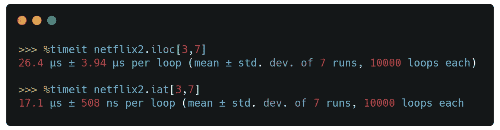

两者都是。iloc 和。loc 索引器能够从序列或数据帧中选择单个元素，即标量值。然而，存在索引器。iat 和。分别以更快的速度实现同样的事情。比如。国际劳工组织。iat 索引器使用整数位置进行选择，必须向其传递两个用逗号分隔的整数。类似于。洛克。at index 使用标签进行选择，必须向其传递由逗号分隔的索引和列标签。

# 七。用 iloc 或 loc 索引器切片行

选择行的快捷方式只有索引操作符本身。这只是显示 pandas 附加特性的一个快捷方式，但索引操作符的主要功能实际上是选择 DataFrame 列。如果要选择行，最好使用。iloc 或。因为它们是明确的。

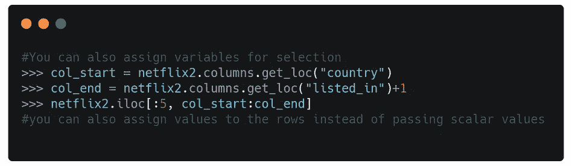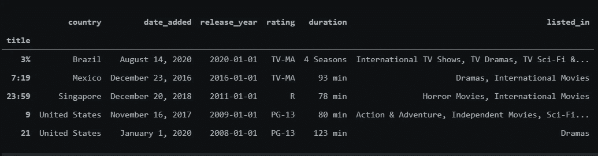

# 八。按字典顺序对行进行切片

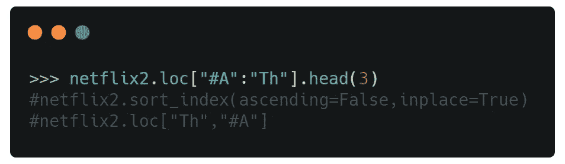

的。loc 索引器通常基于索引的确切字符串标签来选择数据。但是，它也允许您根据索引中值的字典顺序来选择数据。具体来说，。loc 允许您使用切片表示法按字典顺序选择带有索引的所有行。这仅在索引已排序的情况下有效。

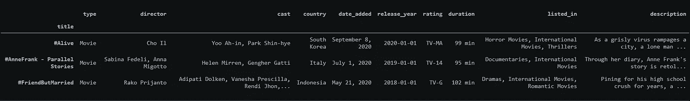

# 九。使用布尔索引器过滤数据

从数据集中过滤数据是最常见的基本操作之一。有许多方法可以使用布尔索引来过滤(或子集)pandas 中的数据。布尔索引是指通过为每行提供一个布尔值(真或假)来选择行。这些布尔值通常存储在一个系列或 n 维数组中，通常通过将布尔条件应用于数据帧中的一列或多列来创建。

创建一个变量，将每组标准作为一个布尔序列独立保存，然后将所有标准组合成一个布尔序列。

将数据传递给索引操作符，以获取过滤后的数据。

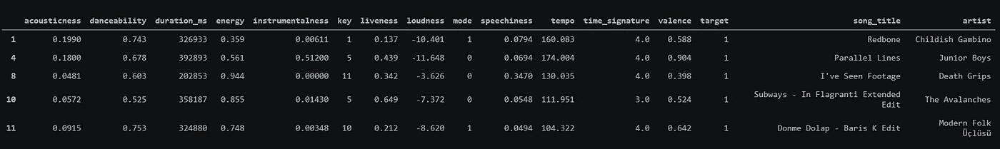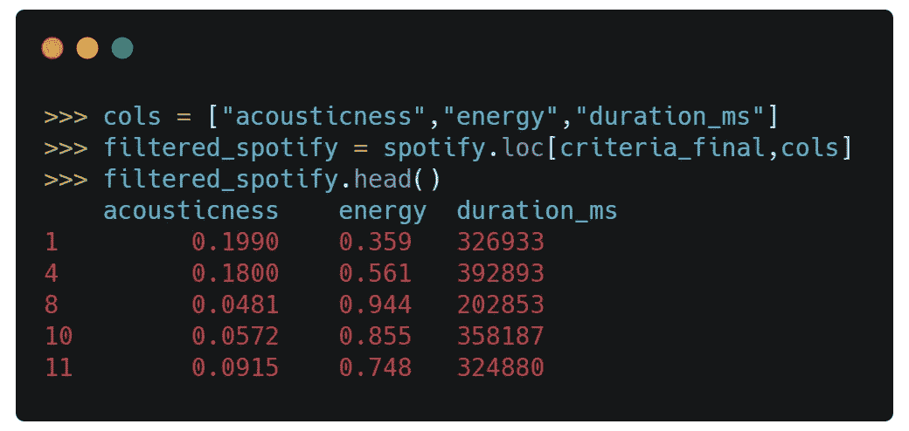

获得过滤后的数据后，我们可以用。iloc 索引器

# X.沿着列寻找最常见的最大值

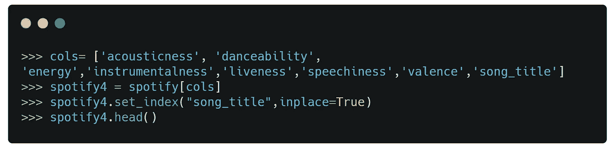

Spotify 数据集包含数千首歌曲，单独查看哪首歌曲在各个列中得分最高会很有趣，我们可以使用 **idxmax 方法( )来检查它。**

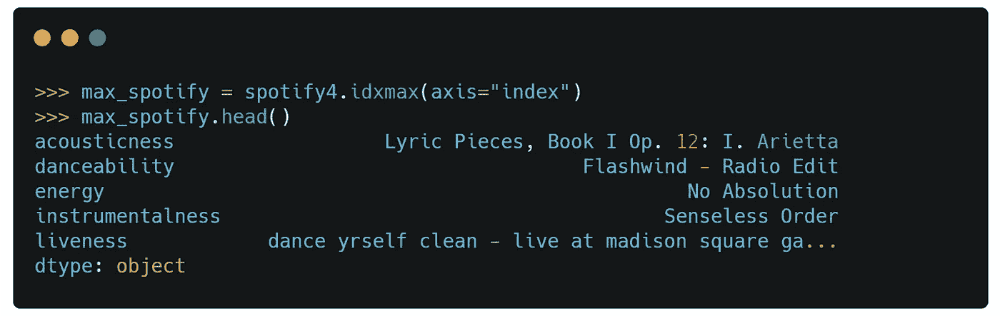

> ***这是我 DataWrangling 系列的第二贴，敬请期待。你可以在下面找到第一个帖子。***

 [## 熊猫图书馆分步编码指南

### Python 的熊猫库初学者入门。一个简单的一步一步全面的编码指南，以获得…

medium.com](/geekculture/introduction-to-pandas-data-wrangling-series-1-a6b1862eb2fb) 

你好，我期待着你的评论和建议。
善意的鼓掌，订阅，分享。

