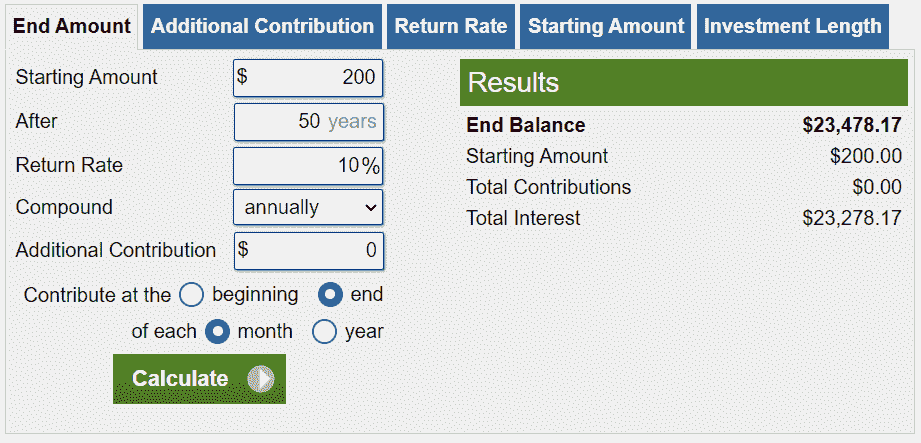

# 你需要知道的。

> 原文：<https://medium.com/geekculture/the-stock-market-what-you-need-to-know-667ae886d6a6?source=collection_archive---------21----------------------->

## 人生投资指南。

Image obtained from Unsplash by ‘[Lachlan Dempsey](https://unsplash.com/@lachlanjdempsey)’

股票市场的民主化是我们金融市场的一个新的、了不起的进步。但可悲的是，这给游戏带来了很多愚蠢。我在这里向大家展示，个人投资者可以像股票市场上的任何知名专家一样成功。

看看世界上所有最富有的人。绝大多数人是通过股权获得这些财富的——股权就是所有权。所以，如果你想在那个名单上，你有两个选择；要么创建自己的股权，要么购买别人的一部分。

如果你希望创造自己的股票，那么你需要建立一家公司——像比尔盖茨、埃隆马斯克或杰夫·贝索斯那样。如果这不是你的命运，那么你可以通过战略投资买入股票——就像沃伦·巴菲特、彼得·林奇或雷伊·达里奥那样。现在我说战略投资，但任何人都可以这样做。说真的，任何人。

这其实非常简单，每一个原则都是从经验数据中获得的，这些数据告诉我们需要如何投资才能带来最大可能的回报。遵循这篇文章，你应该具备在股市中茁壮成长所需的所有知识。

# **历史的确会重演。**

这里是你需要知道的一切:

*   **过去 100 年，标普 500 指数带来了 10%的年均回报率**
*   ******平均每 16 个月发生一次市场调整******
*   ********熊市发生时，平均每单** [**3.6 年**](https://www.fool.com/investing/how-to-invest/bear-market/#:~:text=Bear%20market%20examples&text=Since%201900%20there%20have%20been,every%203.6%20years%20on%20average.)******
*   ******牛市追随熊市******

****现在让我们讨论一下这意味着什么。首先，标准普尔 500 仅仅是在美国股票市场公开上市的 500 强公司。市场修正是指市场下跌 10%或更多。熊市是指市场下跌 20%或更多。牛市是指市场上涨 20%或更多。几乎每一次熊市之后都有一次牛市。****

****这真的是你需要知道的一切。S&P 5500 带来了长期 10%的平均年回报率。所以，尽可能把所有的钱投资到标准普尔 500，在熊市的时候多投资一些——这些股票正在打折。买！买！买！****

****10%的年回报率足以让你变得非常富有——玩一玩这个投资计算器,看看你还有多久能成为百万富翁。简单来说，不断地、持续地、被动地投资，是股市制胜的关键。****

# ******原则。******

> ******买入并持有******

****你的时间跨度越长，这个策略的效果就越好。如果你的时间跨度少于十年，那么你要么亏损，要么赚不到钱。当我说买入并持有时，我是认真的。坚持至少 40 年。但是时间越长越好。****

> ******降 FOMO******

****当你思考和匆忙行动时，你就失败了。仅仅因为其他人都在买 GME 并不意味着你也应该买。正如巴菲特所说:***‘当别人贪婪时恐惧，当别人恐惧时贪婪。’*******

> ******耐心点******

****在股票市场上，你需要极其耐心——你可能看不到头十年的回报。这很好！你有足够的时间。你不应该出售任何股票，因此你不应该担心价格。只有当你亏本出售时，你才真正亏损。****

> ****当你花钱时，你也失去了潜在的收入****

****当你买东西的时候，你不仅失去了物品的成本，你还失去了初始资本可能为你带来的任何潜在的金钱。当你花 200 英镑外出过夜时，你不仅仅是损失了 200 英镑。你已经输了 23478.17。****

********

*******别再买哑巴屎了。*******

> ****被动投资赢了****

****这种策略是被动投资。我们这里不是在谈论日内交易。那是赌博。不要用股票赌博。终生被动投资才是真正的制胜之道。这是一个被证实的获得财富的方法，也是一个在今天投资者的喧嚣中迷失的方法。****

> ******忘记多样化******

****不要相信我的话。自己做研究。我研究了像 Buffet 和 Dalio 这样的公司，我得出了自己的结论:分散投资不是一个好的投资策略。多样化有利于弥补某些资产类别的短期损失。****

****例如，标准普尔 500 进入熊市(下跌 20%或更多)，但与此同时，你也有飙升的房地产投资——弥补股票市场的损失。我的回答是，为什么？股市下跌有什么关系？你假设的净资产没有以前高了，这有什么关系？只有你打算卖了才重要，但我不打算卖。****

****因此，我说的方法是——所有的多样化都会导致你的平均回报率降低。****

****再一次，巴菲特说得很好(我是在转述)——**’*如果你有一份你的十大股票清单，你不会像关心排名第一的股票那样关心排名第十的股票。那么，为什么要费心把钱投到第 10 位呢？把它放到 1 号里。*******

> ******永远不要偏离你的投资策略******

****选择一个策略，非常擅长，不要偏离。当你试图做你专业领域之外的事情时，你会赔钱。坚持你所知道的，慢慢变富。****

> ******不要太执着******

****当你每天看着你的股票价格时，你就会开始轻率地买卖股票。不要。股票的价格并不重要，因为无论价格如何，你都会继续买入，也不会卖出。买了就不管了。****

> ******你无法预测任何事情******

****所以不用费心去尝试了。是的，调整和熊市确实遵循模式，但这并不意味着你应该试图预测崩盘，这样你就可以在顶部卖出，在底部买入。你会输的。你将错过股市的一些最好的日子——大大降低你的回报。只要满足于 10%的回报率就行了——你不需要更多了。****

> ******不保留现金******

****通货膨胀会计——闲置现金会贬值。这是你无法从财富中拯救自己的首要原因。坐收现金从来都不是一件好事。你应该有一些流动资金以应对个人危机，但不要持有太多现金。让现金为你工作。****

****我们讨论了很多。但实际上这是你需要的股票市场的蓝图。这似乎是异想天开，但事实确实如此。为了上演帽子戏法，巴菲特在给贝佐斯的回复中说得最好。****

> ****贝佐斯:**‘沃伦，你的投资策略太简单了。为什么大家不干脆模仿你呢？******
> 
> ****自助餐:**‘因为没人想慢慢变富’******

****被动投资标准普尔 500 会给你带来 10%的回报。那会让你非常富有。遵循这些原则，你就能在股票市场上做得很好。****