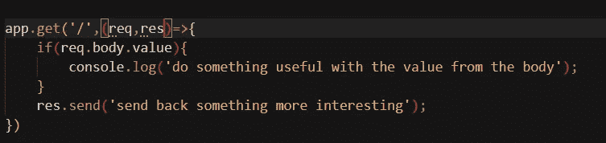
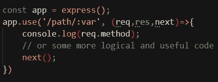
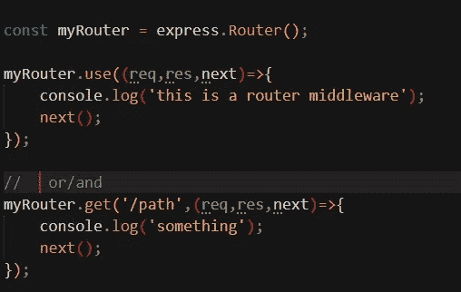
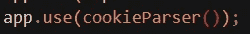
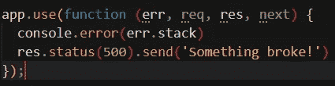
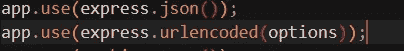
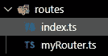
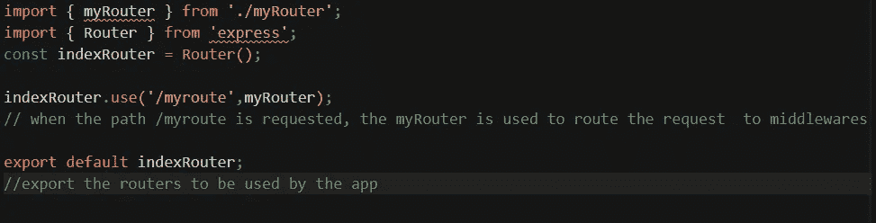

# 后端的故事:铺平道路

> 原文：<https://medium.com/geekculture/the-story-of-a-backend-paving-the-paths-7d22d2a6022c?source=collection_archive---------25----------------------->


好了，欢迎来到这个奇妙旅程的下一部分，我们将深入了解后端开发过程。到目前为止，我们已经讨论了设置一个节点项目，并开始与数据库(对我们来说将是一个 sql 数据库)对话。等待..你读过前两部分吗？没有吗？这里是到[第一部分(开始)](/geekculture/the-story-of-a-backend-the-beginning-e51a31ea83d5)和[第二部分(关于数据库的讨论)](/geekculture/the-story-of-a-backend-the-database-decisions-39f197f65d4)的链接。

哦，林克斯提醒了我..今天的目标是制造端点，并进行一系列的路由，以引导我们的请求通过路径的丛林，得到他们想要的东西。对于所有的路由和应用程序创建，我们将使用一个非常流行的 web 框架 nodeJS——Express(我们在第 1 部分中安装了它😬).在我们进入一堆很酷的代码之前，让我们先谈谈 express，理解实际发生了什么，以及为什么我要做我正在做的事情..我们走吧！

**中间件**

xpress 是一个令人惊叹的框架，它没有太多自己的功能，应用程序可以被认为是一系列的函数调用。中间件是我们为实现某种功能而运行的功能。为了在应用中使用一个函数，我们使用 use()方法(会出现很多次)。

我们在 express 中使用了三种中间件..

*   >应用中间件:使用 app.use()或 app 将应用级中间件添加到应用中。REST_VERB()。其中 REST_VERB 可以是 get、post、put 等。下面是一个相同的例子..

```
Note: If the current middleware function does not end the request-response cycle, it must call next() to pass control to the next middleware function. Otherwise, the request will be left hanging.
```

假设 app 是一个 express 实例，



这只是一个在控制台上显示当前时间的函数示例。我们从 express 导入 express 函数。我们实例化一个 express 应用程序，并将中间件添加到应用程序中。请注意，在运行中间件时缺少任何特定的路径。

如果我们想把它附加到一个路径上，代码应该是这样的



*   >路由中间件:在某条路由上增加一个路由中间件。对于我们的目的来说，这是最常见的中间件。我们使用 express router 为应用程序创建路由，并在路由器上附加一个中间件。这种中间件的一个例子如下



*   >第三方中间件:这为应用程序提供了一些额外的功能，但也让我们免去了从头创建所有代码和考虑所有处理的痛苦..我们将使用这种中间件的一些例子是..

1.  摩根—用于伐木
2.  头盔-头盔通过设置各种 HTTP 头来帮助您保护您的 Express 应用程序。*这不是银弹*，但能有所帮助。(用于生产环境)
3.  cookie-parser——解析`Cookie`头，并用一个以 cookie 名称为关键字的对象填充`req.cookies`

添加第三方中间件的示例如下



*   >错误处理中间件——以与其他中间件功能相同的方式定义错误处理中间件功能，除了使用四个参数而不是三个，特别是使用签名`(err, req, res, next)`



*   >内置中间件—以前包含在 Express 中的中间件功能现在位于单独的模块中。下面是这种中间件的例子
*   express.static:服务于静态资产，比如 HTML 文件、图像等等。
*   json:用 JSON 有效负载解析传入的请求。(适用于 express 4.16.0 以上版本)
*   express.urlencoded:用 URL 编码的有效负载解析传入的请求。(适用于 express 4.26.0 以上版本)

下面是一个添加内置中间件的例子



this is snippet from another app I was working on(but the sensitive data is well hidden😬)

现在，这是出的方式，让我们谈谈如何设置我们一些路由使用快速路由器。

能够创建这样的路由器的有趣之处在于，我们可以创建一个路由器，将中间件添加到路由中，并将路由器传递给应用程序，并且我们保持模块化..

我们创建文件夹 routes 来存储路由器并从那里导出它们。



the routes folder structure

下面是一个示例路由文件代码


myRouter.ts file content

所有路线都被提取到 indedx.ts 文件中，应用程序可以从该文件中访问所有路线



index.ts file content

好了，现在我们已经了解了如何从节点应用程序开始，我们已经谈了一些关于数据库以及如何将 nodeJS 连接到 SQL 数据库的内容，如果我成功地做了一个很好的演示，我们也知道如何将中间件添加到应用程序中，并在 express 中获得路由。

在下一篇博客中，我们将用创建基于 nodeJS 的服务器将应用程序连接到数据库的详细信息来总结这个故事。

直到那时..玩得开心，保重和超！