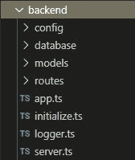
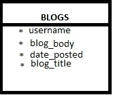
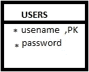
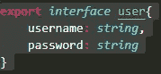
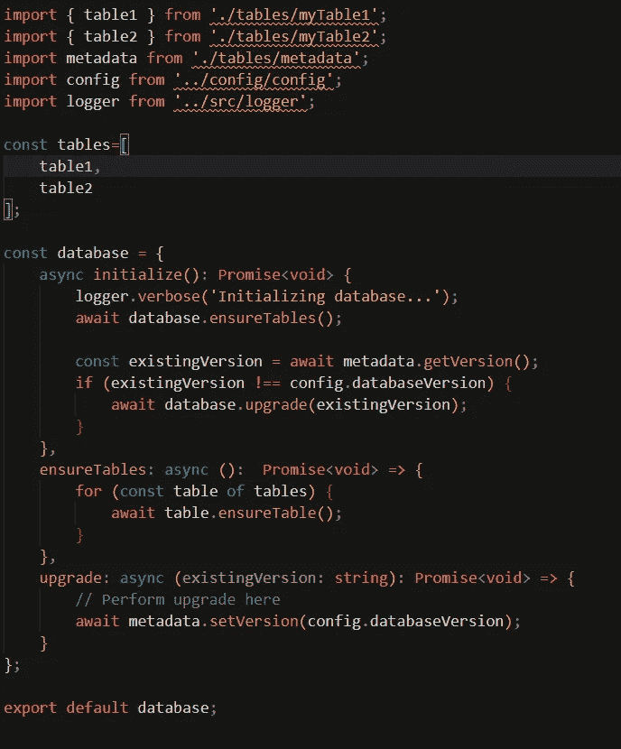
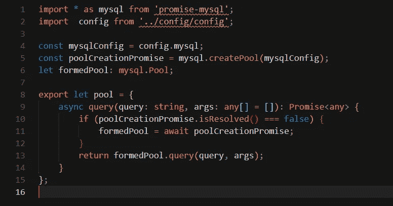
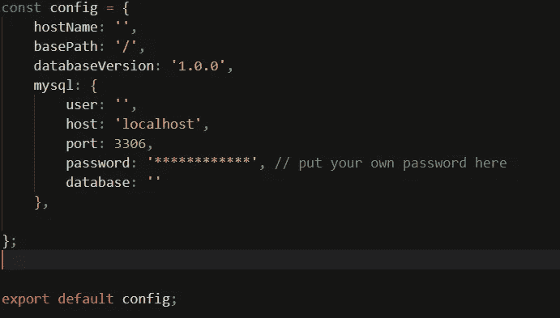
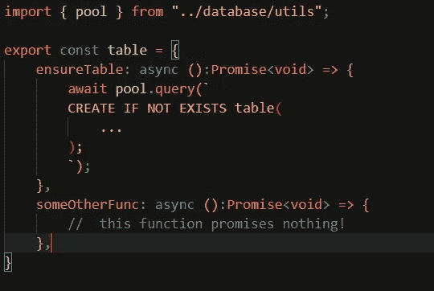
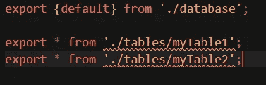

# 后端的故事—数据库决策

> 原文：<https://medium.com/geekculture/the-story-of-a-backend-the-database-decisions-39f197f65d4?source=collection_archive---------31----------------------->

大家好，欢迎来到这个奇妙后端之旅的第二章。

在这个故事中，我将尝试介绍后端的创建，并链接一些有用的链接，看看如何托管它，并向世界展示你的惊人工作。这将是更多的编程概念博客，如果你想知道如何开始建立一个后端，请阅读第一部分[这里](https://cenzio-rey.medium.com/the-story-of-a-backend-the-beginning-e51a31ea83d5#0af8-ef580103d645)。

为了这篇文章，我将假设创建一个博客应用程序的后端。

因此，对于我们的应用程序，假设我们希望应用程序允许用户匿名发帖(这种调整是为了方便我以简洁的方式涵盖尽可能多的概念)。让我们列出应用程序中我们想要的功能

**我们想从后端得到什么:**

→它应该能够接收帖子并将其存储在数据库中(我们将使用 sql 数据库，只是为了给出一个堆栈的概念，而不是普遍显示的堆栈)。

→它应该允许用户自己注册(因为我刚刚意识到这是每个 web 应用程序都要做的最基本的事情，最好演示一下如何处理密码等)。

→它应该能够从数据库中获取帖子，并将其发送到前端(使用 REST API 调用。我们在这里会抛出很多 JSON)。

→应该能够让用户登录(我们还将从我们这边发送一个令牌，这样用户就可以通过身份验证，而不必反复登录。就像在现实生活中一样😀).

正如承诺的那样，我将向您展示一个非常模块化的后端，同时考虑到开发人员的便利性。让我们来看一下目录结构:

为了实现模块化，我们为数据库、路由和配置创建了一个目录。

a sample directory structure

现在你可以看到后端的每个方面是如何被分离在不同的文件和文件夹中，这使得代码非常容易维护和修改。

让我们一步一步地检查文件和文件夹，看看什么是什么的目的。(附“*”。使用“ts”是因为这是我用来创建我的一个项目的 typescript 代码，typescript 基本上是更类型安全的 javascript。请不要惊慌，您也可以在 javascript 中做同样的事情，事实上，相同的基本概念可以在任何其他语言中使用)

**数据库讨论:**

好了，这就是我们想要从后端得到的四个非常基本的任务。让我们来讨论一下我们将用来存储信息的表。截至目前，我们只需要两张桌子。为什么？因为我们要做的只是存储用户和帖子。现在，因为我们有一个用户表，我们可以知道是谁发的帖子，但我仍然希望帖子是匿名的，所以我不要求电子邮件，只需要一个时髦的用户名就足够了(理想情况下应该是唯一的，有非常简单的方法来实现这一点，所以对于我们的应用程序，我假设所有的用户名都是唯一的。基础在这一点上更重要)。

因此，下面将是两个表模式(记住我们将后端链接到一些基于 SQL 的数据库，它们有一个固定的模式)。

sample table for blogs

sample table for users

考虑上面两个我们将使用的非常基本的表。为了安全起见，我们将使用哈希来存储密码的哈希，并检查用户密码的哈希，而不是将密码存储为纯文本。

“models”文件夹包含关于表的模式的信息，例如，对于用户表，model 文件夹将包含一个文件 users.js 或 users.ts(如果您愿意，您可以将该文件称为 ironman <.js or="" .ts="">,但命名为 users 对我来说更有意义，但只要对您有意义，您可以随意使用它)。以下是 users.ts 文件将包含的后端内容示例:

users.ts

我希望这有意义。文件导出一个名为 user 的界面，你将在一分钟左右明白它做什么(试图制造悬念！).

类似地，我们将在 blogs 模型中创建另一个文件条目(我将它命名为 blogs.ts，但是也可以随意命名它，只要对您有意义就行)。现在，在这一点上，我可以把我所做的另一个代码片段，但为了加强悬念，我会让你去做(提示:参考模式，以确定所有的东西都需要在其中)。如有任何疑问，请随时联系我，我将尽最大努力澄清疑问。

我们只处理两个表，所以我们只在目录中保存这两个模型。

现在我们有了模型，让我们开始真正的交易，开始构建数据库 dir。数据库目录包含一个索引文件(类似于入口点)、database.ts 文件(数据库设置的基本活动，如初始化数据库、确保指定的表存在并更新所有元数据)、utils.ts(连接到数据库并查询数据库任务由该文件的代码处理)和包含用于执行 CRUD(C 创建、R 读取、U 更新、D 删除)的函数的表目录。只是想给你介绍一下这个名词也是)手术台上的。

例如，对于我们的博客应用程序，下面分别是 index、database、utils.ts 文件的内容:

database.ts content

utils.ts contents

如前所述，我们将连接凭证存储在一个单独的 cnfig 文件中。这样做的总体目的是为了能够灵活地连接到不同的数据库，如果出于某种原因您想要切换的话。我说过，模块化++。

我将在以后的文章中详细讨论数据库。希望那封信也能很快寄到😬。

仅供参考/DIY，配置文件如下所示…..

as of now, this is your config file

好了，现在我们来谈谈做桌子的事。ts 调用表的 ensureTable 方法来确保数据库中存在表。

示例表格文件如下所示:

an example of tables

this is where the tables go

index.ts 就是所有东西被扔向外界的地方(我指的是初始化方法)。

index.ts

附注:忽略那些歪歪扭扭的行，代码片段是在需要时编写的，不能随意展示任何已部署的代码，只是示例🙂。

这可能又是一篇太长的文章，我真的不想在一篇文章中写太多..所以，下一篇文章再见，我将讨论🤔..让我们看看……一旦这个帖子完成，链接将会在这里，不会更远，在这里。

链接到一个有趣的链接到 [SQL 和 NOSQL 数据库讨论](https://www.youtube.com/watch?v=rRoy6I4gKWU&t=4s)。

直到后来！！..✌

[点击这里看下一章……](https://cenzio-rey.medium.com/the-story-of-a-backend-paving-the-paths-7d22d2a6022c)