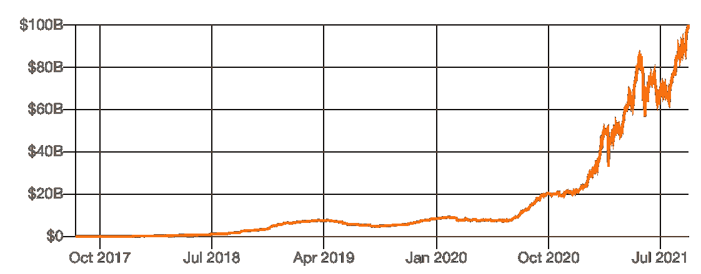
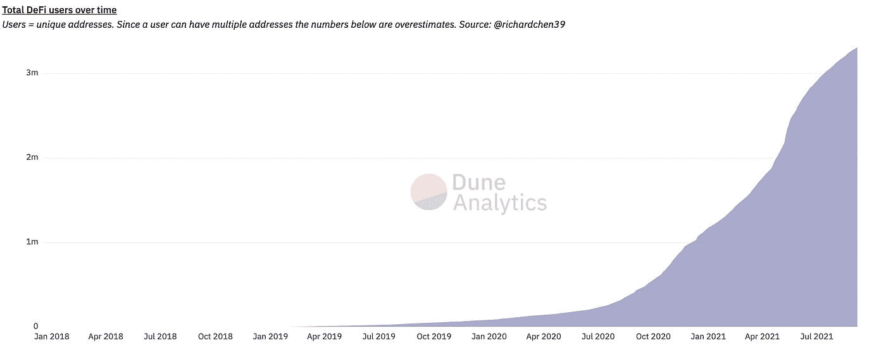

# DeFi 的夏天

> 原文：<https://medium.com/geekculture/the-summers-of-defi-8ea87b17615e?source=collection_archive---------13----------------------->

这是我写的关于加密生态系统进化的系列文章的第二部分。你可以在这里找到第一篇文章:[通过秘密的冬天了解去中心化的世界](/geekculture/understanding-the-decentralized-world-through-the-crypto-winters-edff53378d1a)

> 技术首先逐渐改变世界，然后突然改变。
> - [蒂姆·奥莱利](https://www.oreilly.com/radar/gradually-then-suddenly/)

# DeFi 的崛起

2020 年夏天，加密生态系统中发生了一些不寻常的事情。在一个加密货币的价格主导了大部分对话的领域，一种叫做分散金融(DeFi)的新现象开始以前所未有的速度吸引加密爱好者的注意。

DeFi 是一种总部位于区块链的金融形式，它使用智能合约来提供金融工具，而无需通过银行和交易所等传统中介。想象一个货币机器人，它的软件运行在对等网络上，而不是集中的服务器上，并在没有任何人或机构干预的情况下提供不同的服务，如借贷。

在不到两个月的时间里，YFI——一个 DeFi 协议的监管令牌——从每令牌 6 美元增长到了 3 万多美元。价值增长了 50 万倍。这一阶段被称为 2020 年的 *DeFi 夏季。*

[MakerDAO](https://makerdao.com/en/) ，一个去中心化的自治组织，被认为是 DeFi 的先驱。《做市商协议》利用超额抵押贷款创造了“戴”，一种与美元挂钩的稳定硬币。2017 年 12 月 DAI 推出时，DeFi 协议锁定的总价值约为 1 亿美元。今天，将近 1000 亿美元的加密资产被锁定在 DeFi 协议中。

[Source](https://defipulse.com/)

# 借出、借入、交易等等

DeFi Pulse 上列出了超过 150 个协议。协议的实际数量可能要高得多。这些协议反映了传统金融中存在的产品，但以非常不同的方式运作。

## 贷款协议

顾名思义，用户可以存放加密资产并获得收益，或者从协议中借用加密货币，以换取有利息的偿还。

早期困扰我的一个简单问题是，从这些协议中贷款的人是谁，为什么？这些通常是拥有加密资产的加密本地实体，如交易商、矿工和 Dao。例如，一家加密采矿公司可能对扩展其基础设施感兴趣，但不愿意清算其股份。相反，他们可以从贷款协议中获得贷款，为他们的扩张提供资金。

押金保存在与协议的智能合同中。作为回报，用户会收到一个计息令牌来跟踪他们借出的资金。这些代币是在存款时创建的，在存款兑现时被烧掉。例如，当你在一个流行的借贷协议 Aave 上存入 100 USDC 时，Aave 会发给你 100 澳元，这笔钱会转到你的钱包里。与传统的定期存款不同，这些代币是流动的，可以立即转让。这意味着当你向你的一个朋友转账 50 澳元时，从那时起，你的朋友将开始获得相当于 50 USDC 存款的利息。

该协议根据需求和供应实时计算存款人和借款人的利率以及借款人所需的抵押品。与传统银行的贷款不同，该协议没有明确的回收期，而是针对从协议池中借款的每个钱包维护一个健康系数。如果健康因素低于某个阈值，用户需要增加更多的抵押品或偿还一部分贷款。如果没有发生这种情况，抵押品会折价清算。这就是协议如何确保用户存款的安全。

贷款协议在过去几年里有了显著的发展。Aave、Maker Dao 和 Compound 是三个最大的借贷协议。管理着价值超过 250 亿美元的加密资产。客观来看，领先的新银行之一 Revolut 在 2020 年 12 月拥有 70 亿美元的资产。

## 分散交易所

分散的交易所或指数使得加密资产的交易不需要中央中介。集中式交易所通过做市商的帮助来撮合买家和卖家。相比之下，DEXes 通过使用个人和机器人创建的流动性池来实现交易。流动性池是作为协议的一对令牌进行的存款，然后可以用于交易目的。流动性提供者赚取一定比例的交易费。Uniswap 是领先的 DEX 之一，每天产生 100 万到 200 万美元的费用。

Uniswap、Curve Finance 和 Sushi Swap 是一些最大的指数。Uniswap 于 2018 年 11 月推出，目前每天的交易量约为 20 亿美元。相比之下，比特币基地每天的交易额约为 40 亿美元。

与集中交易相比，DEXes 是不受限制的，并且有更多的硬币在上面。DEXes 的收费通常也低于中央交易所的收费。此外，这些资产由你保管，不像集中交易所那样由交易所代表你保管。DEXes 是全球金融平台的真正体现，没有中央权威，任何人，在世界任何地方，只要有互联网连接和智能手机，都可以参与其中。

## 衍生产品和其他协议

除了借贷协议和交易所之外，还出现了从永久合同到保险的大量协议。Synthetix 是一个交易平台，它将真实世界的货币、股票和商品暴露给加密生态系统，而不必拥有底层资产。在 Synthetix 上，你可以交易黄金、苹果股票和比特币等资产。Nexus Mutual 以社区所有的形式提供保险。会员可以购买保险来保护自己免受智能合约失败的影响。

# 为什么要定义

加密货币让货币变得可编程。DeFi 提供了使社区走到一起并形成经济的基础。

DeFi 协议通常被称为*金钱乐高*。共同的基本原则是可组合性。人们可以将多种协议结合起来构建有趣的用例。一个简单的例子是一个加密交易员，他编写了一个程序，在 Uniswap 等指数上发现机会，从 Aave 获得贷款，完成交易，然后在几秒钟内偿还贷款。

我们把多余的钱存放在不同的工具中，这样那些比我们更知道如何使用它们的实体就可以利用它们了。当我们将储蓄存入定期存款时，传统银行会将它与愿意贷款扩张的公司联系起来。同样，当我们购买一只股票时，我们购买的是一家我们期望增长的公司的所有权。

一个强大的 DeFi 生态系统增加了资金的流动速度。

DeFi 的可编程方面使资金能够通过算法在多个个人和机构之间移动，从而使资金的移动(无论大小)自动化到最佳点。这也大大缩短了转移资金所需的时间以及资金在任何特定实体中停留的最短时间。

DeFi 协议的开放性质允许制造商-检查者过程。它确保可以进行独立审计，以确认协议确实如其所言。此外，它是分散的这一事实意味着没有一个实体能够影响协议的工作方式。

传统金融是科技推动的。在 DeFi，技术是一切的中心。DeFi 以更高的效率和自动化水平运行。由 dmitriy beren zon*所做的一项比较分析说明了制造商 Dao 的利润率(99%)与 Lending Club 的利润率(-50%)的对比。在指数和集中交易所之间也进行了类似的比较。例如，Uniswap 的交易量只有比特币基地的 70%，而员工却少了 33 倍。*

# *前进的道路*

*对于 DeFi 生态系统来说，现在还是非常早期的阶段。与处于婴儿期的加密货币领域非常相似，DeFi 受到了诈骗和协议的影响，导致数百万人丧生。在目前的状态下，这是一项不可思议的技术。但作为一个产品，它还有很长的路要走。*

*分享这一点后，我乐观地认为，随着时间的推移，这些障碍将被克服。与所有加密用户相比，DeFi 用户的数量虽然少得多，但正在快速增长。DeFi 用户数用了近两年时间达到 100 万，用了 5 个月达到 200 万，然后只用了 3 个月就达到了 300 万。虽然这只是一个近似值，但它说明了对 DeFi 的信任正在增长。*

**

*[Source](https://dune.xyz/rchen8/defi-users-over-time)*

*再看远一点，一个特别有趣的方面是将 DeFi 融入现实世界经济的途径。今天，DeFi 在很大程度上局限于加密本地人、机构和用例。我希望在未来，小企业可以在几秒钟内从这些协议中获得贷款，在这个交易所，世界上所有公司的股票都可以由任何人在任何地方进行交易，学生可以贷款完成他们的教育，而不必与官僚主义打交道。*

*分散的基础设施将创造一个经济联系更加紧密的世界。*

*如果你喜欢这个帖子，请给我几个掌声。这将有助于让更多的人看到这篇文章。请在评论中分享你的想法。我仍在学习空间，欢迎任何反馈。*

**另外，如果你觉得 DeFi 有趣，看看我们正在开发的新东西:* [*Brew*](https://brew.money)*

# *感谢*

*   *[Zoltan](https://unsplash.com/@zoltantasi) 为美图*
*   *感谢你在过去的几个月里耐心地向我解释 DeFi 的复杂性*
*   *[请点击](https://www.linkedin.com/in/pritesh123iit/)分享对草案的反馈*
*   *以太坊的 [Vitalik](https://twitter.com/VitalikButerin)*

***脚注***

*[1] [一个有息代币](https://aave.com/aTokens/)*

*[2] [Aave 风险参数](https://docs.aave.com/risk/asset-risk/risk-parameters#health-factor)*

*[3][AUM 革命报](https://assets.revolut.com/pdf/Revolut%20Ltd%20Annual%20Report%20YE%202020.pdf)*

*[4] [DeFi 在吃金融](https://newsletter.banklesshq.com/p/defi-is-eating-finance)【必读】*