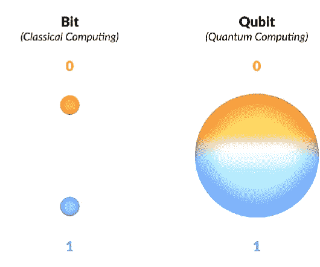
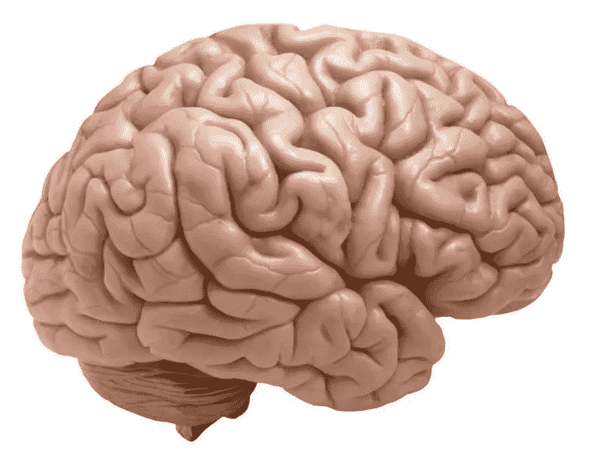

# 你可能从未听说过的超级计算机

> 原文：<https://medium.com/geekculture/the-supercomputers-youve-probably-never-heard-about-837fe69c674a?source=collection_archive---------17----------------------->

## 只需要 6 台电子数字计算机就可以满足整个美国的计算需求

…一个男人在 1947 年说的。公平地说，他们运行的程序可能只有*需要 6 台电脑。他们只是没有理解计算机的巨大潜力，就像我正在打字的这台。当时没有人能看到计算机的这种增长。*

## 经典计算机

你听说过苹果公司。嗯，他们生产笔记本电脑，如 Macbooks(疯狂，我知道，你完全不知道，我刚刚投下了一颗巨大的知识炸弹)。

[Credit](https://www.google.com/url?sa=i&url=https%3A%2F%2Ftechcrunch.com%2F2020%2F11%2F17%2Fmacbook-air-m1-review-the-right-apple-silicon-mac-for-most%2F&psig=AOvVaw049ZNaH7cUl_xUX0fxAeVP&ust=1616441740307000&source=images&cd=vfe&ved=0CAIQjRxqFwoTCOia2--Qwu8CFQAAAAAdAAAAABAb)

这是经典计算机的一个例子。经典计算机使用以 0(关)或 1(开)为单位存储的信息进行逻辑运算，称为经典位。

晶体管是计算机中最简单的数据处理器。负责人控制处理过程，并承担数据保护责任。对于我的生物爱好者来说，它有点像细胞膜。它控制信息通过/阻止/等等…

经典计算机似乎是天赐之物(我敢肯定提出上面这句话的人也是这么想的)，但是让我们来谈谈它们**到底有多烂**。
他们吮吸着下面的:

*   最佳化
*   化学——无法模拟一堆分子和电子，以及其他非常非常小的东西
*   指数级扩展——如阶乘！

为了解决这些问题，引入了超级计算机的概念。1998 年，世界上第一台超级计算机诞生了——大体上被认为是一台 ***量子计算机。***

什么？是吗？那个？

## 为什么是量子计算机？

量子计算机的工作方式与经典计算机略有不同。如前所述，经典计算机一次只能保持一个位置——0 或 1(称为经典位)。这是最棒的部分:量子计算机能够保存 0 和 1(我们将在后面详述)。这个概念被称为**叠加。**

量子计算世界中的完美是在下列情况下达到的:
***完美=低误码率+高量子位。***

让我们喘口气，把它分解一下。

## 什么是量子位？

一个量子比特扩展成→量子比特。它们的行为有点像人造原子。量子位通过微波电缆与其他量子位交流，微波电缆通过微波相互交流。量子比特出现在量子计算机中，就像比特出现在经典计算机中一样。量子计算机将叠加态分解成一系列 0 和 1，更具体地说，分解成 0 和 1 的*概率*。量子位将 0 和 1 编码成两种不同的量子状态。但是，由于量子位的行为是量子化的，我们可以利用“叠加”和“纠缠”现象。

[Credit](https://www.google.com/url?sa=i&url=https%3A%2F%2Fwww.semanticscholar.org%2Fpaper%2FQuantum-Superposition-of-Communication-Lines-Wenxu%2Fdecf3d0bc2822c6e15bbb38b4c5ff04b82b0a4b9&psig=AOvVaw3rYt_g4LzGRdP573K9OX-w&ust=1616441679843000&source=images&cd=vfe&ved=0CAIQjRxqFwoTCPC7sdSQwu8CFQAAAAAdAAAAABAJ)

## 什么是叠加？

叠加本质上是量子系统同时处于多个状态的能力——也就是说，某个东西可以同时“在这里”和“在那里”，或者同时“上”和“下”。例如，叠加意味着一个量子位可以同时是 0 和 1→导致垂直和水平极化。量子位存在于 0 和 1 之间的任何概率。

## 什么是纠结？

把这种现象想象成拼图的一部分，你根据你在拼图上找到的相似性把它们组合在一起。

比如，关于系统的一个特征可以帮助我找到系统的另一个特征。

纠缠是量子粒子之间存在强关联的现象。它说，两个或更多的量子粒子可以完美地联系在一起，即使相隔很远。

为了真正理解量子计算机的巨大潜力，我们来看看这些计算机处理数据的速度。

## 处理数据

**One petaFLOP** — 这种惊人的计算速度每秒可处理一千万亿次数据！相比之下，人类处理语音的速度约为 38 千万亿次。越想越觉得我们的大脑有多缺德！

Cool brain: [credit](https://www.google.com/url?sa=i&url=https%3A%2F%2Ftwitter.com%2Fneurosciencenew%2Fstatus%2F764158915298729984&psig=AOvVaw1u8SmehDDrMLZB_GQEvW72&ust=1616441800690000&source=images&cd=vfe&ved=0CAIQjRxqFwoTCJjssY6Rwu8CFQAAAAAdAAAAABAJ)

另一方面，与科技相关的东西相比，世界上最快的计算机是 93 petaFLOPS！

## 量子位:更深入的观察

虽然量子位元可以以任何状态组合存在，但是当它们被测量时，必须落入其中一个基本状态。信息丢失前状态的所有其他信息。

把它想象成抛硬币。在这个过程中，你真的不知道它会正面还是反面着陆。当它还在旋转时，它似乎在两种状态之间切换；正面和反面。然而，一旦它着陆了，它就做出了决定。

[Credit](https://www.google.com/url?sa=i&url=http%3A%2F%2Fwww.alaricstephen.com%2Fmain-featured%2F2017%2F9%2F6%2Fflipping-a-coin-is-not-5050&psig=AOvVaw3gYYbB46pJ3aZ1VGHt4ErH&ust=1616441897434000&source=images&cd=vfe&ved=0CAIQjRxqFwoTCLiKyb6Rwu8CFQAAAAAdAAAAABAD)

量子比特是由亚原子粒子组成的，这使得它们能够表现出奇怪的量子属性，而不像比特那样遵循经典规则。

[Credit](https://www.google.com/url?sa=i&url=https%3A%2F%2Fwww.npr.org%2F2020%2F10%2F16%2F924586088%2Fquantum-mechanics-for-beginners&psig=AOvVaw2PiY4k3g9DWGrGhiHnekNK&ust=1616441639544000&source=images&cd=vfe&ved=0CAIQjRxqFwoTCJCHjMCQwu8CFQAAAAAdAAAAABAD)

然而，要完全绘制量子计算机，重要的是要有量子力学和/或量子物理学的基础。量子力学是在亚原子水平上研究我们宇宙最小部分行为的领域。奇特的事情发生在仍在被发现的量子领域，例如重力如何与粒子相互作用。

# 个人笔记

查看我的[**LinkedIn**](https://www.linkedin.com/in/fatimah-hussain/)[**insta gram**](https://www.instagram.com/fxtimxhh/?hl=en)，关注我的 [**中**](/@fatimahandhussain) 。我最近发布了我的 [**网站**](https://fatimahhussain.com/)**；**来看看吧！当我写这些文章的时候，我总是付出 100%的努力和奉献，所以我希望你过得愉快！敬请关注，点击“关注”按钮，获取每周更新和引人入胜的项目！