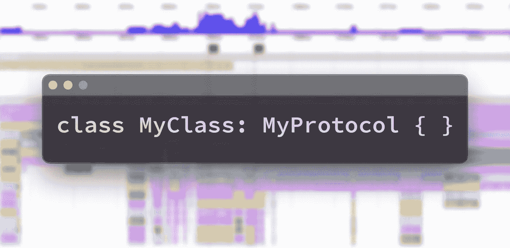
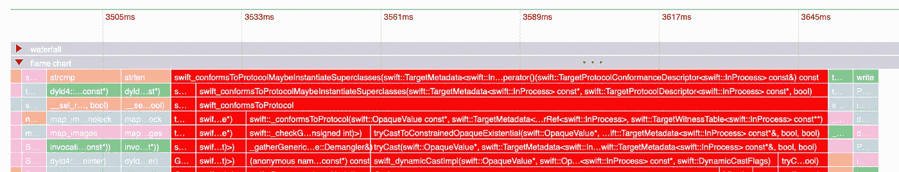
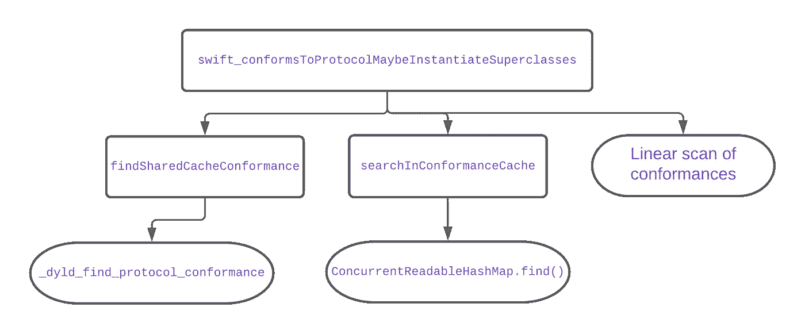
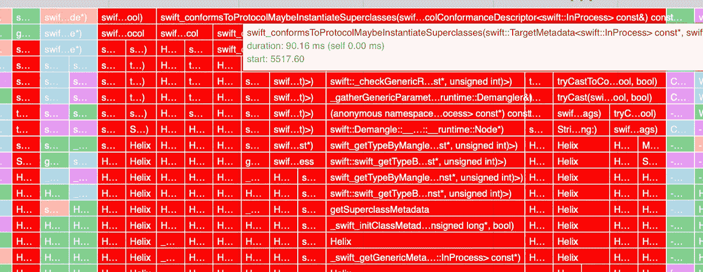
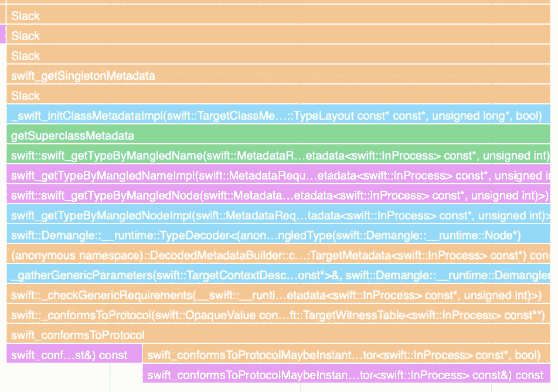

# Swift 协议一致性的惊人成本

> 原文：<https://medium.com/geekculture/the-surprising-cost-of-protocol-conformances-in-swift-dfa5db15ac0c?source=collection_archive---------4----------------------->



在我的[上一篇](https://www.emergetools.com/blog/posts/SwiftReferenceTypes) [两篇](https://www.emergetools.com/blog/posts/iOS15LaunchTime)文章中，我写了关于 pre-main 启动时间，以及应用程序大小如何直接影响 dyld 初始化应用程序的工作量。在这篇文章中，我将仔细研究 Swift 运行时特性，协议一致性检查，看看这个常见的操作是如何随着二进制文件大小的增加而减慢 post-main 时间的。

这可能是引起应用性能担忧的第一个暗示来自于 [Swift 5.4 发行说明](https://www.swift.org/blog/swift-5-4-released/):

> *在 Swift 5.4 中，由于采用了更快的哈希表来缓存之前的查找结果，运行时的协议一致性检查速度明显加快。特别是，这加速了通用运行时* `*as?*` *和* `*as!*` *的造型操作。*

协议一致性检查是指运行时需要查找变量是否符合协议。在你的代码中，这看起来像`myVar as? MyProtocol`。注意`as?`操作也可以用于将变量转换为非协议类型，这些不会导致协议一致性检查。这是 Swift 运行时动态特性的一部分。`as?`操作符表明在编译时不保证类型将会付出运行时代价。

从发行说明中我们知道`as?`的运行速度很慢，有“显著”加快的空间，但是它们到底有多慢呢？既然更快的缓存加快了它的速度，那么我们什么时候会达到未缓存状态，速度有多慢？我在 Emerge 中使用了[应用启动时间可视化](https://docs.emergetools.com/docs/startup-flame-chart),看看这是否会出现在 Swift 应用的堆栈跟踪样本中...果然...👀现场报道。你可以在下面看到`swift_conformsToProtocol`花费了 100 多毫秒的应用程序启动时间。



让我们看看 Swift 的源代码，看看是什么原因导致速度变慢，以及在实践中需要多少时间。然后，我们将讨论在您的应用中避免这种情况的策略，甚至实现 Swift 运行时的更快替代。

# 检查协议一致性时会发生什么？

我们调查的切入点是 [Mike Ash 的 PR](https://github.com/apple/swift/pull/33487) ，它实现了在 Swift 5.4 中发布的 13 倍快缓存。从这里您可以看到新缓存的定义位置:

```
**struct** **ConformanceState** {
   ConcurrentReadableHashMap<ConformanceCacheEntry> Cache;
...
```

代码的最新版本是函数`swift_conformsToProtocolMaybeInstantiateSuperclasses`中的[protocol conformance . CPP](https://github.com/apple/swift/blob/aec4ec4c4a0f647ae6670745cd389aba767f3111/stdlib/public/runtime/ProtocolConformance.cpp#L865)，其中大部分时间是基于启动时间可视化花费的。这个函数有三个高级路径，创建一个 2 级缓存，然后是一个较慢的一致性全搜索。



*   `_dyld_find_protocol_conformance`:在查询 Swift 5.4 中增加的 ConcurrentReadableHashMap 之前，运行时会检查一个 dyld 管理的缓存。据推测，这允许在应用程序启动之间保持缓存。iOS 15 中增加了对这种缓存的支持，你可以使用`nm /usr/lib/dyld | grep _dyld_find_protocol_conformance | c++filt`确认 dyld 中是否存在该功能。不幸的是，Swift 是从 dyld_priv.h 导入的，所以在苹果发布最新操作系统版本的源代码之前，我们无法看到它的实现。您可以在这个函数上设置一个符号断点，并在测试应用程序中验证在使用`as?`时它总是被调用。这似乎是一项正在进行的工作，因为在实践中，总是会查询第二个缓存(使用另一个符号断点进行验证)。
*   `ConcurrentReadableHashMap.find()`接下来，运行时检查 Swift 5.4 中添加的缓存，这是一种内存缓存，不会在应用程序的多次运行之间持续存在。您可以通过在`_ZN5swift25ConcurrentReadableHashMapIN12_GLOBAL__N_121ConformanceCacheEntryENS_11StaticMutexEE4findINS1_19ConformanceCacheKeyEEENSt3__14pairIPS2_jEERKT_NS4_12IndexStorageEmS9_`上放置一个符号断点来验证它是否被调用。这是接受一个`ConformanceCacheKey`并返回一个`ConformanceCacheEntry`的函数的 C++代码[1]名称。查看缓存键的定义，我们可以看到它是基于一致性类型和协议的

```
**struct** **ConformanceCacheKey** {
  const Metadata *Type;
  const ProtocolDescriptor *Proto;
```

这意味着缓存键是特定于该类型/协议对的，对同一协议的多次一致性检查，但不同的类型(反之亦然)不会命中缓存。这也可以用符号断点来验证。

*   线性扫描是最坏的情况，但是在填充缓存之前，总是对每个类型/协议对进行线性扫描。Swift 创建了一个特殊的 mach-o 部分`__TEXT.__swift5_proto`,它是指向二进制文件中每个协议一致性记录的指针列表。为每个类型/协议对生成一致性记录，并允许运行时确定应用程序中的一致性。这种二进制元数据是 Emerge Tool 的分析工作的基础，我们使用它来将源代码的一部分归入二进制大小。[2]对您的应用中加载的每个 dylib 进行所有符合性扫描，包括框架或系统库，如 Swift 标准库本身。这意味着单个一致性查找是 O(n ),查找每个可能的一致性是 O(n^2)，这对性能不好！

# 到底有多慢？

我们现在看到，协议一致性查找的速度取决于应用程序中一致性的数量。这将受到您链接到多少 Swift 库以及您在自己的代码中包含多少一致性的影响。`otool -l Helix.app/Helix | | grep _swift5_proto -A 4`告诉我们优步的应用程序有一个 411200 字节的协议一致性部分。每 4 个字节是一个相对指针，所以 411200/4 = 102800 个一致性。基于此，我实验的测试平台是一个 100k 一致性的应用程序。这些类是编码的，每个都符合相同的协议。所有测试都是在运行 iOS 15.1 的 iPhone 7 上进行的

测试 1:第一次一致性检查第一次执行一致性检查时，包含协议运行时元数据的应用程序二进制文件部分的所有虚拟内存都需要分页。对于 100k 一致性来说，这是一个巨大的成本，并且使得第一次一致性检查慢得多，在我的测试中大约 20 毫秒。

测试 2:高速缓存未命中如果第二次一致性检查是针对新类型的，则它将未被高速缓存，并且仍然需要完全扫描一致性，但是这一次它不会导致任何页面错误。在我的测试中，这花费了大约 3.8 毫秒。这可能看起来不多，但它已经是 60fps 设备上帧之间 16 毫秒的 23%。当执行多个未缓存的协议检查时，这些会增加大量的时间。

测试 3:缓存命中为了测量`ConcurrentReadableHashMap`的时间，我们简单地在一个循环中做同样的`as?`操作，并平均它所花费的时间。正如所料，它非常快，大约 0.0004 毫秒。一旦缓存被填充，协议一致性检查就不是性能的主要瓶颈，这就是为什么当缓存为空时，在应用程序启动期间会特别成问题。

测试 4:否定结果为每个一致性运行的运行时循环有一个[早期返回](https://github.com/apple/swift/blob/aec4ec4c4a0f647ae6670745cd389aba767f3111/stdlib/public/runtime/ProtocolConformance.cpp#L936)，如果被检查的协议不等于一致性记录中的协议，它可以避免大部分工作。为了测试这一点的影响，我测量了在一个协议上运行一致性检查所需的时间，该协议与我生成的 100k 个类不一致。这仍然花费了相当长的时间，0.9 毫秒，但是这个最佳情况时间是之前最差情况的时间。

这些测试为您将看到的协议一致性检查的变化提供了一些见解，但为了真正了解它们的影响，我从 app store 上传了几个大型 Swift 应用程序到 Emerge，并使用倒置的 flamegraph 视图来大致估计应用程序启动期间检查协议一致性所花费的时间。优步、DoorDash 和 Grab 等应用的一致性检查持续超过 100 毫秒。



# 这是什么时候发生的？

我们已经看到，当执行`as?`操作时，应用程序为缓慢的一致性查找付出了代价，但是使用`as!`也会遇到同样的性能损失。当您使用`as!`时，Swift 会验证是否满足协议，并总是中止或继续。

泛型类型元数据是协议一致性检查的另一个来源。您将会遇到代码如下所示的一致性查找:

```
**class** **Test**<**T**: **Decodable**> {}
**let** _ = Test<Int>.**self**
```

Joe Groff 在[这个线程](https://forums.swift.org/t/understanding-code-that-leads-to-swift-checkgenericrequirements-calls/35128)中解释说，Swift 从二进制文件中一个损坏的名称中为该类型生成运行时元数据。这种分离需要一致性查找。您可以在 Swift 应用程序启动中经常看到这种堆栈跟踪，下面是一个通过 Emerge Tool 的应用程序启动工具启动 Slack 应用程序的示例:



JSON 解码和字符串插值都会导致`as?`操作。字符串插值调用 [_print_unlocked](https://github.com/apple/swift/blob/85d9507fde3deb5889f71f81f09a05319898b029/stdlib/public/core/OutputStream.swift#L404) ，它有 3 个一致性检查并使用`Mirror`，在内部执行更多的一致性检查。这种综合效应对应用程序的性能是一个巨大的打击。

# 帮助提高应用性能的策略

通过协议一致性检查提高 app 性能的两种方法是最小化一致性和`as?`操作的数量。Emerge Tool 的应用程序大小分析可以帮助解决这两个问题。众所周知，应用程序的大小是应用程序质量的一个主要指标，这一点在协议一致性案例中得到了清晰的证明。通过关注二进制文件大小的减少，你将从你的应用中移除一致性，并使运行速度更快。

在你的应用程序中，一个唾手可得的结果就是删除那些只用于在单元测试中提供存根实现的协议。这些可以从应用程序的发布版本中编译出来，以避免它们包含在运行时元数据中。

> **提示:**在 Objective-C 领域，今年早些时候有一个属性被添加到 clang 中`objc_non_runtime_protocol`，它指示编译器不要为协议发出任何元数据。如果您知道该协议只在编译时使用，这将减少应用程序的大小并提高运行时性能。更多细节可参见[属性参考](https://clang.llvm.org/docs/AttributeReference.html#objc-non-runtime-protocol)。

使用 Instruments 或 Emerge startup time visualization 等工具分析应用程序，可以帮助您识别应用程序中最常使用一致性检查的位置。然后你可以重构代码来完全避免它们。考虑这些例子:

在第二种情况下，只要编译器知道调用点的事件类型，它就会完全避免动态强制转换。

作为一个具体的例子，[这个提交](https://github.com/noahsmartin/lottie-ios/commit/3d3deed0d47f2c10abebdc029c41168b4c9f9f88)重写了动画框架 Lottie 中的一小部分代码，以避免 22 个可能的一致性检查。有 11 种动画节点类型，根据加载的动画类型，每种类型都可以使用 2 种协议进行检查。这种改变很容易绕过动态强制转换，允许编译器保证协议一致性。

# 实现更快的运行时

在最底层，app 二进制文件将协议一致性存储在一个列表中，因此如果不对整个列表进行 O(n)扫描，就无法进行完整的一致性检查。然而，这并不意味着我们不能将列表转换成更适合我们需求的数据结构。由于协议一致性检查占用了如此多的应用程序启动时间，我们可以完全绕过运行时，制作我们自己的数据结构，以实现更快的一致性检查。这就是我们所做的。

zconform 背后的概念是急切地加载所有可能的协议一致性，并将它们存储在由内存中的协议地址控制的映射中。每个条目的值是保存所有符合类型的地址的集合。如果在缓存中没有找到给定的类型，我们知道一致性不可能成功，可以在没有`as?`操作符的情况下提前返回`nil`。

Zconform 初始化使用`getsectiondata`为每个 mach-o 映像检索`TEXT.__swift5_proto`的地址和大小，然后按照指针链构建一个`unordered_map`作为缓存。

为了检查一致性，使用 unsafeBitCast 将输入类型转换为它们的运行时表示。通过检查 swift ABI 可以找到这些类型在内存中的表示，例如[ExistentialTypeMetadata](https://github.com/apple/swift/blob/e65ae80172ade4120ef51c100e1a69026866936e/include/swift/ABI/Metadata.h#L2059)。由于您可以编写像`typealias MultipleProtocols = MyProtocol1 & MyProtocol2`这样的协议，我们循环检查协议一致性的数量，并验证每一个。[3]

这个例子中省略了一些细节，但是这些都可以在 [GitHub 项目](https://github.com/EmergeTools/zconform/blob/main/ZConformDemo/ZConform/ZConform.swift#L107)中找到。

我的基准测试显示，构建这个缓存需要 3 毫秒的开销。如果您的使用模式与这里优化的相匹配，许多一致性检查可能会导致`nil`，它可以完全消除我们之前测量的`as?`的最坏情况 3.8 毫秒。该项目是一个概念验证，仍然有一些功能是全面推广所必需的。它只支持检查结构与非类绑定协议的一致性。

*支持更多的情况下可以添加，如果你有兴趣使用这个为你的应用程序你可以* [*取得联系*](mailto:team@emergetools.com) *与* [*涌现*](https://emergetools.com) *团队。*

[1]符号[名称变换](https://en.wikipedia.org/wiki/Name_mangling)将人类可读的功能名称转换为存储在二进制符号表中的格式。

[2]当我们构建自己的一致性检查函数时，会有更多关于运行时元数据布局的细节，但如果你对二进制文件中元数据的所有细节感兴趣，请查看 Scott Knight 的这篇[帖子。](https://knight.sc/reverse%20engineering/2019/07/17/swift-metadata.html)

[3]关于这些运行时元类型的介绍以及存在和协议之间的区别，请参见 Bruno Rocha 的[这篇文章](https://swiftrocks.com/whats-type-and-self-swift-metatypes)。