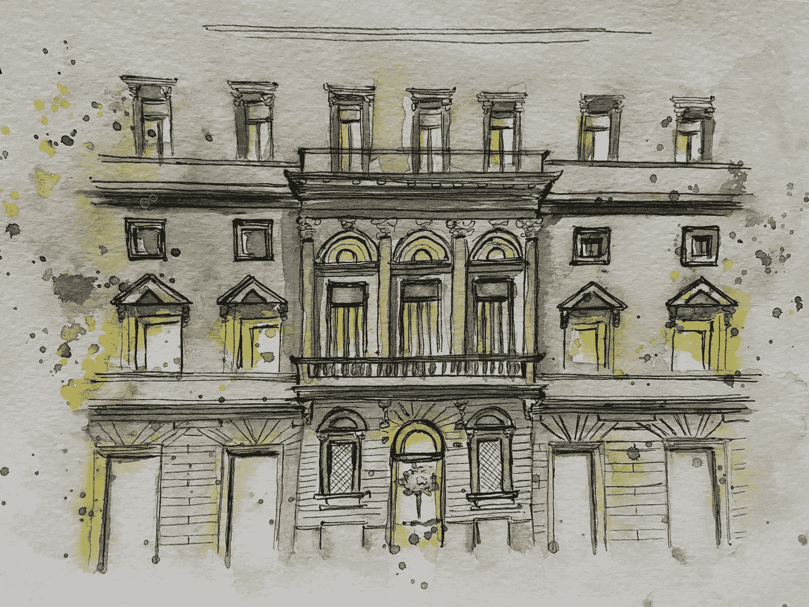
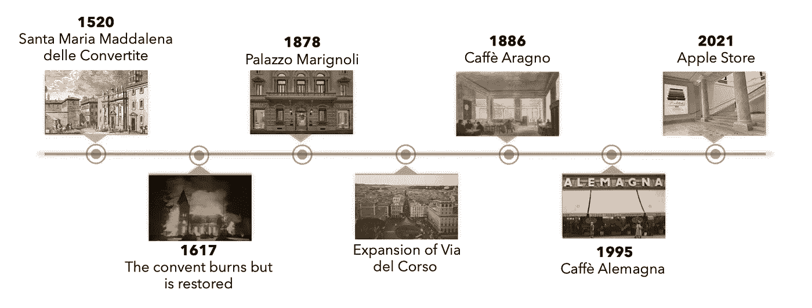
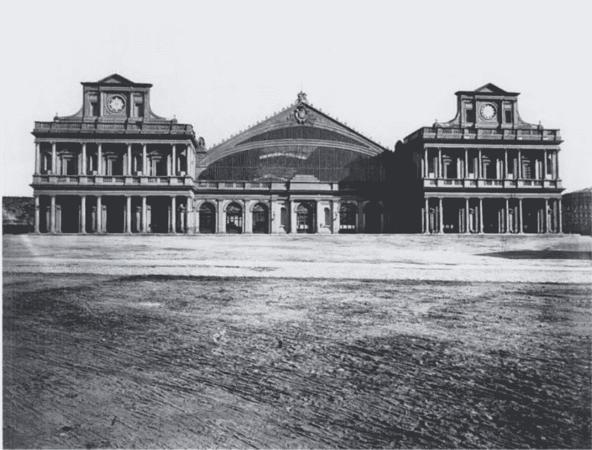
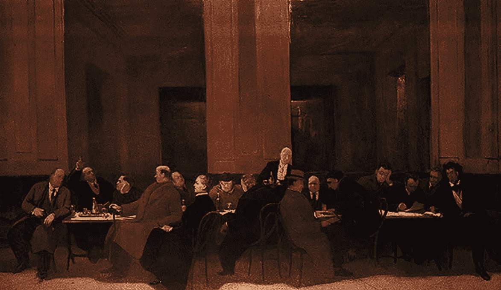
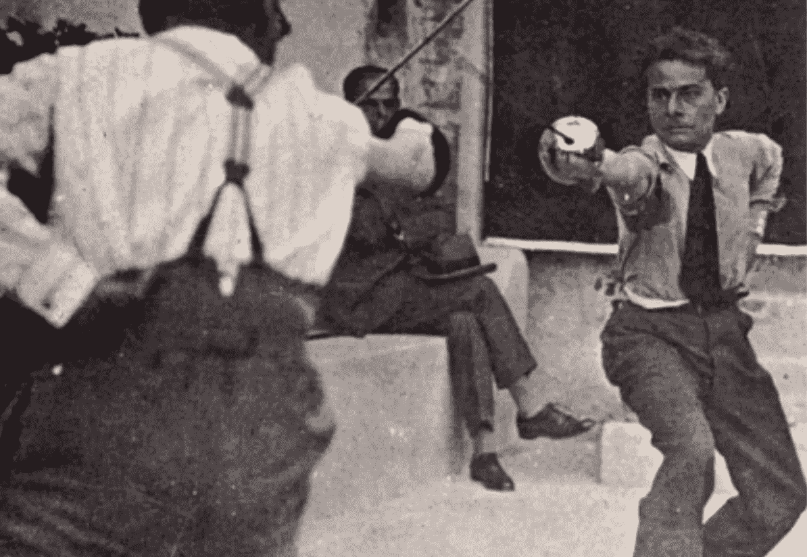
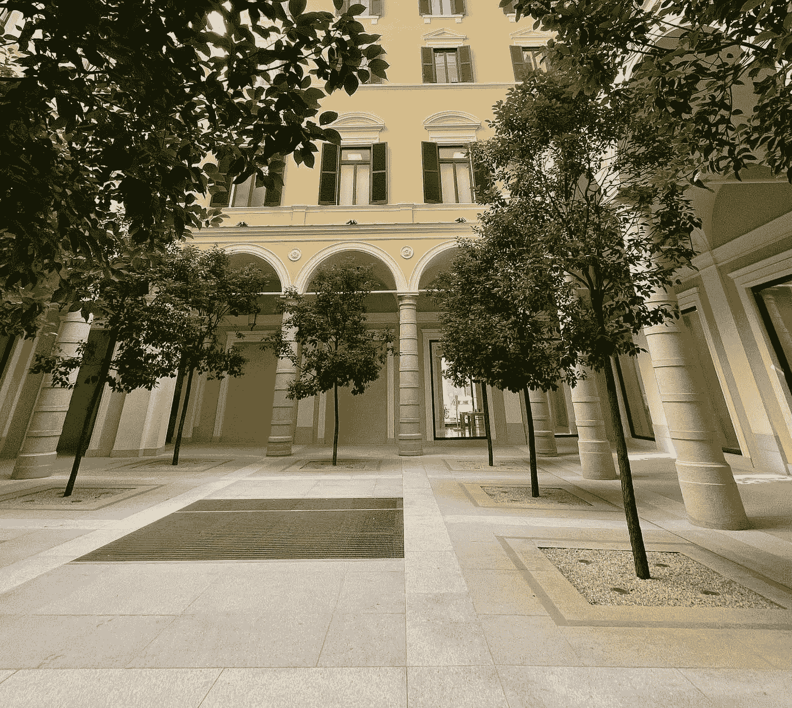

# 苹果修复这座 19 世纪建筑的令人惊讶的原因

> 原文：<https://medium.com/geekculture/the-surprising-reason-why-apple-restored-this-19th-century-building-71255be7e3d4?source=collection_archive---------65----------------------->

## 艺术

## 以及其背后更令人惊讶的历史

Photo taken and painted by author

位于罗马 Via del Corso 180 的苹果新店不仅仅是一家店。

走进去，映入眼帘的是一个巨大的庭院，茂盛的樟树与白色石柱并列，让人想起 19 世纪的宫殿。

在这个庭院的西边，你会发现一个巨大的楼梯，有丰富的装饰和一个目镜。在你忘记自己是在苹果商店之前，你会发现自己在一条长长的走廊上，这条走廊连接着该公司的零售店、论坛空间和天才吧。

在 Foster + Partners 的帮助下，苹果修复了 Marignoli 宫，成为其在意大利的第 17 家店铺。这不是苹果第一次这样做了——以前的修复包括[卡耐基图书馆](https://www.apple.com/retail/carnegielibrary/)、[香榭丽舍大街](https://www.apple.com/fr/retail/champs-elysees/)和[摄政街](https://www.apple.com/uk/retail/regentstreet/)。

如果一想到 19 世纪宫殿里的电子商店就让你犹豫，你不是唯一一个。对我来说，这似乎很奇怪，这促使我研究这座宫殿的起源，以揭示是什么让它如此特别。

当一个人研究一个地方的历史时，他期望发现有趣的故事——它为什么被建造，谁建造了它，在它的轨道上的人们的生活如何。我对马利诺里宫的发现完全出乎意料。我意识到我根本不是在读一个地方的历史。

我们认为地方是静止的，但实际上它们是我们在时间旅行中最接近的体验。马利诺利宫的历史不是一部而是三部。这是它之前和之后的故事。几个世纪的生活；浓缩成一个点。在 Via del Corso 街 180 号。

1.圣玛丽亚·马达莱娜·德勒·卡维特

马利诺里宫是以菲利普马利诺里的名字命名的，菲利普马利诺里是一位政治家、银行家、钱币收藏家和业余建筑师，他在 1878-1883 年间参与了这座宫殿的建设。但在它成为 Marignoli 宫之前，它是 Santa Maria Maddalena delle Convertite，一座建于 15 世纪的修道院，有着非常特殊的用途。目的？收容悔过的妓女，她们希望以皈依妇女的身份通过生活来“偿还”她们的罪恶。这个俱乐部是如此的排外，以至于连老弱病残都被拒之门外，以免他们转向修道院作为最后的避难所，作为一种便利而不是真正的忏悔。

修道院在 1617 年被烧毁，后来才得以修复，但到了 18 世纪，修道院已经被取缔了。

2.马里尼奥利宫

又过了大约 100 年，菲利普·马利诺里被提名为意大利王国的参议员。菲利波侯爵认为一个住所对他这样的人来说是远远不够的。也不是六个、七个或八个。Marignoli 宫——第三座这样命名的宫殿，也是 Marignoli 家族的第九个庄园。

负责设计的建筑师是萨尔瓦托·比安奇，他是 T2 火车站的建筑师，也就是罗马火车站的建筑师。

Stazione Termini, Rome

几年后，由于 Via del Corso 街的扩建，门面不得不拆除，由另一位建筑师 Guilio Podesti 负责。

3.阿拉格诺咖啡馆

然而，科尔索街 180 号最出名的地方甚至不是马利诺里宫。从 1886 年到 1995 年，这座宫殿是阿拉格诺咖啡馆的所在地。

在咖啡馆旁的一个午后，你不会惊讶地发现何塞·卡洛斯·马里亚特吉(他那个时代最有影响力的拉丁美洲社会主义者之一)和罗伯托·布拉克(6 次获得诺贝尔文学奖提名)等人在激烈的辩论中疯狂地打手势。阿拉格诺咖啡馆是记者、艺术家、作家、演员和其他艺术家的最爱，以至于咖啡馆的第三个房间[被命名为](https://it.wikipedia.org/wiki/Caff%C3%A8_Aragno)文学、艺术和新闻的圣地*。*

亚美利哥·巴托利的一幅画最能体现这个地方的重要性。这幅名为 *Gli Amici al Caffè* 和的作品荣获威尼斯双年展大奖，在罗马的国家美术馆展出。

*Gli Amici al Caffè, by* Amerigo Bartoli

[传说](https://www.macstories.net/stories/a-palazzo-reborn-inside-apples-stunning-new-store-in-via-del-corso-rome/)意大利著名作家兼诗人马西莫·邦坦佩利(Massimo Bontempelli)与朱塞佩·恩加雷特(Giuseppe Ungaretti，画中左七)发生了激烈的争论，导致恩加雷特的脸颊红肿刺痛。Ungaretti 像任何正常人一样回应——他向 Bontempelli 挑战决斗。那时候，虽然决斗是不允许的，但只要是闭门进行的决斗都是可以容忍的。诗人兼剧作家路易吉·皮兰德娄非常乐意为这一盛会提供他的别墅。

舞台已经搭好，演员们各就各位。穿着配有领带和吊带的正装，诗人们身兼剑士，一决雌雄。

Duel between Ungaretti and Bontempelli

Ungaretti 输了。

他很幸运，这不是一场生死决斗。Bontempelli 离开了，对这次抽血感到满意，这样他以后就可以去杀人了。开玩笑，决斗后他们就和好了。

在繁荣的 20 年代，墨索里尼以前的朋友，咖啡馆的老板 Guiseppe Aragno，得到了一个启示。这深深地困扰着他，他不仅对他现在的前朋友的政权表示了敌意，而且离开了这个国家，在美国度过了他的最后几天。这一启示来自马特奥蒂案。1924 年，吉亚科莫·马泰奥蒂，社会主义联合党(Partito Socialista Unitario)的秘书，也是一名反法西斯政治家，被亚美利哥·杜米尼领导的法西斯小队绑架并杀害。这一罪行被认为是墨索里尼亲自下令的。

1955 年，阿拉格诺咖啡馆更名为阿莱马格纳咖啡馆，并一直延续到 2014 年。也就是说，直到苹果(与 Foster + Partners)拿起旧凿子，从中凿出一个苹果商店。

修复向宫殿丰富的遗产致敬，庭院中的樟树让人想起 16 世纪的女修道院，20 世纪初的大型天花板画，以及建筑艺术咖啡馆时代的艺术品。

Camphor trees in the courtyard. Picture Credit: [macstories.net](https://www.macstories.net/stories/a-palazzo-reborn-inside-apples-stunning-new-store-in-via-del-corso-rome/)

所有这些历史最终形成了现在的苹果商店，它还将创造另一个历史。正如科技设备商店对我们来说是一种常态，16 世纪的修道院、19 世纪的皇家庄园和革命时期的政治咖啡馆也是如此。

想想你住的第一所房子，你肯定会有与它相关的强烈记忆。你吃早餐的那张桌子，放学后你坐在电视机前的那些下午，你用蜡笔画的墙，直到一些成年人发现你。但在它成为你的房子之前，几十年前，甚至几个世纪前，它是什么呢？还有谁(现已去世)对那个地方有自己特殊的记忆？