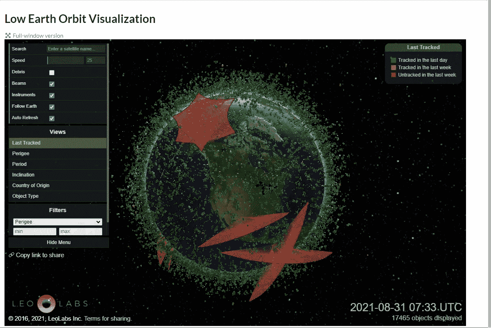

# 近地轨道令人惊讶的状态

> 原文：<https://medium.com/geekculture/the-surprising-state-of-low-earth-orbit-a53297a82261?source=collection_archive---------18----------------------->

## 新技术需要跟踪服务，企业也在做出响应。

Screenshot by the author — [Leolabs](https://www.leolabs.space/) Fair Use. — See the end of this article for terms

最近，我发现了一个很酷的网站叫 Leolabs。

这完全是一个惊喜，改变了我对地球的看法。我们的低地球轨道上挤满了各种各样的物体。