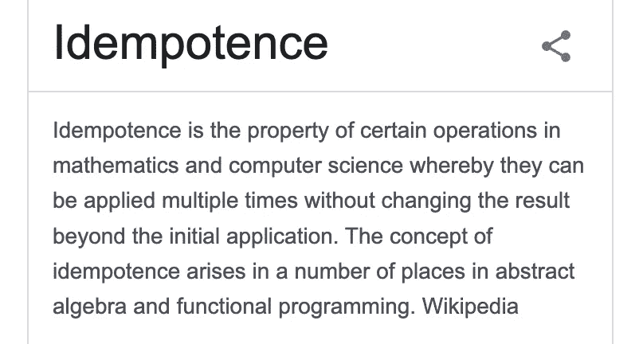

# 大学没教我的系统设计理念

> 原文：<https://medium.com/geekculture/the-system-design-concept-that-university-didnt-teach-me-7e7726031a43?source=collection_archive---------15----------------------->

> 幂等性。

当我第一次在工作场所遇到这个术语时，我完全糊涂了。

然后我继续在谷歌上搜索，搜索结果告诉我:

好的…但是我还是不太明白这和公司的业务有什么关系？