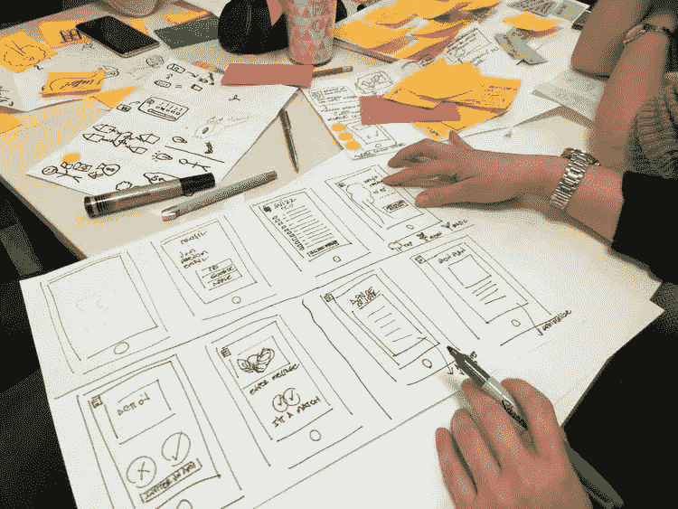

# 系统设计面试

> 原文：<https://medium.com/geekculture/the-system-design-interview-a9f06286c2fa?source=collection_archive---------15----------------------->

系统设计[面试](https://blog.pragmaticengineer.com/preparing-for-the-systems-design-and-coding-interviews/)是 BigTech 面试环节的主要内容。在系统设计面试中，你的工作是设计一个复杂的系统，比如 YouTube 这样的视频平台。您不需要编写任何代码。相反，您关注的是高级架构，并讨论设计的可伸缩性等方面。

通常，只有稍微资深的候选人才能得到这次面试机会。假设您需要…