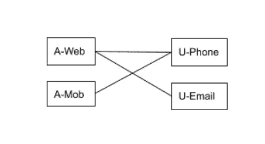
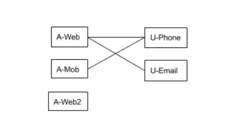
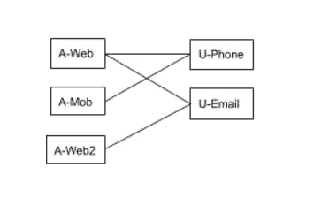

# 身份图和身份解析的故事

> 原文：<https://medium.com/geekculture/the-tale-of-identity-graph-and-identity-resolution-508fc87ac1d9?source=collection_archive---------0----------------------->

在我们之前关于 Mobil e 的[游戏分析的文章中，我们展示了如何使用](https://rudderstack.com/blog/rudderstack-case-study-casino-game-analytics/)[ruder stack](http://www.rudderstack.com)构建一个开源分析解决方案。正如文章中所强调的，理解用户对每一项分析都至关重要。因此，有必要将事件或活动与生成这些事件的个人用户联系起来。分析平台有助于收集这些数据。不幸的是，在用户经常匿名浏览或使用多个身份(例如，电子邮件、电话)使用同一产品或从不同设备和渠道访问的情况下，这并不是小事。ID 解析的问题是尽可能以保护隐私的方式将这些不同的身份联系在一起。身份图有助于更好地理解这些关系。

这篇博客是关于这个主题的两部分系列的一部分。第一部分描述了问题，而第二部分描述了解决问题的可能方法。

# 现实生活中的场景

为了进一步激发这个问题，考虑一个用户在电子商务平台上的简单旅程。

*   用户在这台笔记本电脑上访问网站，匿名浏览某些产品*，然后离开而没有购买。*
*   *他在他的移动设备上安装了电子商务应用程序，通过提供他的*电话号码*登录，但是没有购买就离开了。*
*   *用户回到网站并进行购买。在这个结账过程中，他用他的*电子邮件*注册，并提供他的*电话号码*来接收通知。*

# *不同的用户标识符*

*假设电子商务平台正在使用像 RudderStack 这样的 CDP 来收集所有的用户活动数据。此外，电子商务平台使用 RudderStack 将这些数据转储到一个仓库中，如 Snowflake。每个事件都与一个用户标识符*相关联。用户标识符可以由应用程序显式设置，也可以由 RudderStack 自动分配，或者两者都有。例如，在上述事件序列中，将使用以下标识符:**

*   ***步骤 1** :由于用户没有提供任何用户标识，RudderStack 会关联一个`anonymousID`。姑且说`A-Web` : `A`代表匿名。在这之后，RudderStack 将把这个 ID 保存为一个 cookie。所有事件都将与`A-Web`相关联。RudderStack 将以`A-Web`作为用户 ID 将事件转储到数据仓库中。*
*   ***步骤 2** :与上面类似，RudderStack 会在移动设备中创建一个 ID。姑且称之为`A-Mob`，保存在本地存储。用户注册前的所有事件都会关联到`A-Mob`。一旦用户用他的电话号码(`U-Phone` *)* 登录，我们将能够关联这两个标识符。我们将知道 ID `A-Mob`和电话号码`U-Phone`属于同一个用户实体。*

> ****注意*** *: RudderStack 不会自动捕获电话——电子商务应用程序必须通过* `*identify()*` *调用显式设置它，并传递 ID* `*U-Phone*` *。* `*identify()*` *调用在两个 id*`*U-Phone*`*和* `*A-Mobile*` *之间形成关联。RudderStack 又可以将这个关联保存到数据仓库中。**

*   ***步骤 3** :与步骤 2 类似，RudderStack 会将事件与自动分配的 ID `A-Web`关联起来。稍后，当用户提供电子邮件(`U-Email`)和电话号码(`U-Phone`)时，RudderStack 将使用`identify()`调用将这些与 ID `A-Web` 相关联。*

# *身份图*

*下图捕捉了由上述 id 形成的关联。如前所述，`identify()`调用创建了图中的边。该图表明，已知这两个 id 与同一个最终用户相关联。节点代表身份，而边代表 id 之间的关联。比如我们知道用户用自己的邮箱登录时，RudderStack ( `A-Web`)分配的`anonymousID`和用户邮箱地址(`U-Email`)是一样的。*

**

*Identity graph at the end of steps 1–3*

*人们应该能够将所有的 web 事件(在步骤 1 和 3 中收集的)和移动事件(在步骤 2 中收集的)关联为源自单个终端用户。实现这一点的一种方法是在所有这些单独的 ID(`A-Web`、`A-Mob`、`U-Phone`和`U-Email` ) *、*之间创建一个映射，成为一个单独的*、*虚拟用户 ID。您可以将所有事件与这个虚拟用户 ID 相关联。您可以通过在事件表(具有单独的 ID)和 ID 到虚拟 ID 映射表之间进行连接来实现这一点。*

# *身份图不是静态的*

*这种身份关联可以随着时间的推移而演变。假设用户在第三个设备上——他的办公桌面上访问同一个电子商务网站。如果他不同步他的笔记本电脑和办公室桌面之间的 cookies，系统将把第三个 ID 与他相关联。让我们称这第三个 ID 为`A-Web2`。*

**

*Identity Association with A-Web2*

*此时，我们不知道这个 ID ( `A-Web2`)是否与同一个人相关联。但是，一旦他使用此电子邮件登录，就会形成关联，如下图所示。*

**

*Identity Association with A-Web2*

# *分配虚拟 id*

*ID 解析的目标是采用如上的身份图，并将虚拟用户 ID 与所有节点相关联。这种关联使得直接或间接(通过中间节点)相互连接的节点被分配相同的虚拟 ID。*

*您可以通过在标识图上运行连通分量算法来实现这一点。连通分量算法从随机节点开始，并运行图遍历算法(如深度优先搜索或广度优先搜索)来识别从开始节点可到达的所有节点。因为所有这些节点都是连接的，所以系统需要为它们分配相同的虚拟用户 ID。然后，该算法从先前遍历中未触及的另一个节点开始重复，依此类推。这种方法非常有效，并且与图形的大小成线性比例。*

# *结论*

*在大多数实际应用程序的情况下，图可能非常大，有几千万甚至上亿个节点。例如，RudderStack 的一个客户拥有大约 8000 万个节点(相当于大约 4000 万用户)。此外，这一数字正在迅速扩大。在这种情况下，客户通常会将 ID 图存储在数据仓库中，比如雪花/红移。用户也可以选择将这些海量数据存储在 S3 或 HDFS 这样的数据湖中。在这种情况下，首选选项是使用查询语言运行连通分量算法。仓库本身支持这些查询语言，它们通常是 SQL 的某种变体。*

*然而，SQL 不是一种过程化语言，也没有对循环和分支等基本抽象的本地支持。这些仓库支持的 SQL 方言通常是一个更加受限的版本。这些方言不支持自连接、笛卡尔积等等。因此，SQL 方言使得实现连通分量算法变得不明显。*

*暂时如此:)在下一篇博文中，我们将讨论使用 SQL 查找连接组件的解决方案。*