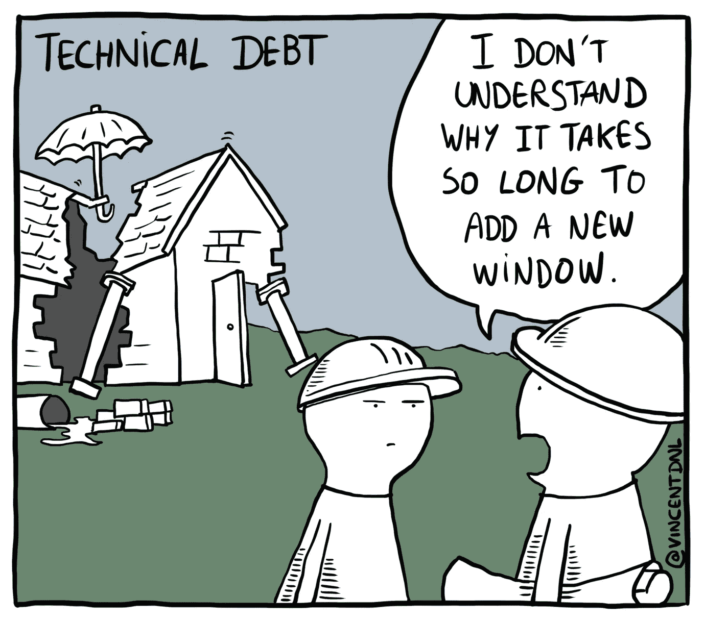

# 科技债务剧本

> 原文：<https://medium.com/geekculture/the-tech-debt-playbook-4e0b2e4c034a?source=collection_archive---------0----------------------->

[Source](https://vincentdnl.com/drawings/)

所有的软件团队都有技术债务——部分代码没有考虑到今天的挑战，或者写得很差，或者是权宜之计，现在成了问题。拥有科技债务不一定是件坏事；如果人们把所有的时间都花在完善代码上，那将一事无成。但是过多的累积债务会使新功能的发布速度变慢，并且会导致错误和质量问题。

当一个团队深陷技术债务时，一个工程领导者应该怎么做？这篇文章展示了我一直遵循的通用剧本。许多人都面临过类似的障碍，并且有现成的最佳实践和积累的智慧可以借鉴。

坏消息是，解决科技债务是一个漫长而缓慢的过程。工程之外的人将很难看到像“重构”或“数据隔离”这样的东西的价值需要说服他们将时间分配给除了增加直接客户价值的新功能之外的事情。

> 解决科技债务的最大挑战将是文化上的，而不是技术上的。

解决科技债务的最大挑战将是文化上的，而不是技术上的。工程团队需要接受更成熟的流程，组织需要致力于从被动操作到审慎规划的转变，每个人都必须真正支持解决技术债务，作为对未来团队能力的投资。

# 围绕科技债务凝聚领导力

科技债务表现为工程项目的运输时间比预期的要长，质量也是一个问题。这几乎总是伴随着来自紧急 bug、操作问题和客户支持升级的频繁中断。可能会有这样一种印象，即工程处于混乱状态，没有做好编写软件的工作。但根本问题是，该系统已经变得过于复杂和随意，难以管理。这将需要专门的努力来解开和清理。

> 该系统已经变得过于复杂和杂乱，难以管理

成长中的团队可能会面临一个额外的组织挑战，即一切都是最后一分钟的争夺。销售可以通过要求紧急功能来满足承诺，从而推动产品开发。CEO 可能希望将工程团队的重点放在几乎每天的基础上。所有的任务都是紧急和直接的，这种心态鼓励快速和肮脏的黑客来满足紧迫的期限。英勇地应对突如其来的变化会得到回报。计划往往是粗略的，过程被低估和忽视。尽管任何组织都必须有能力应对紧急变化，但问题是被动应对是否应该成为常态。

你需要让你的领导层相信，工程机器正面临停止运转的危险。团队希望提高工作效率，但是受到维护成本和过去决策的边缘案例的限制。如果人们想做得更好，他们必须致力于这些事情:

1.  **承认科技债务严重且真实**。我们需要投入大量的资源，使我们的系统更易于管理。这些任务必须和产品功能一起优先考虑，有时我们会选择技术债务而不是功能工作。
2.  **我们希望工作是有计划的。**最后一分钟的紧急情况确实会发生，但我们希望避免这种情况。作为其中的一部分，销售团队和首席执行官将支持规划工作的流程，不再直接控制日常工程任务。

# 建立最佳工程实践

工程团队应该采用交付高质量代码和有效沟通的最佳实践。这种水平的基线成熟度是解决技术债务计划的先决条件，这样人们就不会迷失在杂草中，也可以防止不可持续的攻击或错误进入代码库。设定标准，如:

*   **所有的工程工作都应该记录在像吉拉**这样的问题跟踪系统中。其他部门应使用该系统请求工程工作。从事哪怕是最普通任务的工程师也应该跟踪这项工作，这样才有可见性。
*   工程团队对任务进行优先级排序。通常，产品经理和工程经理定义详细任务的相对优先级和顺序，定期与利益相关者协商更高层次的优先级和主要计划。当工程师“变得不守规矩”并选择去做不是团队优先考虑的项目时，这是不好的。更糟糕的是，当团队之外的人“突然出现”坚持要完成一项特定的任务，而没有与团队合作，在上下文中优先考虑这项工作，并确保它经过深思熟虑。
*   所有代码变更都需要一个同行**代码审查**。
*   提交消息和拉请求描述应该**精心编写，以给出上下文**并描述变更。代码审查者应该拒绝含糊不清的或者单行的描述。
*   所有的拉请求必须包括**自动化测试**，或者注释应该说明为什么测试没有意义。
*   除了自动化测试之外，开发人员还负责在 QA 阶段对一个特性进行端到端的双重检查。
*   项目有一个“完成”的定义开发人员不仅负责代码，还负责任何数据迁移、展示等。
*   开发人员应该一次只做一个任务。限制进行中的工作被证明有助于团队保持更好的专注，更可靠地交付工作。

# 韵律学

选择显示进度和帮助规划的基本指标。开始于:

*   周期时间(Cycle time):从开发人员开始工作到完成一项任务需要多长时间？寻找减少周期时间的方法与改进整体工程的变化相一致——更容易的部署，更小的任务规模，当然还有更少的阻碍开发的技术债务。
*   **回归率:**百分之多少的错误是由最近的代码变更引起的？高回归率要么意味着开发人员粗心大意，要么意味着部分代码非常复杂或难以处理。
*   **冲刺速度:**在一次冲刺中完成的故事(或点数)的计数。这用于预测团队下一次冲刺的能力，并查看随着技术债务的清理，能力是否随着时间的推移而增加。请注意，速度是一个相对的测量，没有内在的意义；这是*而不是*对一个团队或个人的好坏进行评分的方式，比较两个团队的速度是没有意义的，因为他们的计划和工作性质是不同的。

# 建立一个科技债务项目清单

保留一份活文档，列出你所有可能的科技债务项目。对于每个项目，包括一个简短的描述，好处，和粗略的努力。当出现由未解决的技术债务引起的事件或倒退时，在相应的条目上添加一条注释，以加强对解决这一问题的支持。

建立这个列表会出奇的容易。你的一些工程师可能已经有了类似的笔记。调查你的团队，回顾你的积压工作，你会开始看到模式。与您的团队分享这份清单将有助于确认他们的担忧被听到了。

设定预期，工程将在几个月甚至几年内逐渐削减科技债务。非常明智地安排工作的优先顺序；从容易成功的小项目开始，建立信任。

众所周知，科技债务项目很难确定范围和跟踪进度。你不希望一个工程师钻研一个大规模的重写，然后让它们消失两个月；相反，你希望有一个带有离散里程碑的计划。为工程师定义一个“项目前”阶段，以调查问题区域并[撰写一份提案](https://codeburst.io/on-writing-tech-specs-6404c9791159)，该提案将被用作评估工作和管理项目的基础。

## 承诺技术债务的能力

与你的老板和产品经理合作，预算团队时间的百分比将用于以下每个领域:

*   **持续支持:**投入多少工程时间在 bug 和操作上。这类似于科技债务的利息支付。
*   **技术债务倡议**:专门用于清理的能力。这是在偿还技术债务的本金，以便释放未来的团队能力。
*   **特点**:为产品增加新的客户价值。

当一个深陷技术债务的团队现实地进行这种核算时，他们可能会意识到仅他们的支持开销就消耗了他们能力的大部分。除非他们把几乎所有剩余能力都用来偿还债务，否则他们将会被淹死。从“容量预算”的角度解释现实情况可能有助于管理与利益相关者关于为什么新功能工作将受到限制的不愉快对话。

# 开始清理工作

清理技术债务最有效的起点通常不是代码本身，而是围绕部署和监控代码的基础设施改进。这些对周期时间有巨大的影响。有价值的目标是:

*   部署是自动的(“按一个按钮”)和可靠的。
*   监控到位，以便在出现问题时立即知道，并快速诊断根本原因。
*   定期运行单元测试和端到端测试是自动化的。即使每天运行少量的测试也比什么都不做要好。
*   数据库模式更改和数据迁移遵循一个控制良好的流程，而不是由人们进行特别的更改。
*   您有某种形式的配置管理，将设置签入源代码控制。

[你不需要超级高级的设置就可以开始](/@cgroom/the-startup-ctos-guide-to-ops-1-of-3-guiding-principles-2607e21d9f89)。如果您的测试状态不佳，不要阻止您的开发工作，等待团队添加测试覆盖；继续并专注于使部署和监控处于良好状态。

# 待命轮换和 bug 轮换

打断工程师会影响工作效率。但是需要有人来解决紧急问题和回答问题。

标准的做法是引入**随叫随到的轮换。**每周，团队中不同的工程师负责处理所有的中断和紧急修复。目标是团队的其他成员可以专注于计划的工作。因为团队是为它写的代码而挂钩的，所以游戏中有防止问题的真实皮肤。计划冲刺时，不要期望随叫随到的人会有时间进行“正常”的项目工作——这将是一个令人高兴的意外收获。

许多团队都在与大量的 bug 和客户支持请求作斗争。不可避免的是，重要的特性优先于 bug，积压的工作只会越来越长。团队需要一种方法来分配受保护的容量来处理 bug。一个解决方案是让值班人员在停机时间处理 bug。如果这还不够，团队可以考虑建立一个单独的 **bug 轮换**，这样每个 sprint 都会有人 100%致力于 bug 积压工作。

# 把它放在一起——一个例子

作为一名工程领导者，你需要花大量时间向人们推销解决技术债务的计划。你需要提醒人们持续的支持和技术债务是真实的成本，也是工程工作的一部分。强调*我们作为一家公司*已经决定了技术债务问题，所以清理任务不是放纵的工程游戏。

除了解释基本原理项目和评估的更详细的季度路线图之外，我强烈建议分享一个经过提炼的解释器，用于将工程师的工作分成三个工作轨道:支持、技术债务和功能。定期反复分享，尤其是在全体会议和团队会议上。这里有一个虚构的例子:

*我们有 7 名工程师。对于 Q1:*

*每周有两名工程师提供支持:*

*   *一个工程师一周就是* ***随叫随到***
*   *一个工程师一周就上* ***bug 轮换***

*这些内部举措将使我们的系统更加稳定，并为即将到来的项目奠定基础:重构我们的调度系统，将软件部署从 Elastic Beanstalk 迁移到 ECS，并使用户权限成为独立的服务。我们估计这项工作大约需要 40 个工程师周，或者说本季度有 3 名工程师每周* *投入工作。*

*这给了我们一周大约有* ***2 个工程师*******个特点*** *。我们希望推出与 Sesame Co .的合作伙伴集成，增加对 Outlook 日历的支持，并为客户提供一个内部仪表板，按市场显示他们的表现最佳和表现不佳者。**

# *不要让方法成为目的*

*我见过这样的情况，一个解决技术债务的团队采取了一种不必要的极端技术立场，因为他们把他们的方法当作一个咒语，并让它成为目标。例如:*

> **让我们把整块分成可管理的大块* →一切都应该是微服务。*

*对“微服务”的关注掩盖了我们所寻求的好处，那就是将代码和数据隔离到隔离的组件中，这样开发人员就可以快速地做出改变，而不会产生意想不到的后果。也许有些数据必须紧密耦合，因此将一个组件分离出来作为一个更大的服务是合适的。如果一个团队在“微服务”鼓点的“微”部分敲得太响，那可能会导致糟糕的架构决策，比如拥有更新相同数据集的多个代码库。*

*另一个例子:*

> **我们需要添加单元测试* →必须有 100%的代码覆盖率。*

*“部分代码应该有更好的测试”这一说法与“代码的每个部分都必须有测试”有很大的不同可能有旧的代码区域不值得测试；或者高度有状态的工作流，其中维护测试更像是更新复杂的模拟器；或者没有测试环境的第三方集成，使自动化成为一个挑战。而一个领导者可能会试图用最雄心勃勃的术语来构建一个目标(“一切都必须经过测试！”)有了人们应该谨慎行事的默契，这不是一个好主意，因为工程师*做*从字面上理解事情，很容易让计划失去控制。*

*保持技术债务项目在正轨上，并专注于交付价值。重要的是，组织要看到有规律的进展，并且通过提前清楚地定义目标来建立成功的项目。最后，一定要认可和奖励从事代码清理的工程师，因为这和特性工作一样重要。*

# *其他资源*

*   *[*加速*](https://www.amazon.com/Accelerate-Software-Performing-Technology-Organizations/dp/1942788339) 是任何技术领导者的必读之书。这对于选择要跟踪的指标和证明开发运维投资的合理性特别有用。*
*   *马丁·福勒有一篇关于技术债务类型的精彩文章，以及设计缺陷或草率的代码是否也算债务。我承认我的定义有点松散。我甚至没有进入*产品债务*，那里的特性需求已经堆积到令人震惊的复杂程度。*
*   *史蒂夫·拉宾有一篇非常有思想的文章解释什么是科技债务以及如何解决它。*