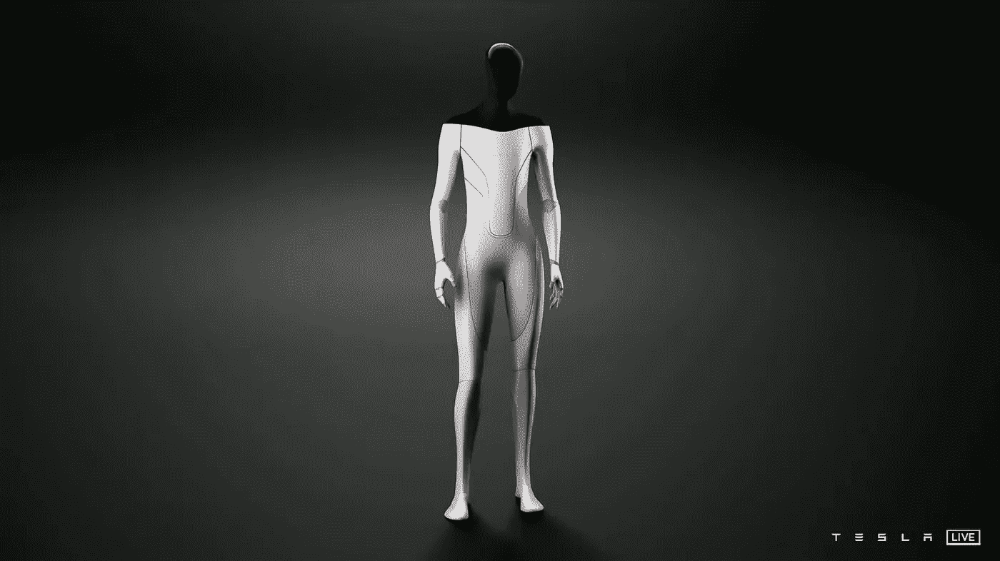
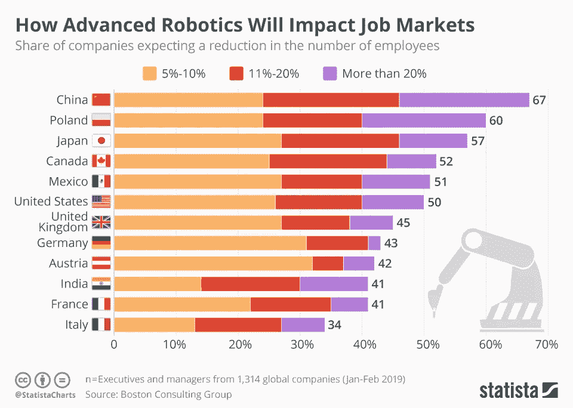

# 特斯拉机器人。它是什么与它的承诺是什么——一个深潜

> 原文：<https://medium.com/geekculture/the-tesla-bot-what-it-is-vs-what-it-promises-to-be-a-deep-dive-e9680e02400e?source=collection_archive---------22----------------------->

## 人工智能

## 人工智能革命已经到来，只不过不是以我们习惯性相信的方式或形式。

Photo by [Brett Jordan](https://unsplash.com/@brett_jordan?utm_source=unsplash&utm_medium=referral&utm_content=creditCopyText) on [Unsplash](https://unsplash.com/s/visual/e418c3d9-22fa-4063-993d-add89429574e?utm_source=unsplash&utm_medium=referral&utm_content=creditCopyText)

*首先，让我们解决房间里的大象*

埃隆·马斯克朗朗上口的人工智能日启示吸引了很多人的目光，让他们想知道他们什么时候才能最终让机器人送货或洗车。还是一个人形机器人！不是你可能在工厂和仓库里看到的跟随机器人的普通生产线。如果我们忽略一个人形机器人实际上有多有效，或者特斯拉在最后期限方面臭名昭著的名声，那么这个问题的答案将是明年的某个时候*。*

*现在，如果你认为这一宣布是人工智能梦想最终实现的分水岭时刻，你可能会想抓住这个想法一秒钟。*

## *但首先，对于外行人来说，特斯拉的人工智能日是什么，他们，一家汽车公司，在做什么来制造机器人？*

*因此，特斯拉采用了每年指定一天的概念来展示他们最新的 R&D 成果，以及他们希望未来建立技术实力的方向。2019 年 4 月，他们举办了他们的**自主日**，展示了其新的全自动驾驶计算机芯片，能够以 144 万亿次/秒的速度运行，比他们最接近的竞争对手快 7 倍。2020 年 9 月，他们举办了**电池日**，将充电之间的距离增加了 54%，每千瓦时的价格降低了 56%。*

*[**人工智能日**](https://www.youtube.com/watch?v=j0z4FweCy4M) 是特斯拉的 2021 年“日”，在这一天，他们专注于他们在计算机视觉和物体检测/路缘检测算法方面的进步，这些算法使他们的汽车能够实现完全的自动驾驶能力。他们还推出了 Dojo——一台超级计算机，将“支持更大、更复杂的神经网络模型”，以实现“最佳的人工智能训练性能”。最后，就在他们结束之前，好戏来了—*

# *一个完整的，人类大小的，有知觉的人形机器人*

*—一个 5 英尺 8 英寸的人形机器人，他们喜欢称之为特斯拉机器人，有 10 个手指，最大速度为 5 英里/小时，可以举起 10 磅，所以如果需要，你可以跑得比它快或超过它。*

*根据马斯克的说法，*

> *它将能够在为人类建造的世界中导航，并消除危险、重复和无聊的任务。*

**

*Tesla Bot*

*这立刻让我想到了很多问题。最重要的是，为什么特斯拉，主要是一家汽车公司，或者如果你选择看看网络卡车，那么主要是一家汽车公司，突然制造机器人？*

*追根溯源，特斯拉之所以是自动驾驶电动汽车市场上最大的品牌，主要是因为他们为汽车提供动力的软件。把特斯拉想成一家软件公司其实是很常见的。到目前为止，他们的自动驾驶能力是市场上最好的，这是因为特斯拉的一个天真的举动—*

*他们已经众包了用于训练自动驾驶学习算法的数据收集。每辆汽车在自动驾驶时做出的所有成千上万个小的即时决定都被上传回他们的服务器，在那里被输入神经网络，以训练特斯拉车队的其余部分。因此，上路行驶的汽车越多，它们就能增长得越快，性能也会成倍提高。这就是他们在竞争中遥遥领先的原因。*

*因此，用马斯克自己的话来说，这是一个短暂的飞跃，从让一辆汽车自动驾驶，从周围的现实世界收集数据，并根据这些数据立即做出决定，到将所有这些技术变成人类的形式，你将拥有一个人形机器人。*

> *特斯拉可以说是世界上最大的机器人公司，因为我们的汽车就像轮子上的半感知机器人。*

*—埃隆·马斯克，在特斯拉人工智能日的演讲中*

*现在，你们可能会问自己，为什么万物都是人形的？因为我对此的看法是，当人类形态被实现为机器人形态时，它并不是非常有效。我们人类按照自己的形象构建了我们周围的世界，当一个机器人被要求以和我们一样的方式在同一个世界中导航时，它肯定会跌跌撞撞。这并不是说机器人比不上我们。他们肯定可以，证明这一说法的最好例子是看看[Atlas](https://www.bostondynamics.com/atlas)——可能是波士顿动力公司制造的迄今为止最先进的人形机器人。*

*看看下面的视频吧*

*但是不要抱太大希望！你实际上买不到这个机器人，原因有很多，其中一个很明显是实际制造它所涉及的极端成本和工程。然而，现在我们知道像 Atlas 这样的机器人确实存在，问题仍然存在——让这样的机器人四处移动真的比建造专门建造的机器人更有效率吗？这些机器人旨在尽可能高效和准确地执行单一动作。*

*以自动驾驶汽车为例。我们不会想象一个机器人坐在驾驶座上驾驶汽车。汽车是机器人。洗衣机或吸尘器也是如此。你不想要一个人形机器人为你洗衣服或者在你的房子里走来走去用吸尘器打扫地板。相反，*我们把机器人做成洗衣机或自动吸尘器。*这是制造机器人的唯一目的，机器人的每个方面都是为了尽可能平稳、高效和准确地完成任务。*

*那么，一个通用的人形机器人在日常生活中能做得多好呢？以马斯克的杂货店购物想法为例，也许你可以让机器人从附近的杂货店给你买一些水果。但是，即使是这样一个简单的任务也比看上去要复杂得多。也许机器人能够自己导航到商店，即使遇到一些障碍，如道路封闭。这是非常标准的东西，而且已经有人做过了。但是潜在问题领域的列表一旦到达商店就开始了。*

1.  *它能区分好苹果和坏苹果吗？大多数情况下，这些差异是细微的，图像分类算法将很难区分这两者。*
2.  *如果店铺关门了，它接下来选择去哪家店铺？是最近的吗？还是街那头有更好的水果？*
3.  *如果店主多收几块钱，它还能讨价还价吗？到什么程度呢？*

*另一种情况是，如果有新的东西出现，比如一款新手机。如果我让它从另一个房间拿到那部手机，它能理解我说的是哪部手机吗，还是需要对它进行明确的编程？*

*这些只是开始的几个例子。在现实世界中，它需要识别无数的其他情况并做出相应的响应。许多这些情况对真人来说是显而易见的，但对机器人来说却很难理解和执行。通用机器人将如何解决这些问题？*

*也许你可以说，这些问题的答案是采用一种分散的训练算法，就像特斯拉汽车通过世界各地数百万小时的驾驶镜头进行训练的方式一样。但要做到这一点，机器人需要实际进入真实的世界，被真实的人用于真实的工作，而不仅仅是实验室中的模拟工作。*

*此外，有一大堆非技术性的灰色区域，我们可能会在街上遇到有感知能力的机器人。*

*   *如果一个机器人不小心将情况分类错误，在繁忙的道路中间跳跃，造成事故怎么办？谁对此负责？—所有者还是制造机器人的公司？*
*   *它能自己穿越国际边界吗？还是也需要某种签证？*
*   *如果有人攻击机器人，允许机器人以何种方式和在何种程度上进行自卫？*

*正如你所理解的，解决这些问题需要一套全新的规则、立法和操作标准。*

**

*Source: Boston Consulting Group*

*不幸的是，问题并没有到此为止。拥有这样的机器人也将导致深刻的社会经济差异。专门制造的机器人已经取代了工厂的常规工人，但有感知能力的机器人有能力取代更复杂的人类角色，比如教师。这将不可避免地缩小就业市场，并压低仅存的少量工作的工资水平。*

*总之，特斯拉机器人，以及一般的有感知能力的人形机器人，代表了人工智能领域的巨大飞跃。但是，在我们能够对上述问题以及随着这种机器人的使用增加而肯定会出现的更多问题给出令人信服的答案之前，这种机器人的大规模使用仍然处于危险之中。*

**万一我们是第一次见面**

*嗨，我是 Shahryar，职业是软件工程师，激情是博客作者。我正试图围绕激励和授权的技术建立有意义的对话。如果你喜欢这个故事，考虑按下鼓掌按钮。你可以在这里谈论[你对这个故事的想法](https://twitter.com/intent/tweet?hashtags=MediumBlog&original_referer=https%3A%2F%2Fpublish.twitter.com%2F&ref_src=twsrc%5Etfw%7Ctwcamp%5Ebuttonembed%7Ctwterm%5Eshare%7Ctwgr%5E&text=What%20are%20your%20thoughts%20on%20virtual%20reality%20%3F&url=https%3A%2F%2Fmedium.com%2F%40shahryarsaify%2Fvirtual-reality-d160015a91d0&via=ShahryarSaify)，或者如果你有任何提示或建议[可以联系我。](https://twitter.com/messages/compose?recipient_id=2560532430)*

***免责声明***

*   *我与博客中提到的任何公司或实体都没有关联或附属关系。*
*   *任何链接、嵌入媒体或对外部网站的引用都不是付费/附属链接，仅作为引用提及。*
*   *不要将任何提及的软件/硬件产品作为购买建议。*
*   *记住要经常做自己的研究。*