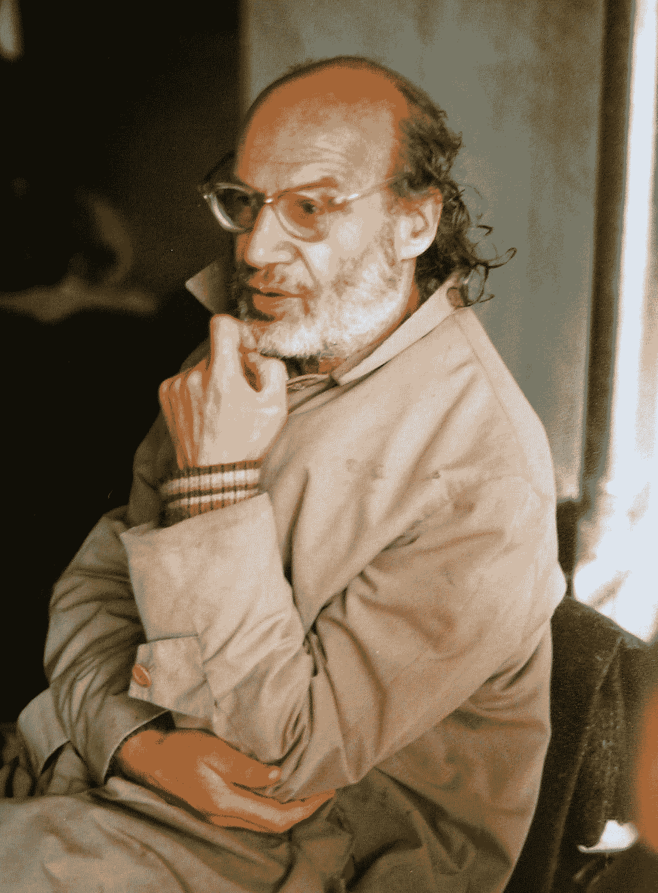

# 天才与疯狂之间的一线之隔:亚历山大·格罗滕迪克——一个数学谜

> 原文：<https://medium.com/geekculture/the-thin-line-between-genius-and-insanity-alexander-grothendieck-a-mathematical-enigma-5bfdaaa77042?source=collection_archive---------0----------------------->

***“嗯，地里的一切都变了，他来了，就像白天和黑夜一样。这是一场革命。”***

——麻省理工学院数学家迈克尔·阿丁(Michael Artin)在 60 年代初与格罗滕迪克共事，当被问及格罗滕迪克对数学领域的贡献时，他笑了。

Image: The New York Times