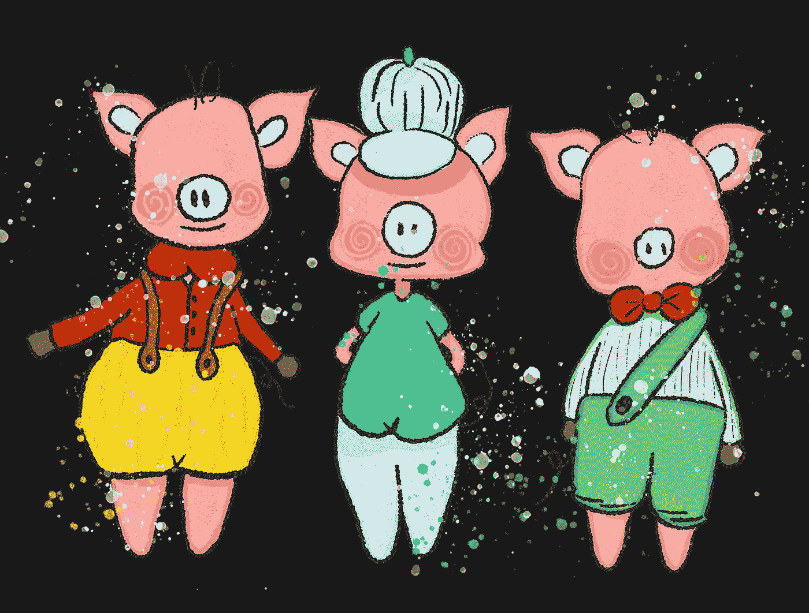
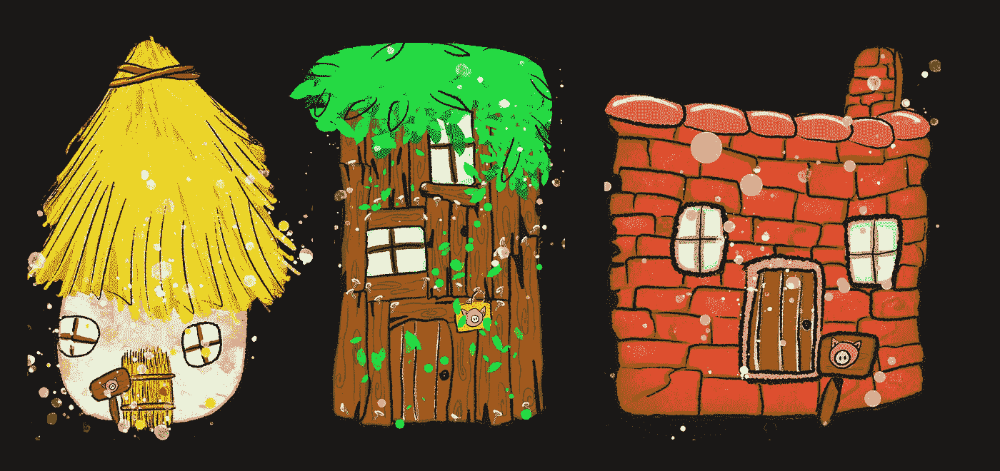
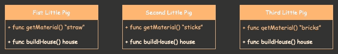
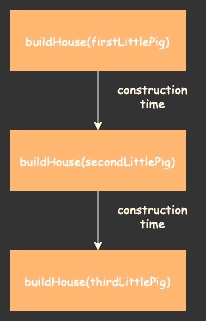
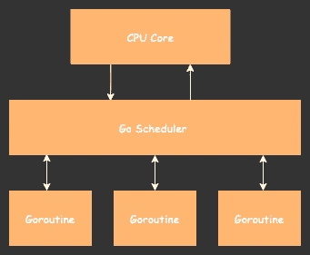

# 围棋语言中的三只小猪

> 原文：<https://medium.com/geekculture/the-three-little-pigs-in-go-language-eb83ab469d6f?source=collection_archive---------4----------------------->

## Golang 适合绝对初学者

Image by [Myrtillemymy](https://pixabay.com/users/myrtillemymy-13928113/?utm_source=link-attribution&amp;utm_medium=referral&amp;utm_campaign=image&amp;utm_content=6703047) from [Pixabay](https://pixabay.com/?utm_source=link-attribution&amp;utm_medium=referral&amp;utm_campaign=image&amp;utm_content=6703047)

你还记得三只小猪用各种材料建造住所，却遭到大灰狼攻击的寓言吗？如果你不熟悉这个故事，剧透警告:当狼被第三只小猪活活煮熟时，他得到了他应得的甜点(这只小猪用煮熟的身体做了什么，留给人们去猜测。事实上，据说猪是杂食动物。我只是把它放在那里)。

在这篇文章中，我想用 Go 语言(水平——绝对初学者)重新告诉你[这个](https://www.hellokids.com/c_14958/reading-learning/stories-for-children/animal-stories-for-kids/the-three-little-pigs?pos=0#top_page)寓言。

都是针对绝对初学者的，那就从头开始吧。

# **变量声明**

关于围棋，你应该知道的第一件事:

> “Go 是一种静态类型的编译编程语言，由 Robert Griesemer、Rob Pike 和 Ken Thompson 在谷歌设计”，[维基百科](https://en.wikipedia.org/wiki/Go_(programming_language))

“静态类型化”意味着变量类型应该显式声明。下面是我们如何在 Go 中声明一个变量并给它赋值:

在这段代码中:`var`键盘代表一个“新变量”。接下来我们可以看到一个变量的名字— `prologue`，后面是它的类型`string`。

另一种简单等效的声明变量的方法是使用冒号等于:

# **结构和接口**

接下来你要知道的是，Go 不是面向对象的编程语言。它不知道类和对象。Go 的数据抽象建立在结构和接口之上。这个故事让我们直接接触到这些概念。

> 第一只小猪用稻草盖房子，因为这是最简单的事情。
> 
> 第二只小猪用树枝盖了他的房子。这比稻草房子稍微坚固一点。
> 
> 第三只小猪用砖建造了他的房子。

## 结构

让我们把重点放在猪的房子上。

Image by [Myrtillemymy](https://pixabay.com/users/myrtillemymy-13928113/?utm_source=link-attribution&amp;utm_medium=referral&amp;utm_campaign=image&amp;utm_content=6703047) from [Pixabay](https://pixabay.com/?utm_source=link-attribution&amp;utm_medium=referral&amp;utm_campaign=image&amp;utm_content=6703047)

根据 Go(而不是 OO)方法，有一种特定类型的实例(在我们的例子中是房子)可能具有一些属性(建筑材料)。该实例具有与其连接的函数(新房屋建筑),可以操纵属性。

看一看一张`type House struct {}`。`type`关键字代表一个可以实例化的定制数据类型。`struct`表示数据类型是结构。Go 中的结构是属性的集合。它们有助于通过将数据分组来形成记录。在我们的例子中，我们有一个 House 类型的数据结构和 string 类型的属性 Material。

现在我们来复习一下`func NewHouse(material string) House {}`。这是一个函数，用关键字`func`来表示。一个函数可以接受多少个参数是没有限制的。在这种情况下，`NewHouse`函数接受一个字符串参数。该函数可以是 void 或返回一个或多个**类型。我们的函数只返回一种类型，House，但是它也可以返回几种类型，比如说 House 和它的描述:**

多个返回类型由逗号分隔，并在括号中列出。它们以同样的顺序返回，也用逗号隔开。

毫无疑问，您已经注意到，在上面的例子中，所有的结构名、它们的属性和它们的函数都是以大写字母**开始的。这是因为 Go 中函数的可访问性是用大写字母表示的。我是认真的。`NewHouse()`对**公共**开放，而`newHouse()`是**私有**。请记住，在 Go 中，隐私是在**包级别**定义的(记住，没有类？).**

## 接口

所有人都盯着猪。

Pigs functions

三只小猪都做着同样的事情:他们盖房子(如此普通的养猪事业)。他们之间唯一的区别是他们使用的材料类型。它有一股强烈的复制气味。幸运的是，和许多其他编程语言一样，Go 鼓励重用。

欢迎来到界面的世界！如果你以前使用过面向对象编程，你肯定会傻笑着说，“去过那里，做过那个！”你也许应该抛弃你所知道的关于接口的一切。Go 的界面与其他语言的界面有很大不同。

该接口是一个自定义类型，它指定了函数签名的集合。通过实现这些方法，其他类型可以成为此接口的成员。界面会员作为精英俱乐部的成员，可以访问代表其定义的所有功能。不要困惑。这比看起来容易。

下面是一个带有`GetMaterial() string`签名的`LittlePig`接口。`BuildHouse()`是这个接口的一个通用函数，它接收接口(实际上是它的成员)并执行一些构建逻辑。

现在，如果第一只小猪想加入小猪俱乐部(相信我，他想)，他应该实现`GetMaterial()`方法。我们到了。

考虑一下`(pig FirstLittlePig) GetMaterial() string {}`函数。你已经注意到了一种新的语法。我们有一个`FirstLittlePig`类型，它被称为**接收器**，就在函数名之前。接收方的目的是表明`GetMaterial()`函数现在可用于类型`FirstLittlePig` (Oink！).

让我们把其他的猪也加入小猪俱乐部吧。

现在，每只精英小猪都可以调用这个叫做`BuildHouse()`的可重用函数。万岁！让我们运行程序，看看我们有什么。

`main()`功能是应用的起点。要运行它，您可以简单地点击您的想法中的运行图标，或者您可以通过 CLI 从相关包中使用命令`go run main.go`来执行它。瞧，这就是你的输出:

为了打印应用程序的输出，我使用了名为“fmt”的 Go 源包(“format”的简称)。你可以在这里阅读更多关于这个包的功能[。](https://pkg.go.dev/fmt)

顺便说一下，在 Go 语言中使用缩写是一种惯例。我的意思是，你可以很容易地找到带有参数`s string`的函数的例子。在我看来，这与干净代码的概念背道而驰。所以，在我的例子中，我使用了完整的变量名。我的准则，我的规则😎。

既然我已经提到了干净的代码，让我们偷偷把打印内容放在`BuildHouse()`函数中。很好的机会来看看 Go 中的开关。

# 开关

我想，我没有什么可说的了，Go 中的开关和其他语言中的开关非常相似。

我想提醒您注意以小写字母**开始的`printOutPigPerformance()`函数名。也就是说，这是一条**私信**。**

# **切片，用于循环和映射**

## 部分

是时候谈谈数组了。Go 定义了两种处理记录列表的基本数据结构:数组和切片。Array 表示一个固定长度的列表，而 slice 是一个可以增长或收缩的数组的别称。

我们的猪是切片的完美候选。哦，我的天，听起来太可怕了。但是，你知道，坏大灰狼可以对猪阵的大小产生影响。没关系，我会这样重新组织它:让我们列一个清单🐷🐷🐷。

**方括号**用于声明 Go 中的切片，以及将出现在该切片中的数据类型。因此，在这个例子中，我们有一个类型为`LittlePig`的切片。我们可以在声明状态下将猪添加到切片中，方法是用花括号将它们括起来。或者将它们附加到现有切片，如下所示:

## 对于循环

当我们有一个切片时，我们可以迭代它的元素。

For 循环接收两个元素:数组中元素的索引和元素本身。关键字`range`表示这一片小猪会循环播放。

在我们的例子中，每只小猪应该建一座房子，对吗？我们也可以把这些住宅映射到猪身上。是啊，我们来绘制地图。

## 地图

Map 是**键值对**的集合。在 Go 中声明地图的方法不止一种。

第一种方式:

请注意，与其他语言不同，我们在**中添加的每个键值对(包括最后一个)都应该以逗号**结尾。

另外两种创建映射的方法与空映射声明有关，我将改变键和值的类型来匹配我们的 fabel 的过程。

后期增值完全赞赏。这正是我们要做的。

对于小猪切片中的每一只小猪，我们将建造房子并将其添加到地图中。语法是:`map[key] = value`。

注意,**下划线**代替了索引变量。Go 绑定使用声明的变量。如果变量已声明但未被使用，您将面临编译错误。下划线用于跳过实例化变量。

到目前为止一切顺利。上述解决方案的唯一问题是一次只能建造一个猪舍。

Execution Schema

我的意思是，第二只猪只有在第一只完成后才能开始建造他的房子。第三头猪甚至还没开始造就可以吃了。这可能会极大地影响故事的结局🐺🍖。太糟糕了。我们最好让所有的猪协同工作。为此，Go 语言提供了一个称为 Goroutines 的特殊特性。

# 戈鲁廷斯

Goroutine 是同时运行的任何独立活动的通用术语。

我想让你明白的第一件事是，当我们启动一个 Go 程序时，我们会自动创建一个 Goroutine，也称为 Main Goroutine。这个 Goroutine 获取我们程序中的每一行代码，并逐个执行。

我们可以通过简单地在函数调用前添加关键字`go`来创建并发的 Goroutines。

请记住,**并发并不等同于并行**。并行性是(潜在相关的)计算的同时执行。而并发是独立执行的进程的组合。即使您创建了几个 Goroutines，一次也只能执行一个，因为它们都使用相同的 CPU 内核。

Goroutines use one CPU core

在上图中，你可以看到 CPU 内核和 Goroutines 之间的 Go 调度程序层。这个调度器的工作是跟踪每个 Goroutine 中执行的代码。当调度程序检测到其中一个例程已经运行完其中的所有代码时，或者如果例程中的某个函数进行了阻塞调用(如 sleep)，则当前例程暂停，下一个 go 例程开始。这是默认的 Go 行为。

当然，这些默认值可以被覆盖。本地机器上多个 CPU 核心的存在改变了游戏规则。例如，Goroutines 可以并行运行。但是，这是一个更高级的话题，我打算跳过。干杯。

回到我们的猪身上。小猪的性能负责一个叫做通道的 Go 结构。

## 频道

管理不同操作程序之间通信的唯一方法是使用通道。

让我们调整我们的`BuildHouse()`代码来更好地理解通道。

请先移除返回类型。你不再需要它了。因为此函数被设计为作为子 Goroutine 运行，所以它的值必须以不同的方式传输(通过特定的通道 dah)。

现在，添加这个特定的通道作为函数参数。语法:`{channel name} chan {value type}`。与 Go 的函数不同，Channel 只能传递一个**单值类型**。如果您希望与房屋及其创建者(Pig)进行通信，您可以使用列出的属性创建自定义类型。

建造一个家需要时间。我猜对小猪来说更是如此。无论如何，我建议包括一个睡眠经纪人。假设在猪的一生中，5 秒钟等于 5 天。

最后一步是应用函数结果到通道，使用`channel <- result`语法。

`main()`功能也需要少量更改:

`main()`函数的代码运行在主 Goroutine 上。我们希望这个主 Goroutine 知道子 go routine 的进度。所以，首先要声明渠道:`make(chan {value type})`。接下来，这个通道将被传递给函数:`go BuildHouse(pig, channel)`。

您可以注意到代码片段中有两个循环。第一个循环遍历小猪切片，并为每个切片启动一个单独的 Goroutine。第二个循环将频道结果反映在地图上。

这里需要理解的最重要的一点是，我们正在使用通道为主 Goroutine 创建一个**拦截器。通过添加这个`channelResult := <-channel`行，我们实际上是在说:停止运行，直到通道返回结果。你能看见它吗？**

现在，因为我们为每只小猪创建了 Goroutine，所以我们想等待所有小猪完成它们的房子。这就是为什么在循环中检索通道结果。只是澄清一下，`<-channel`语法从通道接收一个值。

我们很好！我们已经涵盖了围棋的大部分基础知识！但是，相信我，我救了🌰最后。

# 两颗北极指极星

如果 C 是你的语言宝库中的一员，你可能对指针很感兴趣。但是，我说的是 Java，太痛苦了。

总之，在前面的例子中，我为每只小猪创建了一个单独的结构。让我们一般化它。

这里我们有一个具有属性`Name`和`House`的`Pig`结构。Pig 类型的实例可以接收一个`UpdateName(newName string)`函数。好吗？

现在，我们可以创建一个名为 Fist Little Pig 的猪实例，它有一个用稻草建造的房子。让我们假设一下，这头猪一开始对第一只小猪这个名字没意见，但后来他意识到这个名字不够独特。Fifer 被选为新名字。现在，尝试运行代码。

这是您将看到的输出。

你不应该感到吃惊。正如我前面所说的，这一节是关于指针的👆。这是因为 Go 是一种按值传递的语言。也就是说，每当我们将值作为接收方或参数传递给函数时，Go 都会复制这个值，并将其存储在本地机器内存中的一个空容器中。

因此，当您在`UpdateName()`函数中更改小猪的名字时，通过运行这段代码，您正在更新第一只小猪的副本，而不是原始结构。

若要更新原始结构，必须首先定位该结构的内存地址并获取其值。这里有两个您需要的运算符:

`&variable` —返回该变量指向的值的内存地址。

`*pointer` —返回该内存地址指向的值。

现在，我们可以稍微修改一下我们的代码。

看一看`UpdateName()`的修改。您可能会注意到两个变化:第一，接收方键入前的星号，第二，指针前的星号。根据 Go 的指示，这是一个相当复杂的情况。不，这不是复制。虽然接收者前面的星号仅仅是描述性的**，但是它们表明我们正在处理一个`Pig`类型的指针。指针前面的星号表示真正的**操作符**，这意味着我们想要改变指针所指向的值。**

简要归结为`main()`功能的修改。你可以在这里看到一个`firstLittlePigPointer`变量声明，它保存了原来`firstLittlePig`的内存位置。最后的变化是函数在新形成的指针上运行。

再次运行代码。试试看。

有用！！！但还是很困惑，对吧？幸运的是，Go 语言的创造者很仁慈，为我们提供了指针快捷方式。

## 指针快捷方式

令我非常高兴的是，Go 中的指针传奇可以简化为传递的值类型前的一个星号。

至于我，我可以接受，即使是我下巴颏上的毛🐽。

这篇博客文章只包含了“三只小猪”寓言的第一幕，已经翻译成 Go。其余的源代码(没有残忍的细节)可以在我的 [GitHub 库](https://github.com/genezeiniss/go-three-little-pigs)中找到。