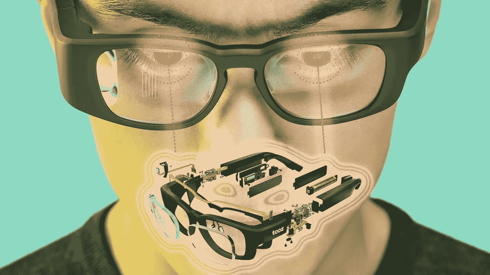
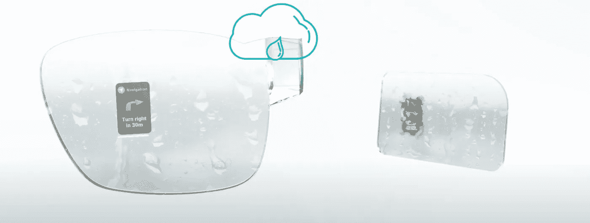
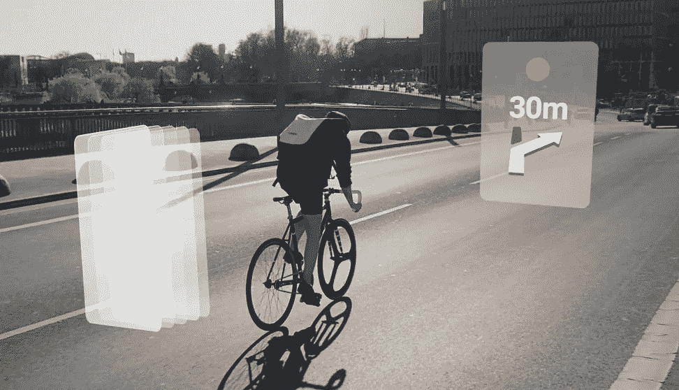
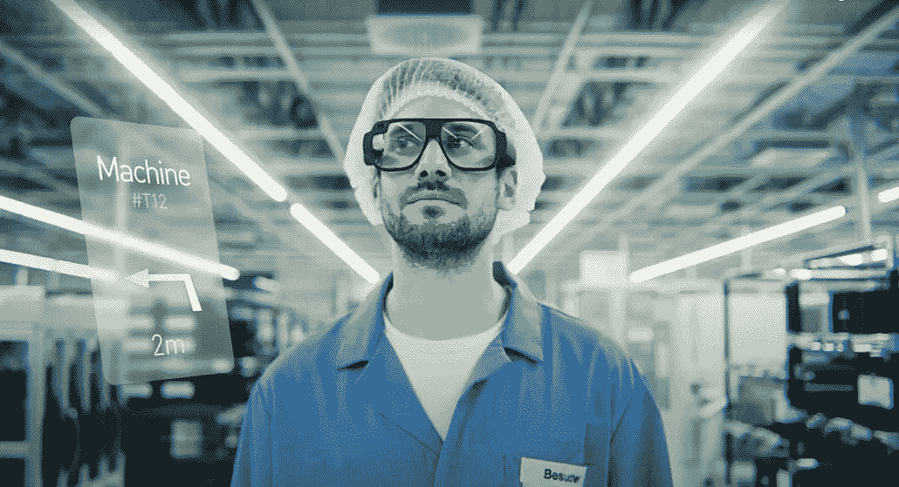
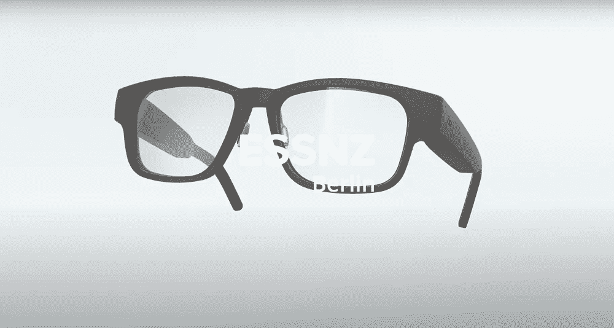
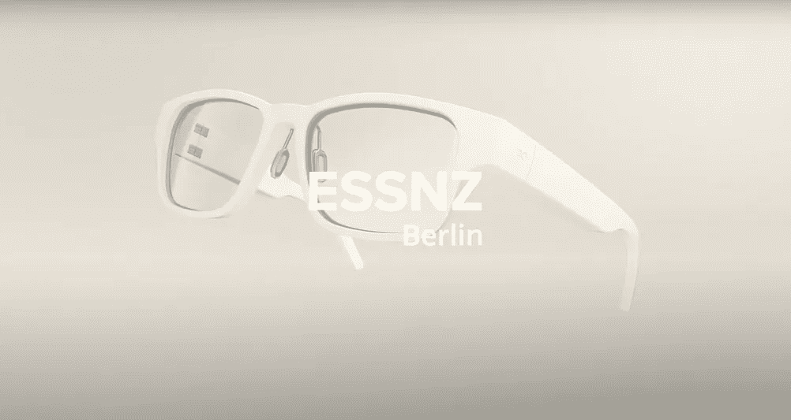
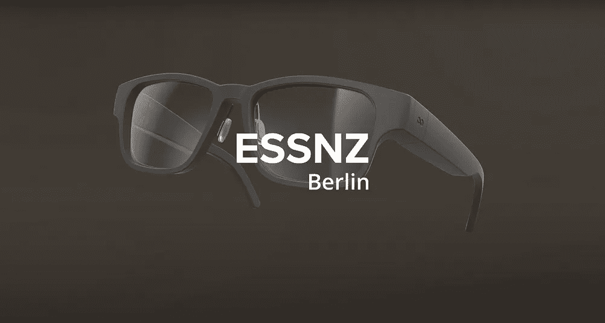
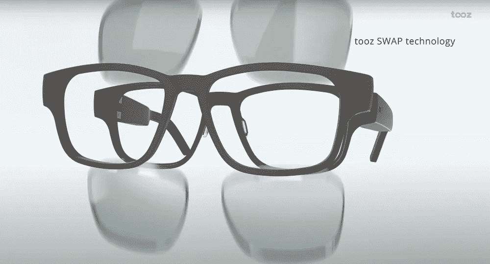
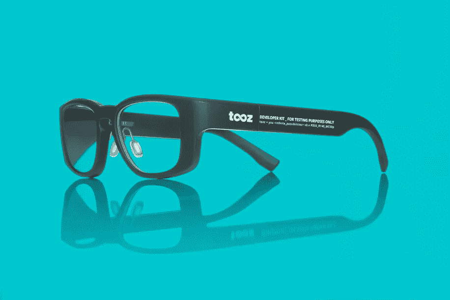
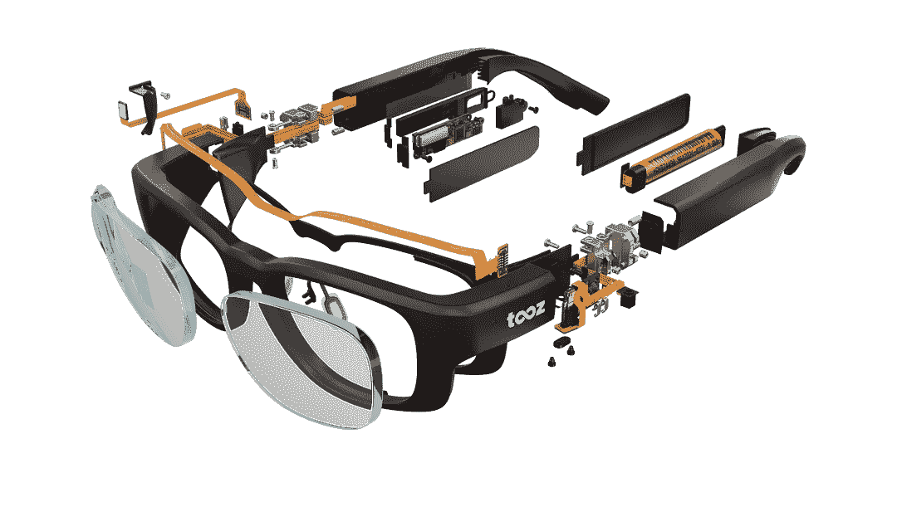

# Tooz 智能眼镜可以吸引广大公众对 AR 未来的关注

> 原文：<https://medium.com/geekculture/the-tooz-smart-glasses-can-fascinate-the-broad-public-of-the-future-of-ar-3e269582577d?source=collection_archive---------2----------------------->

## tooz 技术应用于智能眼镜的优秀方法和使用案例

T ooz technologies 是一家来自一些大玩家的德国创业公司，用**完美的方式向广大公众**介绍智能眼镜！

我将向您展示他们的独特卖点、使用案例、公司以及在哪里**购买开发工具包**。

## **公司**

*Tooz technologies* 是 [*蔡司*](https://www.zeiss.com/corporate/int/home.html) 和德国电信的合资公司。蔡司是国际领先的光学技术公司，几年前开始涉足虚拟现实。德国电信是欧洲最大的电信供应商。

他们生产的智能眼镜针对的是那些已经不得不戴眼镜的人，因为他们生产的镜片是有处方的。他们想把这种眼镜放在眼镜店的普通处方眼镜旁边出售。

因此，购买者无论如何都需要眼镜，只需少量加价就能享受智能眼镜的优势。进入门槛低，接触的人很多，不仅仅是科技爱好者。

这些看起来像普通眼镜的智能眼镜之所以成为可能，只是因为**它们的弯曲波导**。与常规平面波导相比，这具有一些显著的优势:

*   在户外使用时，弯曲的波导管**不会捕获环境光；使用**平面波导，将会出现彩虹效应
*   **下雨时，平面波导不会出现图像失真**
*   tooz 弯曲的**波导是牢不可破的** (FDA 批准)，这确保了眼睛保护，常规平面波导需要额外的保护层
*   根据**的规定，与平面波导相比，眼镜的厚度变化不大**

left the curved waveguide by tooz and on the right a regular planar one

# 个案研究

## 导航—室内和室外

平视显示器是现代汽车上一个昂贵的附件，显示有关导航、交通堵塞、道路施工或速度限制的相关数据，增加道路安全。

有了这些智能眼镜，你可以在摩托车、自行车或你的汽车没有内置抬头显示器时使用这些功能。每辆车都可以更经济高效地享受所提供的安全性。

室内导航的安全性更低，效率更高。告诉你去机场下一个登机口的路，或者帮助仓库的员工找到合适的货架。

On the left is a design prototype of a navigation display for cycling, and on the right for one in a warehouse — pictures by tooz technology.

## 商业部门

在医疗领域， *tooz* 与数字健康研究院 (EKFZ)有[的合作。他们展示了一个令人印象深刻的应用程序概念，该应用程序向患者显示有关个人、药物和疾病的信息。](https://tooz.com/the-ekfz-for-digital-health-researches-the-use-of-smart-glasses-in-everyday-clinical-practice-with-tooz-technologies/)

相关信息在正确的时间和正确的地点提供给承运人。你也可以在视频中看到，作为眼镜的输入，头部的手势可能是什么。

use case video tooz x EKFZ

导航中提到，它可以是仓库和工厂的工具。如下图所示，您可以**访问机器、手册、特定设备的数据并被授予访问权限。**

这对于高风险的工作来说尤其有趣，比如处理有害物质的工作。比如化学物质的监测，可以显示在你的视野里。在危险的情况下，你可以通过声音和显示器得到通知。

## 健康

不仅仅是在开车的时候，你还喜欢在没有视线转移的情况下访问数据。由于 *tooz* 与*Adidas Runtastic**应用程序的[合作，你可以直接向前看，而不是在你的智能手表上。](https://tooz.com/adidas-runtastic-tooz-technologies-cooperation/)*

*Runtastic* 在您的智能手机或智能手表上显示数据，如**心率、节奏、距离和导航。**为此，tooz 智能眼镜确实有一个**独特的运动设计**，看起来像自行车眼镜。

Use case video tooz x adidas runtastic

随着导航和健康数据的结合，它为其他应用提供了可能性。这可能是一个完美的除了骑自行车与头部单位或不断检查您的血糖监测。

## 日常生活情景

健身概念取代或扩展了您的智能/健身手表。这在你的日常生活中也是可能的，通过显示你的通知、消息、天气或者你的信用卡验证。

为此， *tooz* 为日常生活设计了一款独特的产品，名为 *ESSNZ Berlin。*因为它取代了你的常规处方眼镜，所以你也可以换一副色调更暗的眼镜。

The different style with colours of the ESSNZ Berin and the swapping of the glasses — [photos](https://youtu.be/mQRhsHlphJw)

Use case video everyday life.

他们制作了一部试图解释“日常情况”的视频。以及在关于 B2B 用例的视频中，您可以看到头部手势。

# 开发工具包

为了将这个和更多令人兴奋的想法变为现实，您可以将您的 tooz technology 智能眼镜放在他们的[开发工具包](https://tooz.com/product/tooz-devkit/)中。他们还鼓励你在 [*tooz + You*](https://tooz.com/tooz-and-you/) *与他们联系“探索联合解决方案的潜力”。*

该套件价格为 499 欧元(580 美元)，并且**具有峰值亮度高达 5000 尼特的弯曲波导**、触摸控制**、头部手势的 IMU 传感器**以及麦克风和扬声器**和**。****

它在基于 android 的操作系统上工作，并通过蓝牙连接到移动设备以访问数据。它没有摄像头，这极大地简化了你周围人的接受度。

它配备了一个加速度计、一个陀螺仪、一个指南针、一个环境光传感器和一个接近传感器。显示屏为全 RGB 有机发光二极管显示屏，亮度可调，20°视野。

You can buy the tooz developer kit on the left, and on the right is the explosion drawing.

## 结论

*tooz 技术*的做法很优秀。这些智能眼镜向更广泛的公众介绍了增强现实的未来。

从你的日常眼镜升级很容易，你不需要一直使用这些功能，而且它们似乎很划算。用例展示了什么是可能的，而不是一些科幻场景。

这种用途，尤其是在商业和健身方面，可以改善人们的生活，并为 AR 技术在未来的更广泛应用开辟道路。如前所述，没有摄像头是一个显著的优势，将简化在公共场合的使用。

想了解这家公司及其背后的技术吗？他们有详细的 [*网站*](https://tooz.com) *和更多制作精良的视频在他们的* [*youtube 频道*](https://www.youtube.com/channel/UCmZY3IGjye8y47e4PXVaEkQ) *。*

将来，我很想和公司的人谈谈案例研究，谈谈他们销售智能眼镜的方式，当然也很想尝试一下。如果你感兴趣，请随时给我写问题，并订阅我的媒体页面。