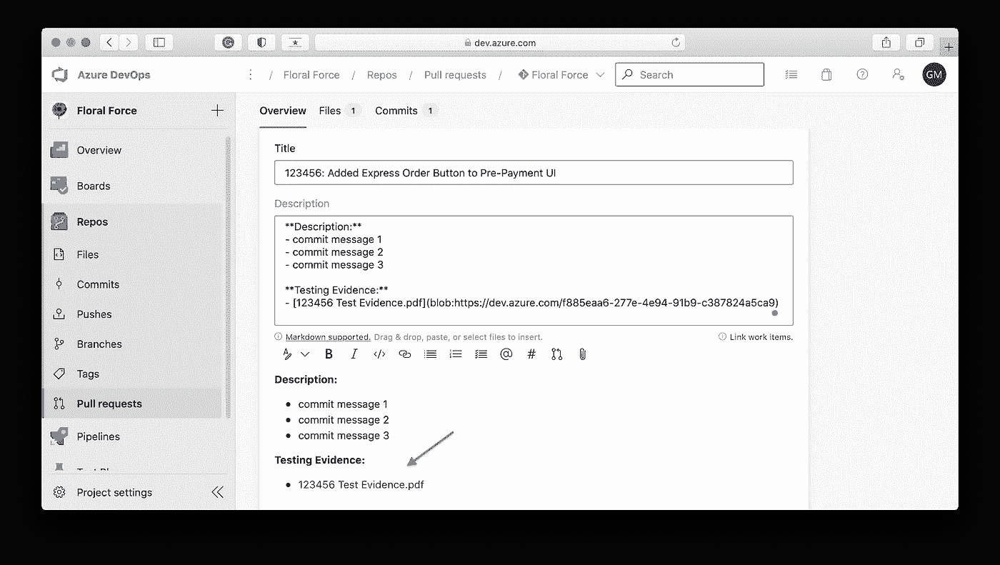
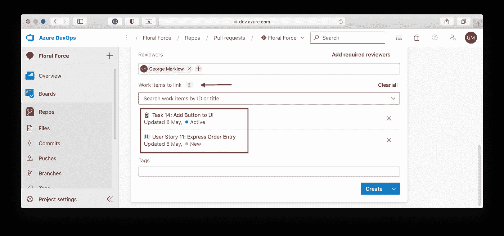
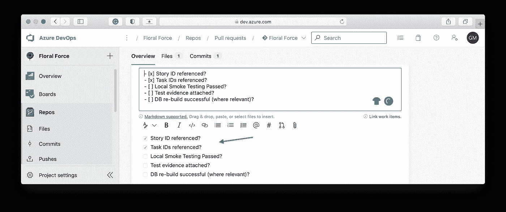

# 在提出拉取请求之前，您应该做的 10 大检查

> 原文：<https://medium.com/geekculture/the-top-10-checks-you-should-do-before-raising-a-pull-request-6dea166515ac?source=collection_archive---------25----------------------->

## 提高每个人都会感谢你的公关


Photo by [Monica Garniga](https://unsplash.com/@dolis_ly?utm_source=unsplash&utm_medium=referral&utm_content=creditCopyText) on [Unsplash](https://unsplash.com/s/photos/astronaut?utm_source=unsplash&utm_medium=referral&utm_content=creditCopyText)

# 介绍

你可能会认为美国宇航局的宇航员花了大部分时间试图打破最长太空行走的记录。当然，你错了。太空的真空充满了危险，所以宇航员花了大部分时间检查清单，很多很多。

核对表对于缓解常见问题至关重要，可用于各种场景。对于软件工程师来说，**拉式请求(PR)清单**确保每个人的 PR 满足一套标准的质量保证规则。

在本文中，我将讨论在提出拉取请求之前我要做的 10 项检查。

# 1.比较更改

仔细检查你的简历中每个文件的修改前后。

例如:

*   您是否无意中删除/更新了其他错误代码？
*   每个单元测试是否正确地描述了正在发生的事情，对于更新的测试，描述是否仍然准确？

最好在提交代码时尽早发现这些问题。现在花额外的几分钟来检查您的更改，比以后必须修复它们要好得多。

# 2.检查命名约定

确保遵循组织内部使用的命名约定:给类、方法和变量起适当的名称，这些名称能够正确描述它们的功能，而不需要使用注释。

此外，将您的代码与以下内容进行比较:

*   大写规则
*   私有变量中下划线的使用
*   文件命名约定

如果你的约定没有记录在团队维基上，努力添加它们。

# 3.评估可访问性

确定哪些方法可以被*保密*或*保护*。例如，如果一个方法只在一个类中使用，那么将该方法设为私有是有意义的。

# 4.确认单元测试通过

如果一个 PR 因为单元测试没有通过而被阻止，这表明你没有注意预先运行单元测试。提前执行单元测试，并利用任何特性来防止您在单元测试没有通过时签入工作。

# 5.只做有意义的改变

**删除代码中的所有注释**。注释应该只是短期的笔记，以帮助和提醒你在编写代码时需要做什么。

另外，**不要添加不必要的空白**修改编辑过的文件。除非空白检查被禁用，否则空白会分散 PR 审阅者的注意力，因为她/他需要检查每个突出显示的更改，却发现这些更改是不相关的。

# 6.删除并重新创建数据库

如果您进行了任何与数据库相关的更改，最好删除本地数据库并重新创建它，以确保没有错误。

# 7.做局部烟雾测试

没有什么比利用每个人的时间来批准一个 PR 更糟糕的了，只是因为在测试过程中发现了一个 bug，QA 分析师才把任务重新分配给你。

因此，对您所做的更改进行局部冒烟测试，以确保您已经捕获了错误并满足了验收标准。此外，在进行本地烟雾测试时，**保持浏览器控制台打开**以检查控制台错误。

# 8.检查拉取请求的标题和描述是否符合团队规则

公关描述应该是对**你的代码变更将会产生什么样的**影响的简单解释。接下来，你应该解释**你是如何**做出这些改变的，以及**为什么**。

PR 描述应该由提交描述中创建的要点自动组成。因此，提交消息本身应该是准确的。

# 9.附上测试证据

我是个好人(诚实)；然而，我有一些严厉的话:

> "如果没有测试证据附在 PR 上，我认为测试从未发生过！"

有太多的理由说明为什么你应该在附在 PR 上的测试文档中包含一步一步的截图。

主要是测试证据:

*   向 PR 评审者展示你已经测试了你的代码。
*   为您对其他开发人员所做的更改提供一些上下文。
*   帮助新的 QA 分析师理解他们测试中的工作流程。
*   为您提供了证据，证明您在测试中一直很努力，以防以后出现问题。

特别是，对于**数据库**的变化:

*   开发者应该在 UI 动作截图之间，对相关表格中的数据进行截图。

对于 **UI** 的变化:

*   在进行更改之前，对 UI 进行截图，然后在进行更改之后再次进行截图，并将这两个截图都附到 PR 中。这样做可以让每个人更容易看到 CSS 的变化。

个人偏好是将截图放入文档，将其转换为 PDF，然后**将 PDF** 附加到 PR(如下所示)。

请注意，在这个例子中，我通过使用粗体字清楚地标记描述和测试证据标题，并利用项目符号来提高可读性，来帮助 PR 审阅者。



# 10.参考任务和用户故事

确保 PR 引用所有相关的任务和用户故事 id，以便有变更的书面记录。

一些 DevOps 平台——比如 Azure devo PS——允许你搜索和附加 id 到你的 PR(见下文)。



# 最后的想法

如果可以的话，[编辑您的 PR 模板](https://docs.microsoft.com/en-us/azure/devops/repos/git/pull-request-templates?view=azure-devops)并包含每个开发人员在提交 PR 之前需要查看的复选框，例如:

```
[X] Story ID referenced?
[X] Task IDs referenced?
[ ] Local Smoke Testing Passed?
[ ] Test evidence attached?
[ ] DB re-build successful (where relevant)?
```

例如， [Azure DevOps](https://azure.microsoft.com/en-gb/services/devops/) 控制的项目中的拉请求页面如下所示:



感谢阅读！在下面的评论区让我知道你的想法，别忘了订阅。👍