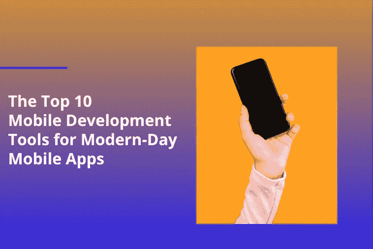

# 现代移动应用的 10 大移动开发工具

> 原文：<https://medium.com/geekculture/the-top-10-mobile-development-tools-for-modern-day-mobile-apps-588311650c62?source=collection_archive---------18----------------------->

[截至 2021 年，全球电子商务的移动份额已上升至 59%。](https://www.simicart.com/blog/m-commerce-statistics/#:~:text=good%20to%20go.-,Statistics%20of%20mCommerce%20Retail,reach%2072.9%25%20globally%20by%202021.)面对国际购物者对移动商务的流动性，对[移动应用开发](https://www.botreetechnologies.com/blog/programming-languages-used-for-medical-app-development/)服务的需求显著上升。但是，不同的移动应用程序有不同的要求。因此，为了满足多样化的移动应用需求，[软件开发公司](https://www.botreetechnologies.com/)试图找到支持他们开发出最好的移动应用的移动开发工具。

在众多的移动应用程序开发工具中，我们将讨论现代移动应用程序开发的 10 大开发工具。

# 什么是手机 App 开发工具？

移动应用开发者使用移动应用开发工具来创建移动应用。手机 app 开发工具有两种。

*   **原生手机 App 开发工具:**
*   这些可以帮助您创建操作简单、质量上乘的专业应用程序。这些可以利用各自平台上的特性。
*   **跨平台手机 App 开发工具:**
*   这些应用程序使得同时为多个平台创建通用应用程序成为可能。它们有助于降低开发应用程序所需的成本和时间。

关于[手机 app 开发工具](https://www.business2community.com/mobile-apps/top-7-tools-for-cross-platform-enterprise-mobile-app-development-02430057)，有几个类别和选项可供选择。例如，开发者有机会从跨平台应用开发、混合移动应用开发和快速移动应用开发中进行选择。没有内部知识的组织可以使用低代码或无代码工具进行开发。

让我们来看看顶级移动开发应用工具及其关键特性的精选列表

*   **Jamf-**
*   它是许多企业移动应用程序开发公司作为商业和教育解决方案使用的工具。该工具使开发人员能够连接、管理和保护云中的苹果应用、产品和企业资源。
*   **功能—**
*   在电子邮件和聊天中提供支持
*   它可以轻松配置 Wi-Fi、电子邮件联系人日历，没有任何麻烦
*   它将使用您的自定义配置文件启用 VPN 配置
*   它有助于对 iOS、iPadOS 和 macOS 进行补丁管理
*   **好友—**
*   该应用程序帮助[企业软件开发公司](https://www.botreetechnologies.com/software-development-company)在各种专用的、预配置的动作和服务的帮助下，轻松实现应用程序部署自动化。
*   **特色—**
*   清洁用户界面/UX
*   基于反应、颤动等的专用 Android 动作
*   支持所有主要语言和任务管理器
*   **安卓工作室—**
*   它是谷歌打造的一种 app 开发工具。该工具的实现编辑器对于 Android [移动应用开发公司](https://www.botreetechnologies.com/mobile-app-development)来说非常方便。Android studio 提供了编码和设计的快捷方式。
*   **功能—**
*   布局设计使我们很容易
*   拖放功能来设计应用程序的布局
*   该工具有一个免费试用版
*   **appy pie—**
*   该工具使[移动应用开发](https://www.botreetechnologies.com/blog/10-important-mobile-app-development-facts/)公司能够开发一个无需编码的移动应用。它允许整合社交媒体，没有任何麻烦。该应用程序的分析功能有助于改善用户体验。
*   **功能—**
*   支持多语言应用程序的开发
*   使您能够向客户发送推送通知
*   允许应用程序中的 GPS 位置跟踪
*   **Xamarin-**
*   这个移动应用程序开发平台是开源的一部分。NET 平台。它从微软获得持续的支持来构建跨平台的应用程序。NET 和 C#。
*   **特色—**
*   它拥有出色的 UI 组件和控件
*   第三方 web 服务、扩展和库支持在不同的操作系统上共享相同的代码
*   它允许应用程序索引和深度链接
*   **Swiftic-**
*   是最好的 iOS 移动应用工具之一。这是一个非常易于使用的界面，允许任何人创建一个应用程序。它有许多使它非常有用的特性。它也很悦目。
*   **功能—**
*   帮助在领先商店发布应用
*   为任何企业创建定制应用和忠诚度计划
*   使用推送通知联系客户
*   **加速器-**
*   该工具允许软件开发服务用更少的代码创建应用程序。Appcelarator 支持 iOS、Android、Windows 和基于浏览器的 HTML5 应用。
*   **功能-**
*   高云容量限制
*   它提高了移动应用程序的开发速度
*   它支持虚拟、私有或内部部署
*   **AppCode-**
*   该工具是用于 iOS/macOS 开发的 IDE。该工具支持 Objective-C、Swift 和 C/C++等语言，并能与 JavaScript、HTML、XML、CSS 等多种 web 技术配合使用。
*   **功能-**
*   30 天免费试用期
*   包括各种有价值的集成
*   **应用手表—**
*   这是一个基于云的移动分析和安全产品，帮助用户保护他们的移动应用程序免受黑客攻击。
*   这是一款基于云的移动分析和安全产品。它帮助用户保护他们的移动应用程序免受黑客攻击。它获得用户的信任，并确保应用程序保持安全。
*   **功能-**
*   启用移动应用程序的完整扫描
*   它有助于识别可能的安全漏洞
*   该工具有助于生成带有修改后的描述、徽标等的定制报告
*   **反应式—**
*   该工具由脸书社区设计和开发。它是一个基于 JavaScript 技术的跨平台框架。它帮助开发人员使用单一代码开发增强的和类似本机的应用程序。它可以作为小企业和大公司的移动应用工具。
*   **功能-**
*   支持跨平台移动应用程序开发
*   这是一个开源平台
*   它有一个充满活力的开发者社区

# 结论

市场上有过多的[移动应用开发工具](https://www.botreetechnologies.com/blog/top-8-mobile-app-development-tools-technologies/)。然而，这使得移动开发工具的比较成为一个非常繁琐的过程。在选择最适合自己的工具时，确定开发项目的需求，并相应地设置选择参数。此外，所有项目涉众必须考虑项目细节、财务资源和其他可能影响工具选择的重要变量。

应该谨慎选择合适的工具，因为错误的选择会减慢应用程序开发过程并增加开发成本。

许多顶级移动应用程序开发公司未能做出适当的工具选择，将面临严重的后果。选择错误的开发工具会导致应用程序开发过程变慢，开发成本增加。

*原载于 2022 年 6 月 27 日*[*【https://froodl.com】*](https://froodl.com/the-top-10-mobile-development-tools-for-modern-day-mobile-apps/)*。*