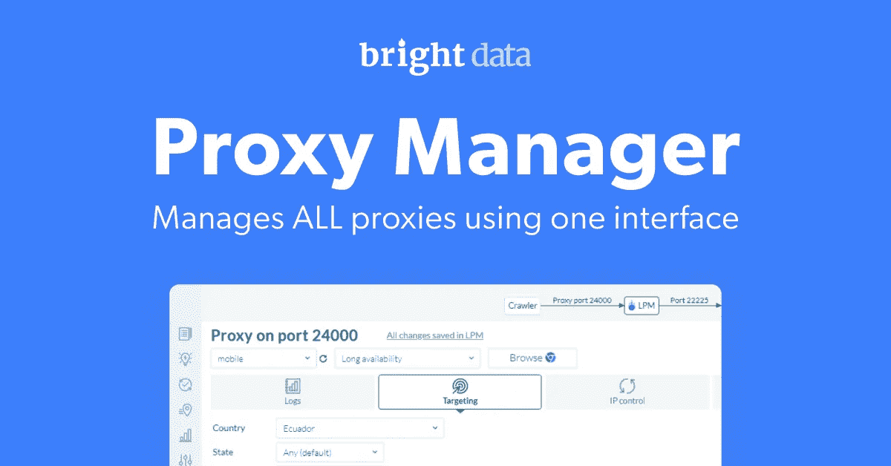
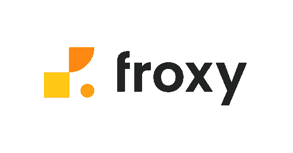

# 每个网络抓取者必须尝试的 5 大代理集成

> 原文：<https://medium.com/geekculture/the-top-5-proxy-integrations-every-web-scraper-must-try-c227045b15d1?source=collection_archive---------4----------------------->


(Image licensed from Shutterstock)

如果你是一个经验丰富的网页抓取者，那么你现在肯定知道使用代理是避免触发网站的僵尸检测算法和阻止你的 IP 地址的关键。

坦率地说，当我开始的时候——主要是尝试一些抓取库和我从 Github 抓取库 中获取的代码片段[——我根本没有意识到那个指导方针。很快我就联系了 r/webscraping 和其他论坛上的用户，请他们检查一下为什么我在目标网站上得不到似乎可以访问的数据。](https://github.com/lorien/awesome-web-scraping)

但是，为我辩护的是，随着时间的推移，我发现这并不完全是常识，和我一样，还有许多人像海浪一样冲击着网站的请求率限制、IP 标记和更多机制。

所以现在，不再是新手，我觉得最好是帮助别人加快进程，更快到达山顶。也就是说，**从网站上大规模抓取数据。**

对于公司来说，订阅一个 [**web 抓取 API**](/api-world/scraping-essential-tools-10-best-web-scraping-apis-7a17804504e3) 或一个全服务 [**web 数据**](https://brdta.com/39QwhHZ) 平台有时会更方便，但对于我们这些为客户构建定制抓取器或为自己的业务使用它们的自由职业者来说，保持对 web 抓取器源代码的所有权和控制权是非常重要的。

除此之外，我们许多 DIY 程序员以维护代码中的所有依赖关系为荣。因此，将代理或云代理管理器直接与我们的爬虫或自动化浏览器脚本集成是必须的。

# web 抓取工具通常使用什么工具和库？

最常见的 web 抓取设置包括用于 web 爬行、数据解析和浏览器自动化的各种工具。原因是许多网站有不同的架构和不同的数据处理方法。有些更简单，需要 Python 上的一个简单的请求命令。

不过有些网站比较复杂，有些很容易搞清楚。例如，一些网站将其大部分数据存储在 JavaScript 后面，这迫使 web scraper 模拟用户与页面的交互，以便加载目标数据。这是像 **Selenium、木偶师、Scrapy、剧作家**等工具的地方。进场吧。

但是不管你的设置如何，在大多数情况下，尤其是在经常成为网页抓取目标的网站上，仍然有限制和各种各样的**反抓取技术**需要网页抓取器来处理。大多数新手抓取者都无法屏蔽他们的算法来对抗机器人检测。他们要么超过网站对单个 IP 的请求速率限制，要么通过容易检测的**数据中心 IP**发送请求。解决方案是使用住宅代理，这有助于抓取工具模仿真实用户的行为而不引起怀疑(最重要的是保持网站不受损坏)。

因此，对于那些还没有找到代理提供商的有经验的 web 抓取者和那些刚刚开始用代理扩展 web 抓取项目的新手来说，我们已经编辑了一个简短的列表，列出了代理市场可以提供的最佳选择。

# 以下是您应该考虑的 5 大代理集成:



(Image courtesy of Bright Data)

# 1.明亮的数据代理集成:

Bright data 是 Selenium 和 Puppeteer 代理集成的流行选择，因为它提供了高质量的代理，既快速又可靠。真正的优势来自于使用他们优秀的 [**代理经理**](https://github.com/luminati-io/luminati-proxy) 。它具有“ ***瀑布路由*** ”功能，这意味着它可以根据您可以轻松定制的规则，通过住宅 IP、数据中心 IP 和移动 IP 网络路由您的请求，从而为您的抓取或 web 自动化项目获得最具成本效益的**流**。代理管理器可以在您的设备或云上运行。

Bright Data 领先的[代理集成](https://brightdata.com/integration)指南包括以下内容:

*   Selenium(支持 Java、C#、Python、Ruby、Javascript)
*   操纵木偶的人
*   剧作家
*   Adspower
*   幻影杀手
*   虚拟机登录

在 Bright Data 代理管理器中创建代理区域后，下面是如何在 Selenium 中使用它的示例:

```
const {Builder, By, Key, until} = require('selenium-webdriver');
const proxy = require('selenium-webdriver/proxy');(async function example(){
    let driver = await new Builder().forBrowser('firefox').setProxy(proxy.manual({
        http: '127.0.0.1:24000',
        https: '127.0.0.1:24000'
    })).build() try {
        await driver.get('http://lumtest.com/myip.json');
        driver.switchTo().alert().accept();
    } finally {
        await driver.quit();
    }
})();
```


(Image courtesy of Netnut)

# 2.螺母:

[Netnut](https://github.com/NetNut-Proxy-Network/NetNut#integrations-and-configurations) 代理是 Selenium 和 Puppeteer 代理集成的另一个选项。它提供了广泛的功能，包括自动轮换代理和同时使用多个代理。

Netnut 与工具有一些有趣的合作和集成，例如:

*   贾维
*   卡梅莱奥
*   拉利卡
*   Parsehub


(Image courtesy of Smartproxy on Twitter)

# 3.智能代理:

Smartproxy 提供了几个集成库，我们想要指出的是 [BeautifulSoup](https://pypi.org/project/beautifulsoup4/) 代理集成。BS4(beautiful soup 的最新版本)是最流行的 Pyhton 库之一，用于解析 **HTML** 和 **XML** 数据，对于只依赖 Python 的 web 抓取器来说是必不可少的。您可以在 Github 资源库中找到 Smartproxy 指南，了解如何在 BS4 中使用代理。


(Image courtesy of Zyte Facebook page)

# 4.Zyte:

Zyte 拥有最广泛的代理集成，这仅仅是因为它的大多数工具都是开源的。这鼓励了 Scrapy 社区的成员和更多人创建他们自己的[集成和变体](https://docs.zyte.com/smart-proxy-manager-integrations.html)，主要是使用 Zyte 的**智能代理管理器**(有点类似于 Bright Data 的代理管理器)。

Zyte 的代理集成指南包括以下语言:

*   C#
*   Java 语言(一种计算机语言，尤用于创建网站)
*   节点. js
*   幻象
*   服务器端编程语言（Professional Hypertext Preprocessor 的缩写）
*   计算机编程语言
*   红宝石
*   稀有

当然，还有 Scrapy(Zyte 赞助的基于 Python 的网络抓取环境)。

为了在 Scrapy 中使用 Zyte 智能代理管理器，用户需要安装 [Zyte 代理中间件](https://github.com/scrapy-plugins/scrapy-zyte-smartproxy)，可以安装:

```
pip install scrapy-zyte-smartproxy
```

然后以这种方式启用中间件:

```
DOWNLOADER_MIDDLEWARES = {'scrapy_zyte_smartproxy.ZyteSmartProxyMiddleware': 610}
ZYTE_SMARTPROXY_ENABLED = True
ZYTE_SMARTPROXY_APIKEY = '<API key>'
```



(Image courtesy of Froxy)

# 5.Froxy:

除了这个酷名字之外，Froxy 代理还提供了一个简单的 Selenium 代理集成。下面是一个如何使用 Java 建立代理连接的示例，看起来像是使用 Froxy:

```
String ProxyServer = "proxy.froxy.com";
  int ProxyPort = 9000;
```

**重要提示！**

几乎所有上述代理集成和指南都可以互换。例如，在 Selenium 中，您需要做的就是在代码的适当位置替换代理名称和访问链接，这样就可以了。因此，您没有与上述任何代理提供者“结婚”,可以在它们之间切换，而不会破坏您的代码。

# 结论

所以你有它！这是每个网络抓取者必须尝试的 5 大代理集成。将其中的一个整合到你的网络抓取代码中，将会帮助你避免被检测和阻止。无论您选择哪种代理集成，都要确保在生产中使用它之前进行彻底的测试。使用代理时要小心，因为如果使用不当，它们可能会被滥用。

还有更多的集成。例如，[*bestproxyreviews*](https://www.bestproxyreviews.com/selenium-proxy/)*有一篇专门针对 Selenium 代理集成的文章。如果你使用了一个你认为我们被错误地排除在这个列表之外的，请给我们发送一个链接，我们会试用它！*