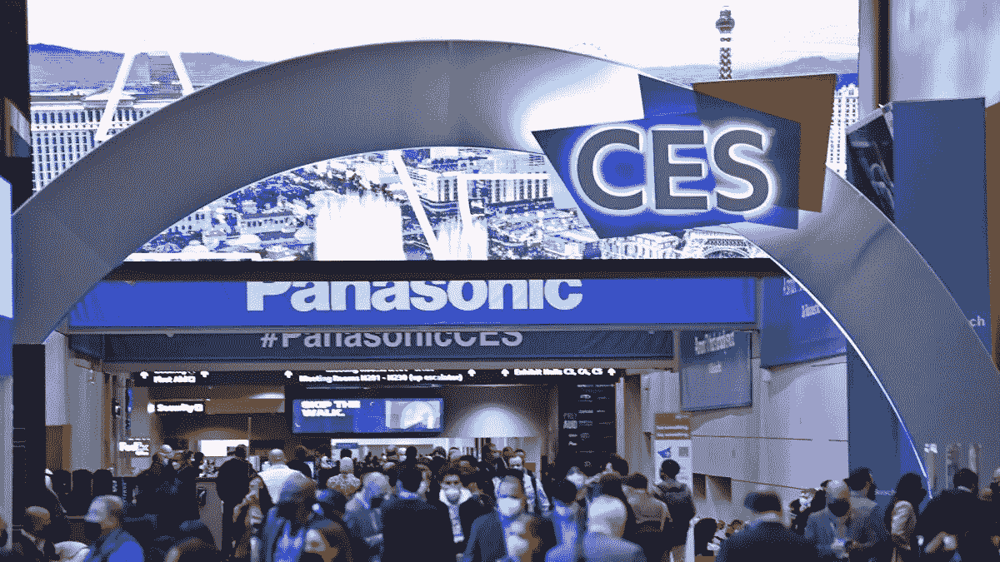

# 在 CES 2022 上引起我注意的五大技术

> 原文：<https://medium.com/geekculture/the-top-5-tech-that-caught-my-eye-in-ces-2022-7b520cae868b?source=collection_archive---------24----------------------->

CES 将于 2022 年再次回归，尽管许多公司由于冠状病毒而选择虚拟化，包括 Meta、亚马逊和谷歌等公司。

尽管如此，该活动展示了其一贯的迷人、创新和有时古怪的技术。

不幸的是，活动已经结束了，让我们回顾一下吸引我的 5 项令人印象深刻的技术…