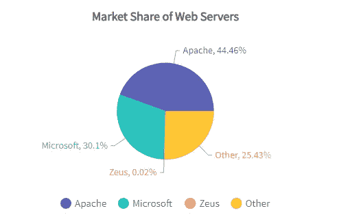
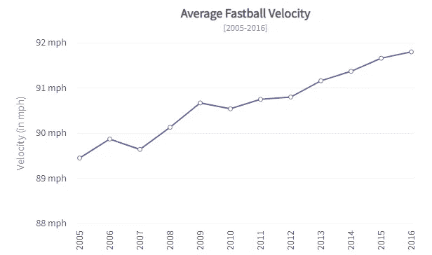
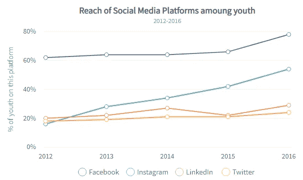
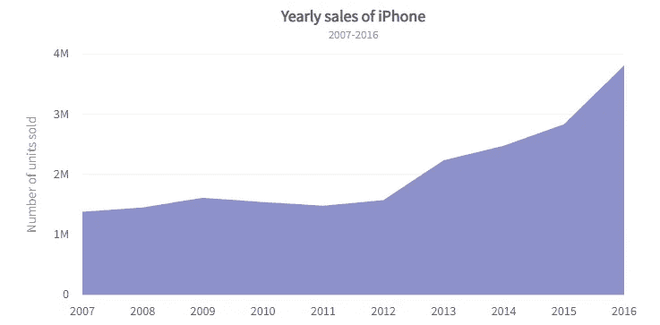
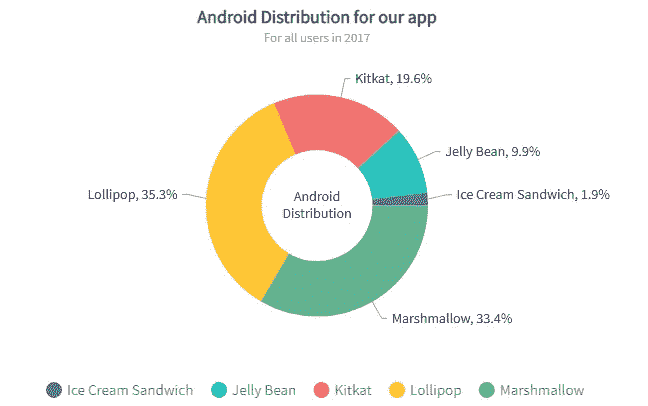
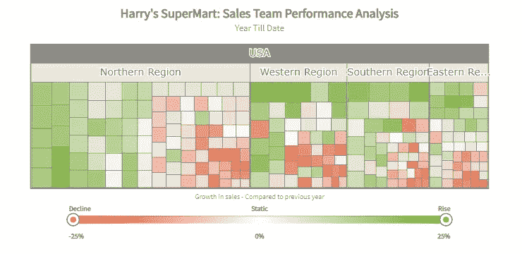
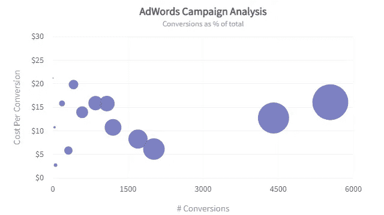

# 你需要知道的 8 大社交媒体数据图表和直播图表

> 原文：<https://medium.com/geekculture/the-top-8-social-media-data-charts-and-live-charts-you-need-to-know-d2c6cd87ea64?source=collection_archive---------17----------------------->

就像许多其他行业一样，在过去的二十年里，市场营销的前景已经发生了根本性的变化。

随着社交媒体和智能设备的普及，营销活动可以更容易地触及受众，但面临着吸引他们的挑战。

因此，只有抓住消费者兴趣的策略才能在今天取得成功。这些吸引注意力的策略包括利用数据图表和实时图表。

# #我如何在营销中利用技术？

令人欣慰的是，技术进步带来了营销行业的许多范式转变，并赋予了它全新的工具。

具体来说，营销活动现在可以有效地利用二十一世纪最强大的商品——数据——来为自己谋利。此外，营销活动现在可以采用更加个性化的方式来接触受众，并使用智能数据来影响他们。

现代营销中许多面向数据的方法之一是利用引人注目的数据可视化。

您可以使用强大的数据图表来教育您的受众，并更好地影响他们的决策。社交媒体营销可以从整个营销活动中的实时图表中受益匪浅。

我们将探索您可以用于社交媒体营销活动的[数据图表](https://www.fusioncharts.com)。我们还将讨论如何根据您的营销目标选择更合适的选项。

# 哪些图表让你在社交媒体上更有影响力？

虽然数据可视化在许多情况下很简单，但最好的例子是选择相关的数据图表。不幸的是，有数百种方法可供您选择，每种方法对一种情况来说都是完美的选择，但对另一种情况来说却是灾难性的。

因此，你需要了解有效数据可视化背后的科学，以及如何为你的社交媒体营销选择正确的实时图表。

看看社交媒体营销成功的八个流行数据图表。

# #饼图

饼图是最常见的数据可视化形式之一，在商业和科学演示中非常重要。它们便于直观地解释多个组件如何以何种比例形成一个实体。

为了更好地理解，不同的部分可以根据上下文进行颜色编码，并标上百分比。一些饼图是三维的，以给出关于其数量的更可靠的概念。

社交媒体活动可以在多种情况下使用饼图来教育受众关于产品的知识，如果不一定能卖出去的话。例如，饼图可以显示特定产品的用户群是如何由来自不同人口统计的个人组成的。

它可以帮助观众理解，如果他们属于相同的人口统计数据，该产品将非常适合他们。

# #折线图

折线图是流行且易于制作的数据可视化的另一个例子。这些数据图表包括一对代表某一数量的轴。

这些图表上的线条是通过找到最适合图表所有数据点的线条来定位的。折线图也可以是交互式实时图表，可以帮助用户在数据实时更新时可视化数据。

折线图可以在你的社交媒体活动中派上用场，用于许多不同的目的。例如，您可以通过指出事件发生的时间来显示特定事件的前后。

此外，通过绘制与实体状态随时间变化相对应的线形图，可以看到特定方面或现象的增长。

# #堆积折线图

堆叠折线图进一步扩展了基本折线图，并涉及多条线。每条线可以对应同一时间段内各种现象表现出的增长。

这种数据图表尤其以建立特定数量相对于其他数量的确定性而闻名。因此，单个堆积折线图可以捕捉多个实体中的变化，并对它们进行排列以便直接比较。

像堆积折线图这样的数据图表在社交媒体活动中很方便。当消费者选择一个特定选项和其他选项时，您可以使用它们来直观地表示用户的旅程。此外，当用户必须从大量潜在选项中进行选择时，它们可以帮助用户直观地了解特定选项是如何有益的。

# #条形图

条形图类似于折线图，只是它们不涉及绘制连接轴上数据点的线条。相反，条形图包括为每个数据点放置一个列，以便列的高度对应于数据点的特定方面。

多个这样的列有助于建立数据点之间的比较以及它们在特定元素中的公平性。

社交媒体活动经常使用条形图，因为它们简单但视觉上很吸引人。条形图有助于查看者快速掌握两个数据点之间的差异，您可以利用这一点来影响他们的决策。

例如，您可以直观地将折线图和条形图结合起来，以确定两个数据点之间的变化。

# #面积图

面积图是另一种概念上接近折线图的数据可视化。这种类型的数据图表的附加特征是线条下的区域是彩色的或突出显示的。突出显示有助于观众理解连续数据点之间某一数量的连续变化。

与堆叠折线图一样，您可以将多个面积图组合成一个大的可视化图，每个面积都用颜色编码并代表不同的实体。

由于面积图类似于折线图，它们的使用取决于你的社交媒体活动的性质和目标。

具体来说，如果您强调数据点之间的巨大差异，或者传达总和与组成部分一样重要，面积图会非常有用。颜色选择对于实际的面积图实现是不可或缺的。

# #甜甜圈图表

圆环图还向您展示了一个实体的组成部分和每个比例，从饼图中获得灵感。

然而，它们在中间的孔中提供了一个额外的数据点，使整个可视化呈现为一个甜甜圈形状。在大多数情况下，附加数据点是所有组件的总和。因此，当建立一个实体的组成以及它们如何相加来创建最终方面时，圆环图是很方便的。

你可以用各种令人兴奋的方式将甜甜圈图用于你的社交媒体活动。饼图和圆环图的选择取决于您是否需要额外的数据点空间。

圆环图也有助于一目了然地显示不同类别之间的比较。

# #树形地图

树状图是你见过的最具创造性的数据可视化类型。它们结合了多个可视化方面，并一次性传达了各种数据集特征。

它们是独一无二的数据图表，让我们深入了解对现象的组成部分和比例进行分类。此外，您可以在同一可视化中显示元素之间的层次关系。

虽然树状图对于有效的社交媒体营销活动来说似乎过于复杂，但在某些情况下，它们可能非常有用。

例如，它们经常被用来传达来自社交媒体分析的见解。因此，你可以显示某些方面的组成部分以及每个组成部分在整体中的位置。

# #气泡图

气泡图以不同的方式处理可视化方面及其在上下文中的贡献的问题。绘制气泡图包括用气泡指定每个元素，气泡的大小对应于某些特征。

因此，同一轴上的多个气泡可以有效地比较各个方面。此外，轴的存在有助于确定气泡之间的差异。

使用气泡图，您可以教育您的社交媒体受众不同方面如何促成一种现象。

例如，您可以使用它来显示您的总销售额是如何由单个销售额组成的。每个气泡的大小代表每种产品的销售数量。

# #准备好了解 FusionCharts 如何提升你的社交媒体排行榜了吗？

使用强大的数据可视化工具，您可以实现有助于社交媒体目的的不同图表。因为所有形式的社交媒体都在网络上，所以你需要合适的基于网络的数据可视化工具。

通过选择 FusionCharts，您可以实现所有流行的数据可视化图表，这些图表具有交互性和视觉吸引力。

FusionCharts 是最受欢迎的数据可视化工具之一，因为它的数据图表范围很广。这些也可以是实时跟踪所有数据变化的实时图表。

此外，您可以轻松地将 FusionCharts 集成到您的项目中，并开始用独特的主题和颜色显示您的见解。

除了简单的地图和数据图表，您还可以通过组合多种可视化方式来创建广泛的数据仪表板。您可以以所需的形式导出图表和仪表板，而不会失去视觉吸引力。

FusionCharts 定期更新，因此您总是可以获得最现代、最时尚的可视化效果。