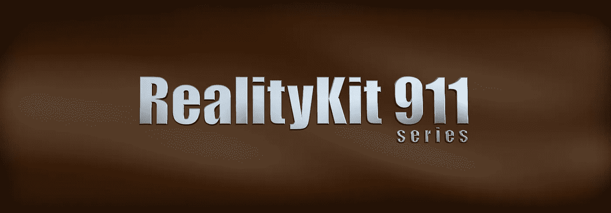
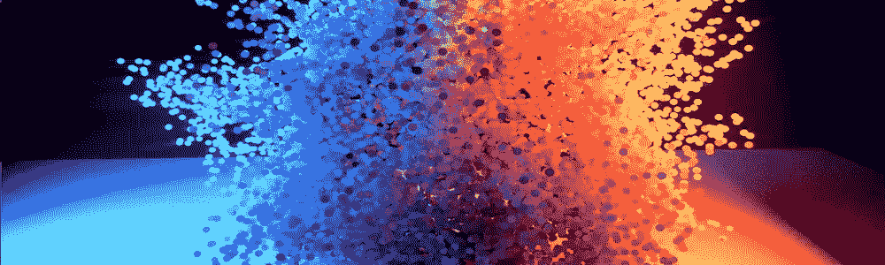
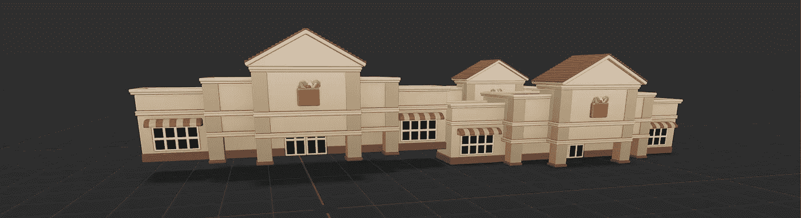
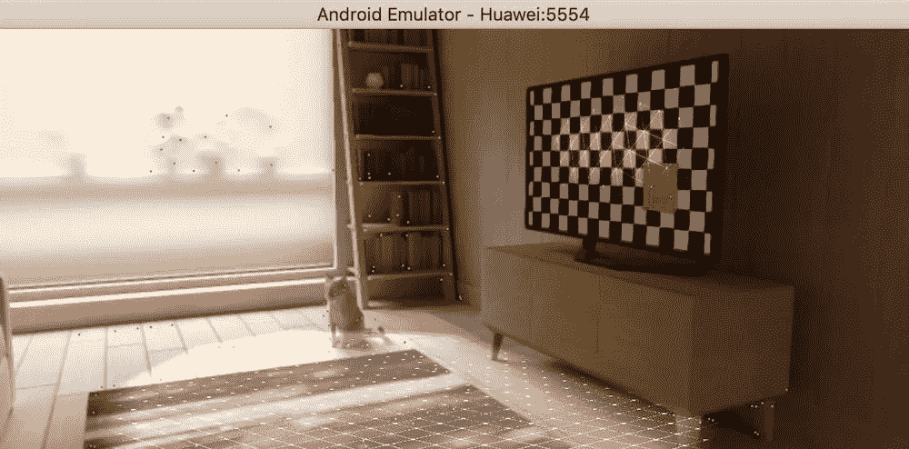
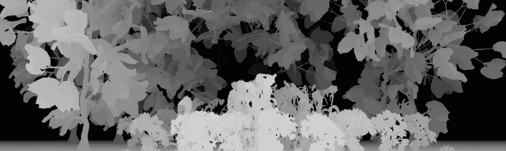

# RealityKit 3.0 最受欢迎的 9 大功能

> 原文：<https://medium.com/geekculture/the-top-9-most-in-demand-features-for-realitykit-3-0-c1a50f08909d?source=collection_archive---------8----------------------->



现实 Kit 很棒，没人质疑。然而，这个框架还不完善。 [RealityKit 2.0](https://stackoverflow.com/questions/60505755/high-quality-rendering-realitykit-vs-scenekit-vs-metal/60513052#60513052) 没有我们在 SceneKit 中习惯的所有功能。因此，我决定写下我希望在框架的下一个主要版本中看到的九个重要特性。 ***相信苹果的 RealityKit 团队成员会读到这个故事*** 。

# 1.粒子系统

原生粒子系统是任何 3D 软件包或游戏引擎的基本元素。我期望看到一个先进的粒子系统(与 SceneKit 中的不一样，而是与 Maya 或 Houdini 中的一样)。至少，我想看到诸如 3D 粒子发射器、照明粒子、粒子碰撞和从纹理继承颜色的能力。



# 2.allows camera control

许多 SceneKit 开发人员高度赞赏这一特性。它允许你推车，卡车和/或基座你的主动相机。如果你忘记在 AR 应用中禁用它，它可能会完全破坏你的 AR 体验。尽管如此，没有它是很难生活的。

```
sceneView.allowsCameraControl = true
```

即使 RealityKit 2.0 中没有实现这个特性，也可以尝试自己实现。阅读 [***这篇文章***](https://stackoverflow.com/questions/71516286/realitykit-as-a-framework-to-build-3d-nonar-apps) 寻求提示。

# 3.仅阴影

在 SceneKit 中，我们习惯了名为 ***shadowOnly*** 的光照模型。换句话说，它是影子捕手。很难高估它的好处。

```
**let** material = SCNMaterial()
material.lightingModel = .shadowOnly
```

我知道 Reality Composer 的地板，能够捕捉阴影，但最好有一个着色器。



Reality Composer’s shadow

# 4.支点

为什么 RealityKit 2.0 和 Reality Composer 1.5 中没有 ***旋转*** ？你不得不承认这很不方便，对吧？SceneKit 是这样写的:

```
**let** node = SCNNode()
node.simdPivot.columns.3.y = 0.25
```

你们中的许多人可能会与我争论——只需在一个组(实体)中嵌套一个模型，就可以获得控制支点的方法。但是你必须承认，当场景中有大量的物体时，这是控制物体变形的非常不方便的方法。

# 5.物理精度

游戏开发者的主要愿望之一是一个精确物理模拟的引擎。当前版本的 RealityKit 是 ***在动力学方面与理想的*** 相差甚远，例如，与 Unity。RealityKit 中用于控制物理的参数数量很少，碰撞效果也不好。

# 6.Xcode AR 模拟器

ARKit/RealityKit 开发者迫切需要一个类似 Android Studio 中 ARCore 模拟器的 AR 模拟器。无可奉告。



这个方向的积极转变已经被勾勒出来，开发者可以在 iPadOS 上的[***Swift Playgrounds***](/geekculture/realitykit-911-swift-playgrounds-or-how-to-create-and-debug-ar-apps-on-ipad-pro-190a6d2e03bb)测试他们的应用。

# 7.在场景重建期间捕获纹理

即使在 WWDC 2021 上宣布了一个名为 [***对象捕捉***](https://stackoverflow.com/questions/63793918/lidar-and-realitykit-capture-a-real-world-texture-for-a-scanned-model) 的新 API，我们仍然需要一个 API 来使用激光雷达扫描仪即时捕捉纹理。

# 8.深度图可视化

如果能同时渲染视频部分和开箱即用模型(无需手动输入金属代码)的深度数据的最终合成，那就太好了。



# 9.播放列表中的所有动画

目前，RealityKit 开发者只能播放与实体相关联的动画集合中的第一个元素。尽快解决这种情况很重要。

```
**let** entity = ModelEntity()
**let** animation = entity.availableAnimations[2]       // error
entity.playAnimation(animation)
```

# 固定—主动方案与 iOS 模拟器

在 Xcode 13.2 中不再有这样的问题。但是在 Xcode 以前的版本中，所有的开发者都多次看到这个烦人的消息。


问题很简单——选择的 ***iOS 模拟器*** 方案不支持 ***会话*** 实例属性。很高兴终于修好了。

# 另一种选择

当然，所需选项的列表可能会更长——可能会有变形、蒙皮、相机约束、物理约束、*双面*材质(尽管双面着色器目前可以通过 python[***USDZ 模式***](/macoclock/augmented-reality-911-usdz-schemas-367ae40c6950) 激活)等功能，但我决定将列表限制在最重要的功能上。

# 捐赠给作者


Click on the picture to make the QR code bigger

```
addr1q9w70n62nu8p7f9ukfn66gzumm9d9uxwppkx7gk7vd7gy0ehfavj97gkncwm8t8l8l8x9e4adzmw2djh4y5gd9rmtewqr99zr3
```

目前就这些。

如果你同意我的意见，请按下 ***拍下*** 按钮，按住*即可。在 Medium 上，每个帖子最多可以拍 50 次*。**

**你可以在我在 [StackOverflow](https://stackoverflow.com/users/6599590/andy-fedoroff) 上的帖子中找到更多关于 ARKit、RealityKit 和 SceneKit 的信息。**

**后会有期！**