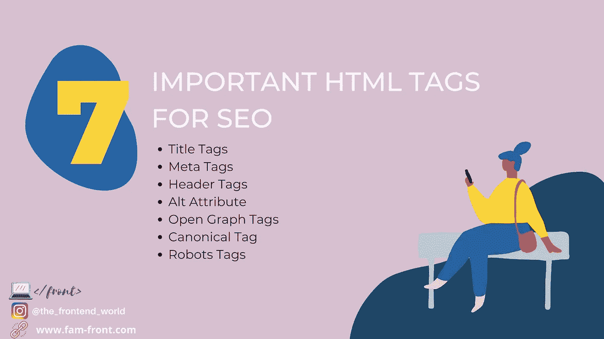

# 搜索引擎优化最重要的 HTML 标签

> 原文：<https://medium.com/geekculture/the-top-important-html-tag-for-seo-b3e915e15ede?source=collection_archive---------14----------------------->

## 如何让你的网站 SEO 友好？

By FAM

SEO 代表搜索引擎优化。这是从搜索引擎提高网站流量的质量和数量的过程。SEO 的目标是未付费流量，而不是直接流量或付费流量。对于互联网上的任何页面来说，拥有有机流量都是至关重要的。好的方面是有一些…