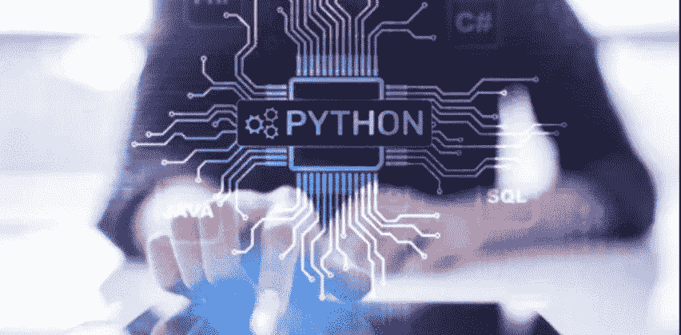
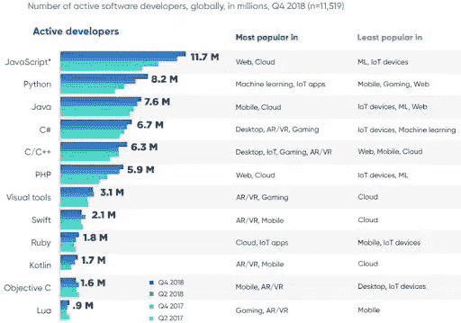

# 2022 年开发者的顶级 Python 开发技能

> 原文：<https://medium.com/geekculture/the-top-python-development-skills-for-developers-in-2022-2028277dc016?source=collection_archive---------19----------------------->

Python 现在是不同领域中许多解决方案的选择，例如 Python web 开发解决方案、数据科学和机器学习。根据 2018 年的一份报告，Python 已经实现了 820 万活跃开发者，现在在受欢迎程度上已经超过了 Java。它已成为增长第二快的语言社区，2018 年有 220 万新的 Python 开发者。数字还在上升。机器学习的兴起是其受欢迎的一大原因。现在超过 69%的机器学习开发者和数据科学家使用 Python。

Source: [STATE OF THE DEVELOPER NATION — Amazon AWS](https://slashdata-website-cms.s3.amazonaws.com/sample_reports/ZAamt00SbUZKwB9j.pdf)

# 选择 Python 应用程序开发的理由

组织倾向于使用 [**python 进行应用开发**](https://www.botreetechnologies.com/blog/python-for-enterprise-app-development/) **:** 的原因有很多

*   Python 是一种可扩展的语言，使得管理不同的活动变得容易
*   它是高度可读的，因为它是动态类型的，并要求缩进
*   Python 的几个库使得开发人员很容易访问它
*   Python 可以用来在很短的时间内设计原型

> *阅读更多:*[***Python 中的敏捷软件开发:2022 年要知道什么***](https://www.botreetechnologies.com/blog/agile-software-development-in-python/)

很明显，如果你是一名程序员，Python 是一个很好的选择。对于任何一个 [**软件开发公司**](https://www.botreetechnologies.com/software-development-company) **来说都是很容易理解的，也足够通用。**然而，尽管对 python 开发服务有巨大的需求，但对最好职位的竞争也很激烈。

## 顶级 Python 开发者的技能

这篇文章涵盖了强大的技能，如果掌握了这些技能，可以帮助年轻的程序员提高他们作为 Python 开发人员的市场竞争力，并被最好的 [**python 应用开发**](https://dev.to/botreetechnologies/7-ways-a-python-application-can-benefit-your-business-2g2k) 公司聘用。

1.  调试技巧
2.  了解前端技术
3.  人工智能和机器学习
4.  通讯技能
5.  列表理解和切片
6.  设计技巧
7.  分析技能
8.  Python 库
9.  核心 Python 的专业知识
10.  网络框架知识

**1。调试技巧—** 虽然 Python 是一种初学者友好的编程语言，并且很容易开始您的编码生涯，但可能会出现输出与预期不同的情况。对于这种情况， [**python 软件开发服务**](https://www.botreetechnologies.com/python-development) 在应聘者中寻找调试的技能。一个简单的调试过程包括打印变量值、修改程序路径、停止事件的执行以及使用调试器。

**2。了解前端技术**——在 python 开发期间，开发人员有时需要与前端团队沟通，以确保服务器端与客户端相匹配。因此，前端语言和框架(如 HTML、CSS、C++等)的知识可以帮助你理解应用程序将如何出现。虽然这不是一个必须知道的技能集，但即使是工作知识也是非常受欢迎的。

**3。人工智能和机器学习** —人工智能和机器学习都是不断增长的领域。对于这两个领域来说，Python 都是很棒的编程语言。专业人士和崭露头角的数据科学家应该投入大量时间来磨练包括 Python 在内的不同机器学习主题。

**4。沟通技巧** —不，开发人员不在孤岛中工作。大型项目需要大团队协调他们之间的活动，并保持在正轨上。在任何 python 应用开发公司中，只有通过有效持续的沟通，才能达到最终的生产力和质量。任何 python 应用程序开发团队中的开发人员都需要沟通，这不仅是为了完成他们的工作，也是为了保持文书工作准备就绪和清晰，以便团队和他们的成员能够阅读和遵循。

**5。列表理解和切片**——这些被认为是 [**python 开发**](https://yourstory.com/mystory/how-to-get-started-with-python-development-wcmtcnz36p) 最重要的特性。切片可以在字符串上实现，并且有足够的天赋来删除部分列表。列表理解是一种基于当前列表建立新列表的机制。这有助于将循环中的不同行消除为一行，并易于理解语法。因此，对于任何 Python 开发人员来说，精通列表理解和切片知识都是加分项。

**6。设计技能**——一些 python web 应用程序开发公司不仅寻找完美的程序员，还寻找能够帮助设计可扩展的长期产品并以高度可用的方式实现服务器的人。了解 Django 和 Flask 等主要 python 框架是一个优势，因为 Python 可以在客户端和服务器端编程中工作。

**7。分析技能**——就像任何编程语言一样，除了精通语言之外，Python 开发人员还需要良好的分析技能。对算法的良好理解有助于编写更好的无冗余代码，可视化数据集等。

**8。Python 库**——几乎所有语言都有自己的库。库的可用性及其最终的可用性会影响任何语言的使用率。库旨在使 python web 开发公司的生活更加轻松，因为它有助于更快、更有效地执行工作。Python 没有自己的移动开发能力，但是有可以用来创建移动应用的库包，像 Kivy，Beeware 的托加库等。这些库都是 python 移动开发的主要参与者。
一个优秀的 python 开发者应该知道不同项目中有用的不同库。

**9。web 框架知识**——任何优秀的 Python 开发人员都必须精通两个 Web 框架 Django 或 Flask 中的一个或两个。Django 是一个 Python Web 框架，鼓励干净和现实的设计，而 Flask 也是一个广泛使用的 Python 微 Web 框架。全面熟悉 HTML、CSS 和 JavaScript 等前端技术也是一个优势。

**10。核心 Python 的专业知识** —核心 Python 的坚实基础是成为一名成功的 Python 开发人员的必备条件。Python 的核心概念包括:

*   迭代器
*   发电机
*   面向对象编程语言的概念
*   数据结构
*   变量和数据类型
*   异常处理
*   文件处理概念

> *阅读更多:* [***机器学习和深度学习的 11 大 Python 框架***](https://www.botreetechnologies.com/blog/top-11-python-frameworks-for-machine-learning-and-deep-learning/)

## 结论

你的技能就是你的剑。你必须削尖它，以确保在一次挥杆中产生最大的冲击力。在编程中，世界学习是成长的同义词。获得额外的技能不仅有益，还会让这条道路更有趣、更具挑战性。2022 年，努力提高自己的技能将会帮助你找到一份好工作，并让你的职业生涯走上正轨。参加课程、参加网络研讨会、教授他人、加入编程社区等等，这些都是成为更好的 Python 程序员的方法。

如果您正在寻找最好的 python 应用开发或需要任何咨询， [**联系**](https://www.botreetechnologies.com/contact) BoTree Technologies 免费咨询。

*原载于 2022 年 4 月 5 日 https://www.botreetechnologies.com***。**