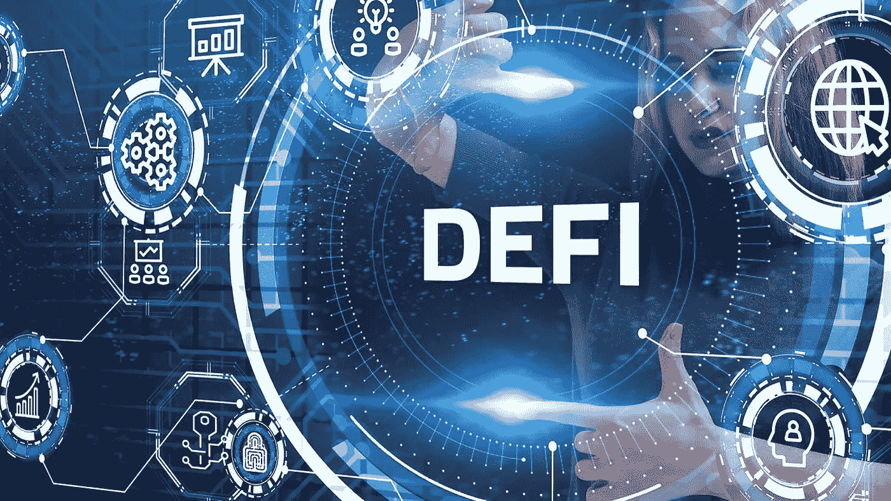

# 利润最高的 DeFi 掉期应用 2022

> 原文：<https://medium.com/geekculture/the-topmost-profitable-defi-swap-application-2022-2103903361cb?source=collection_archive---------19----------------------->

2022 年对于加密货币和 DeFi 空间来说是巨大的一年。大多数国家已经开始接受加密货币。如此多的年轻企业家和初创公司已经进入了密码世界。太好了，没错！

每个人都在为赚钱和发展自己的生活方式而工作，因此我们工作的方式很重要，聪明还是努力。显然，我们需要聪明。

盈利的聪明方法是分散融资(DeFi)。

DeFi 成为加密货币交易所和区块链世界的中心。

# **分散融资(DeFi):**

DeFi 是开放金融，也被称为金融自由。在进行交换、交易、购买等时，它去掉了中间人。它允许你自己拥有数字货币的所有权，而不需要中介。DeFi 用于各种垂直业务，如银行、医疗保健、DEX、游戏、供应链、教育等。在分散金融中，有许多商业理念可以帮助你获利。在这方面，DeFi swap 应用程序起着至关重要的作用。

# **DeFi 互换申请:**

在 DeFi 领域，可以帮助你获利的顶级利率互换应用程序是

Pancakswap 克隆脚本

Uniswap 克隆脚本

Sushiswap 克隆脚本

Bakeryswap 克隆脚本

Justswap 克隆脚本

这些是流行的基于 DeFi 的 exchange 克隆脚本业务模型。您也可以通过复制现有的上述交换项目来启动您自己的 DeFi 交换项目。太令人兴奋了，对吧！

让我们详细了解一下上述克隆脚本。

## **Pancakeswap 克隆脚本:**

Pancakeswap 克隆脚本是一个像 pancakeswap 一样的基于 AMM 的 DeFi 交换。它开发了现有 Pancakeswap 网站的所有高级特性和功能。它是基于币安智能链(BSC)网络开发的。使用 [**Pancakeswap 克隆脚本**](https://www.alwin.io/pancakeswap-clone-script) ，您可以启动自己的基于 DeFi 的交换项目。你也可以在不同的区块链网络上开发你自己的克隆，比如 ETH，polygon，Tron，Solana。

## **uni WAP 克隆脚本:**

Uniswap clone script 是一个基于 DeFi 的交换平台，它复制了 uni WAP 平台开发的所有智能功能和特性。它是在以太坊网络上开发的。它开发的特点包括交换、低交易费用、产量农业、不持有资金、代币多功能性。

## **Sushiswap 克隆脚本:**

Sushiswap 克隆脚本是对 sushiswap 分散交换平台的模仿。它开发的特点，如高安全性，适应各种区块链网络，交易机器人，AMM，接受 14+加密货币钱包。这是一个受欢迎的以食物为主题的 DeFi 交易所。

## **bakery WAP 克隆脚本:**

bakery WAP 克隆脚本是基于 Bakeryswap DeFi 的 exchange 平台的副本。在币安智能链网络上开发。它以各种各样的秘密投资机会而闻名。也因为其无可挑剔的产量农业、加密货币发射台和 NFT 投资。

## **Justswap 克隆脚本:**

和上面提到的其他 DeFi 交换一样，Justswap 克隆脚本也是 Justswap 交换的复制。Justswap 克隆脚本是在 Tron 网络上开发的，具有所有需要的特性。它开发了智能功能，如流动性供应，赌注，池和奖励选项。

# **如何开发 DeFi swap 应用程序？**

在 DeFi 领域，有许多 [**DeFi 开发服务**](https://www.alwin.io/decentralized-finance-defi-development) 提供商。其中选择正确和优质的服务提供商是一项艰巨的任务。根据我的调查，我建议 WeAlwin technologies —一家领先的 DeFi 开发公司，拥有一个专家团队，帮助您开发具有所有高级特性和功能的 DeFi 项目。他们提供优质服务，并在不同的区块链网络中提供解决方案。他们的 DeFi 克隆脚本是一个价格合理的即时解决方案。