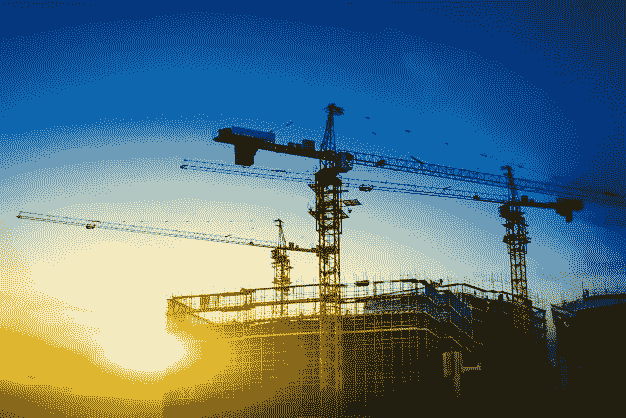

# 人工智能(AI)后 Covid 对 AEC 行业的变革

> 原文：<https://medium.com/geekculture/the-transformation-of-aec-industry-by-artificial-intelligence-ai-post-covid-fc9b20002373?source=collection_archive---------25----------------------->

## 如何利用人工智能工具应对 Covid 带来的安全和维护自动化挑战

Image Source — Freepik.com

> ***艾而建***

几个世纪以来，人们一直在建造避难所和建筑物，这使得建筑成为最古老的建筑之一