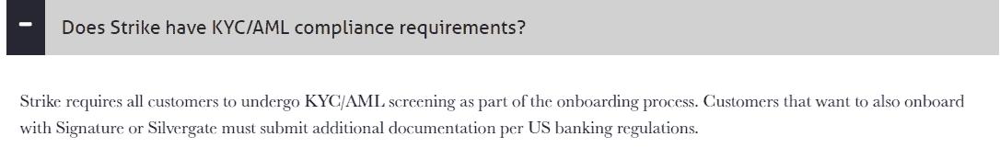
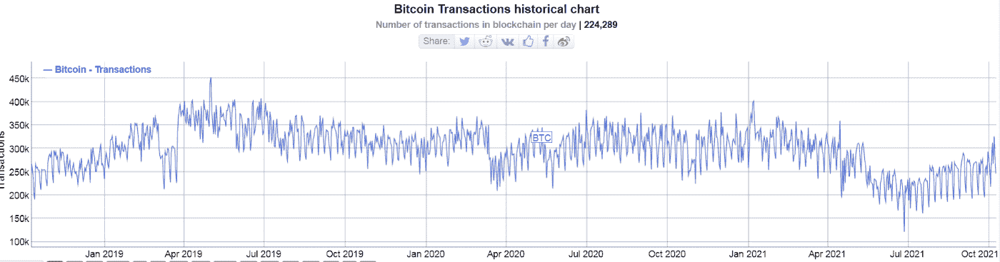
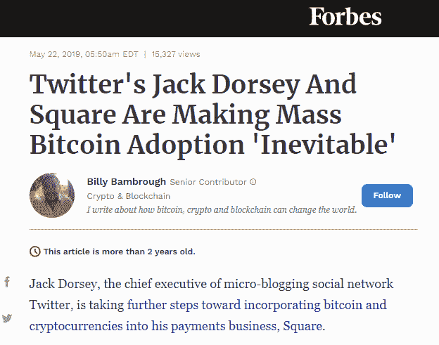

# 比特币被采用的真相:抛弃和拒绝

> 原文：<https://medium.com/geekculture/the-truth-about-bitcoin-btc-adoption-abandonment-and-rejection-8c4fee4f96ee?source=collection_archive---------14----------------------->

[*Source*](https://pixabay.com/tr/photos/melek-ac%c4%b1mas%c4%b1z-ay-arka-fon-fantezi-4057032/)

BTC 社区目前正在讨论采用 BTC 作为使用闪电网络的支付方式，但他们忘记了考虑 BTC 区块链的失败。

或许随着时间的推移，灵动网络也会有类似的方法([最近宕机 22 小时](https://insidebitcoins.com/news/liquid-network-block-production-resumes-after-22-hour-glitch))，这是 Blockstream 开发的另一个侧链。

我们目前所了解的是，这两个网络(BTC 侧链)都增加了中央集权和政府干预。审查制度肯定会适用于闪电网络，因为在收费高和主链拥堵的时候，金融中心会占据主导地位。

审查一直是 LN 的一个特色，因为它的结构有利于在政府的管理和监督下建立由金融实体经营的中介中心。

当 Strike 和 Chivo 钱包的用户使用 LN 时，KYC 已经是强制性的。

[Source](https://strikeprotocols.com/faq/)

虽然，更有可能的是不会有 LN 的大规模采用，因为人们已经拒绝它作为支付和交易的手段。

# 查看过去 3 年 BTC 的采用水平

[Source](https://unsplash.com/photos/-WIX7zDyXLQ)

在萨尔瓦多，大约有 500 万人使用 Chivo/Strike 钱包，并在菲亚特取出约 30 美元。一次空投增加了一个人造闪电网络的 500 万用户，那可能永远不会再使用它了。

随着 Strike wallet 的使用，Twitter 可能会使用 Lightning 网络来获取提示。我不确定这是否会帮助 Twitter，或者闪电网络。

不过，有趣的是，这两起 LN 案件都使用了同一个名为 Strike 的中央金融实体。

有 LN 钱包提供更好的隐私和资金控制(可以选择打开/关闭通道)，但 Twitter 甚至没有考虑过。只有当 Strike 出现时，Twitter 才发现这是一个可以在其平台上实现的伟大想法。

这是过去三年 BTC 交易的每日图表。

[*Source*](https://bitinfocharts.com/)

**一张看跌图只指向一个事实，那就是每个人都在放弃使用 BTC。**

这对于采用条款来说并不乐观。网络效应正在减弱，交易量甚至更少了。这是一个令人担忧的负面长期指标。尤其是那些新来的亿万富翁投机性地进入 BTC，并向新闻媒体大肆宣传其潜力。

我们看到的是 BTC 使用率的下降。这与 2019 年福布斯的声明截然不同:

[*Source*](https://www.forbes.com/sites/billybambrough/2019/05/22/twitters-jack-dorsey-and-square-are-making-mass-bitcoin-adoption-inevitable/?sh=4b2de8533a36)

直到最近，Square 甚至不允许 BTC 退出。它只是一个交易平台，增加了投机，但不是采用。

这个图表有一个解释。2014 年以来的 BTC 纯属猜测。没人愿意用它或用它来支付。

99.99%的新投资者甚至没有把他们的 BTC 从交易所转移到钱包里。这是因为:

*   大多数人通过不提供取款服务的托管服务购买 BTC(robin hood、Revolut、that、PayPal、Square 等)。
*   其余的通过加密交易所购买 BTC(比特币基地、币安、北海巨妖等)。)却从来不关心加密货币。
*   每个人都认为它会涨到 100k，并在那里或更高的价格卖出。
*   这完全是猜测，因为对 BTC 没有任何用处。

即使是上图中的这些交易也是投机性的。这些交易的一部分是套利交易，即 BTC 在交易所之间转移，这种交易大部分是自动化的。

目前，BTC 的费用为 2 美元，没有用户真正使用网络。这些交易所在钱包之间转移 BTC，并为 0.1%的投资者服务，这些投资者将资金转移到非托管钱包。

收养是出于投机的原因，没有别的。这是相当清楚的，因为所有 BTC 社区讨论的是硬币的价格，同时资助和游说政治家和名人进入促进 BTC 的模糊事业。

无论如何，大多数政客都是关注的“寻求者”。他们会很乐意提拔 BTC，甚至是一个明显的庞氏骗局，如果这能帮助他们为连任争取到足够的选民。

# 打击钱包的缺点:

*   KYC/反洗钱合规
*   集中的，在某个政党的控制下运行
*   可审查的交易和可被扣押和冻结的资金

也许 Twitter 可以添加 PayPal 作为小费，因为这没什么不同。Strike wallet 正在消除加密货币的所有优势，并将其变成一个典型的中央金融实体，需要从其中央枢纽获得授权。

> **区块链**是一个革命性的、不可变的数据库，它颠覆了金融业，有可能在一个安全的环境中提供支付，**不受中介的阻碍**。
> 
> *来源:* [*ResearchGate*](https://www.researchgate.net/publication/333997659_Lightning_Network_A_Comparative_Review_of_Transaction_Fees_and_Data_Analysis)
> 
> **闪电网**
> 
> 两个实体进行支付转账需要一个支付通道，创建**会产生高额费用**。
> 
> 然而，Lightning Network 还通过网络中的中介促进**支付转账，该中介与这两个实体有**支付渠道**。该特征通过在网络**中结合多个中介**来扩展，以进行从一个实体到另一个实体的支付转移**，从而形成支付通道网络。中介为提供支付渠道收取非常低的费用(表 1)。
> 
> *来源:* [*研究之门*](https://www.researchgate.net/publication/333997659_Lightning_Network_A_Comparative_Review_of_Transaction_Fees_and_Data_Analysis)

低 LN 费用需要集中的金融中心。闪电网络是基于中介来工作的。

正如我们在 Strike 的例子中看到的，与竞争对手相比，Strike 目前处于领先地位，它是政府监管的钱包，集中并控制着资金。

作为第二层的闪电网络具有 BTC 网络的所有弱点，为了实现规模化，它需要集中的金融实体来操作交易。在我们看来，这些实体是被监管的金融机构，消除了金融自由。

# 隐私— KYC 合规

一部分网民不重视隐私，会很乐意交出任何在线网站要求的任何私人文件。

大多数情况下，这些文件会被泄露，直接在黑市出售。这是任何 KYC 表演的最终结果。要么是一个受监管的组织要求的文件或任何私人网站。大多数 KYC 泄密事件发生在被认为是安全的数据库中。

如果你想安全，永远拒绝 KYC。和其他任何网站一样，国营在线服务也容易受到黑客攻击。

# 最后

[Source](https://unsplash.com/photos/0jdV5Ashbf8)

收养是人为的，在独裁的布克勒政府的强迫下，人们拒绝了。

BTC，它经历的不是收养，而是遗弃。作为一个用例，在营销网络创造的叙述之后有非常模糊的论点。

BTC 仅仅是最初比特币愿景的一个影子。今天，其他区块链正在经历用户群、效用和有机采纳的巨大增长。BTC 只是有了更多的投机者、交易量和投机者，这些都不算是采用。

Follow me on: ● [ReadCash](https://read.cash/@Pantera) ● [NoiseCash](https://noise.cash/u/Pantera99) ● [Medium](/@panterabch) ● [Hive](https://hive.blog/@pantera1) ● [Steemit](https://steemit.com/@pantera1) ●[Vocal](https://vocal.media/authors/pantera) ● [Minds](https://www.minds.com/pantera99/) ● [Twitter](https://twitter.com/Panterabch) ● [LinkedIn](https://www.linkedin.com/in/panterabch/) ● [email](https://read.cash/@Pantera/localcryptos-p2p-exchange-is-now-offering-bitcoin-cash-trading-06637230#bad-link)

***支持内容创作者。如果你喜欢这个故事，请订阅！***

*原发布于*[*https://read . cash*](https://read.cash/@Pantera/the-truth-about-btc-adoption-abandonment-and-rejection-e3bc96cd)*。*