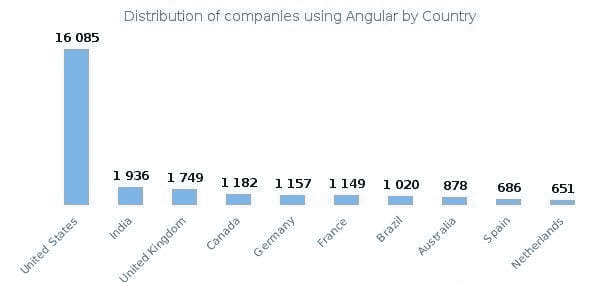
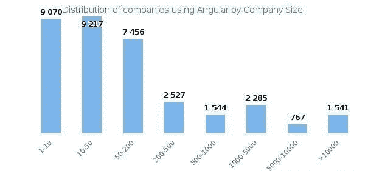

# 非技术创业者角度的终极指南

> 原文：<https://medium.com/geekculture/the-ultimate-guide-to-angular-for-non-tech-founders-7a46cf49bd9a?source=collection_archive---------14----------------------->

作为一个新手，你希望像科技企业家一样快速获得更多的网络流量。你不希望自己缺乏编码知识，在某个有角度开发背景的挑战者推出比你更强、更快的东西时，让你后退一步。拥有一个交互式的网络和移动应用程序来鼓励企业成功是至关重要的。而 [**棱角分明的开发**](https://www.yourteaminindia.com/hire-angular-js-developer) 是很多 UI/UX 开发者的首选，它在每个版本中都以几次更新继续让他们疑惑。

这篇博文解释了为什么 Angular 对于非技术型创始人来说是一个很好的选择。让我们深潜一下。

## 角度框架——概述

Angular 是一个基于模块的 JavaScript 框架，用于创建 web 应用程序。这个开源框架是用 TypeScript 编写的。对于想要建立自己的第一个网站的个人和旨在建立一个有吸引力的 web 应用程序的企业来说，这都是一个很好的解决方案。

第一个版本 AngularJS 于 2010 年发布，在众多版本推出独特功能后变得流行起来。它包括一个用于创建 web 应用程序的基于组件的框架。该框架是一个集成良好的库的集合，涵盖了一系列特性，如表单管理、路由、客户机-服务器通信等。

[Angular web development](/geekculture/83-tools-for-web-developers-a54cfa7fa522) 软件让更新代码变得省事。它赋予了 web 开发人员工作的标准结构。该框架通过提供一致的结构增强了 web 创建的效率和性能，因此创建者不必从头开始重新构建代码。Angular 框架的一个优点就是更新频繁。事实上，Angular 框架团队每隔几个月就会推出新的更新。

## 是什么让 Angular Framework 风靡全球？

Angular 框架开发在最近几年有很大的需求。该框架提供了一系列功能、特性和优势。它已经被列入主流编程语言的名单。Angular Framework 使得编码人员管理前端开发过程变得非常容易。即使市场上有数不清的插件和框架，Angular 也因为其先进的特性成为了首选。

目前 Angular 在全球约有 1000 万开发者使用，并有微软等技术支持；Angular 的受欢迎程度正在令人难以置信地增长。

大约有 90799 家企业使用 Angular 框架，包括酒店、制造、客户服务、商业服务、零售等等。

角框架的市场份额为 0.28%。

大约 20.39%的开发者使用 Angular 框架创建交互式 web 应用。

## Angular Framework 提供的 7 大特性。

*   **兼容所有设备:** Angular 是用 JavaScript 编写的，几乎适用于任何设备。拥有这些特性的开发人员可以创建一个可以在任何设备上正常运行的 web 应用程序，包括笔记本电脑、智能手机和平板电脑。
*   **基于模块:**使用 Angular 框架构建的 web 应用程序被分成像树一样的模块层次。它简化了更新任何代码的任务，因为模型没有链接在一起。使用基于模块的结构，用户会发现角度适中且耗时。
*   **TypeScript:** 有助于在编写代码时轻松发现错误。TypeScript 包含一个内置的库。利用向后兼容性，开发人员可以向代码中添加功能。这也是开发者偏爱 Angular 框架的原因之一。
*   增强的结构: Angular 框架结构比其他 web 开发平台好得多。
*   使用一个接口来减少代码及其结果的困难是至关重要的。Angular 命令行界面(CLI)包括通过文本的用户界面，开发人员可以编写代码，端到端执行，同时进行单元测试。
*   **声明式 UI:** 利用这个特性，开发者可以设置布局，声明式 UI 自动加载组件。这个特性不允许编码者将 JavaScript 用于 web 应用程序的用户界面。相反，开发人员可以利用 HTML，这比 JavaScript 简单得多。
*   **依赖注入:**是一种提供对另一个依赖的设计安排。该功能提高了网站的性能。

## 是什么让 Angular Framework 成为 Web 开发的首选？

随着创建交互式用户界面越来越受重视，Angular 社区也在广泛发展。 [**angular web 开发**](https://www.yourteaminindia.com/blog/guide-to-hire-angular-developers) 工具为企业提供了很多东西。它有一个内置的依赖接种子系统，这对于开发人员以适当的方式构建应用程序很有用。以下原因使得 Angular Framework 成为 web 开发的首选。

*   **双向数据绑定:** Angular Framework 因其双向数据绑定功能而大受欢迎。由于这个特性，如果在特定的模块中做了任何改变，那么当模块改变时，它会自然地被注意到。因此，通常需要编写的同步代码自然减少了。
*   **简单易用:** Angular Framework 为开发人员提供了众多属性，使 web 开发成为一项轻松、轻松、省时的任务。此外，它使用户能够编写更少的代码，用更多的执行时间构建出色的应用程序。
*   **强大的社区支持:** Angular 是一项优秀的技术，得到了 Google 和 Reddit 的支持。
*   **给 web 应用程序结构化:**有了 Angular 框架，就有可能按照 MVVM 模式来构建你的源代码。它允许开发人员在模块中编写代码，以提高 web 应用程序的可维护性和可测试性。

## 使用 Angular 的顶级国家

43%的棱角分明的消费者在美国，5%在印度。下图展示了使用角度框架的国家统计数据。

**公司使用角形**

在所有使用 Angular Framework 的客户中，51%是小型企业，34%是中型企业，15%是大型企业。下面是一张事实清楚的图片。

## 使用 Angular 框架构建的应用程序示例

Angular 框架是编程各种卷积解决方案的绝佳选择。无论你是想创建一个网络商店，小型通讯应用程序，新闻应用程序，还是电子商务平台，Angular 都可以为你提供前端开发任务。下面是一些使用 Angular Framework 开发的应用程序。

*   谷歌邮箱
*   福布斯（美国出版及媒体集团）
*   向上工作
*   油管（国外视频网站）
*   好电影
*   贝宝
*   Weather.com
*   维基世界
*   网飞
*   自由记者
*   捷蓝航空
*   乐高牌塑料锁定式积木
*   兰德森
*   沃尔玛
*   《纽约时报》
*   《卫报》
*   iStock
*   天气
*   雨林连接等。

## 结论

Angular 最近名声大噪。这背后的原因是其强大的组件让开发人员可以毫不费力地读取、编写和维护代码。Angular 配备了优雅的特性和可重用的组件，以及适合前端开发的技术。 **Angular web development** 特性毫不费力地消除了网站创建的复杂性，并继续以其版本中令人难以置信的更新让开发人员震惊。希望这篇文章能帮助你了解 angular 在前端 web 开发中的作用。