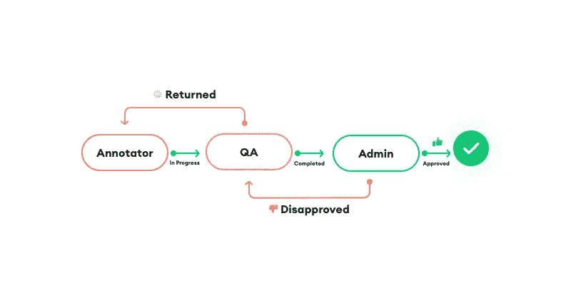
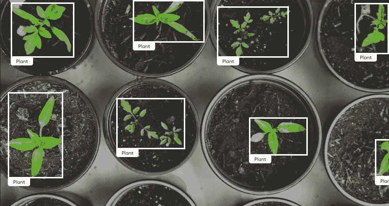

# 数据标记的终极指南:如何为 ML 标记数据

> 原文：<https://medium.com/geekculture/the-ultimate-guide-to-data-labeling-how-to-label-data-for-ml-f6e9ae3864b3?source=collection_archive---------14----------------------->

人工智能(AI)正在推动未来，你应该做好准备，让它拥有竞争优势。

机器学习(ML)是人工智能的一个子集，它为软件应用程序提供了检测模式和做出准确预测的能力。ML 给了我们自动驾驶汽车、垃圾邮件过滤、交通检测等等。

为了训练最高质量的 ML 模型，您需要为它们的算法提供准确的标记数据。

这篇博文涵盖了您需要了解的关于数据标注的一切，以便为您的业务做出明智的决策。以下是这篇博文将要回答的问题:

*   什么是数据标注？
*   数据标注是如何工作的？
*   有哪些数据标注的最佳实践？
*   公司如何给自己的数据贴标签？
*   我需要一个用于数据标注的工具平台吗？

# 什么是数据标注？

数据标注的任务是识别原始数据(如视频和图像)中的对象，并用标签标记它们，以帮助您的机器学习模型进行准确的预测和估计。例如，数据标注可以帮助自动驾驶汽车在人行横道停下来，数字助理可以识别声音，安全摄像头可以检测可疑行为。

# 数据标注是如何工作的？

# 数据收集

首先收集大量数据:图像、视频、音频文件、文本等。与少量数据相比，大量不同的数据保证了更准确的结果。

# 数据标记

数据标记包括人工标记器使用数据标记平台识别未标记数据中的元素。他们可以被要求确定一幅图像是否包含一个人，或者在视频中跟踪一个球。

# 质量保证

您的标记数据必须信息丰富且准确，才能创建性能卓越的 ML 模型。确保你[有一个质量保证(QA)过程](https://superannotate.com/quality-management/)来检查你的标签数据的准确性，否则你的 ML 模型将无法成功运行。

# 模特培训

若要训练 ML 模型，请向 ML 算法提供包含正确答案的标记数据。使用新训练的模型，您可以对一组新数据进行准确预测。

# 数据标注的一些最佳实践是什么？

应用这些经过试验和测试的数据标签实践来运行一个成功的项目。

# 收集不同的数据

您希望您的数据尽可能多样化，以尽量减少偏差。假设你想训练一个自动驾驶汽车的模型。如果您选择用来训练模型的数据是在城市中收集的，那么汽车在山区行驶将会有困难。因此，请确保从不同的角度和光线条件下拍摄图像和视频。

# 收集特定数据

您的数据需要具体，以免混淆模型。这听起来与前面的观点相矛盾，但是为模型提供成功运行所需的信息是很重要的。因此，如果你正在为机器人服务员训练一个模型，使用在餐馆收集的数据。向模型提供在商场、机场或医院收集的数据会导致不必要的混乱。

# 建立质量保证流程

*   **审核任务:**在常规任务中包含“审核”任务，以测试贴标员的工作质量。“审核”任务不应与其他工作项目不同，以避免偏见。
*   **有针对性的 QA:** 对注释者之间存在分歧的工作项进行优先级排序，以便进行评审。
*   **随机 QA:** 定期检查每个注释者的工作项目的随机样本，以测试他们工作的质量。

将 QA 方法集成到您的项目管道中，以评估标签的质量并保证项目成功。有几种方法可以做到这一点:

应用这些方法，并使用这些发现来改进您的指南或培训您的注释者。

# 设置注释指引线

编写一个信息丰富、清晰、简洁的注释指南，定义注释和工具说明，从一开始就避免可能的错误。考虑用例子来说明标签:视觉帮助注释者和 QA 比书面解释更好地理解注释需求。该指南还应包括向员工展示全局并激励他们的最终目标。

# 找到最合适的注释管道

实现适合您的项目需求的注释管道，以最大化效率和最小化交付时间。例如，您可以将最流行的标签设置在列表的顶部，这样注释者就不会浪费时间去寻找它。您还可以设置注释工作流来定义注释步骤。

# 保持沟通畅通

与员工建立沟通渠道，并与关键利益相关方保持联系。你可以通过安排定期会议和创建群组渠道来建立有效的沟通。

# 提供定期反馈

与您的员工交流注释错误，以简化 QA 流程。定期反馈有助于他们更好地理解指导方针，并获得更高质量的结果。确保反馈与提供的注释指南一致。如果您遇到指南中没有阐明的错误，请考虑更新它，并与员工交流更改。

# 运行一个试点项目

在跳进水里之前，一定要先试一试。通过运行一个试点项目来测试您的劳动力、注释指南和项目过程。这将帮助您确定完成时间，评估贴标机和 QAs 的性能，并在开始项目之前改进您的指南和流程。

# 公司如何给自己的数据贴标签？

*   **内部:**利用现有资源和员工在内部管理您的数据注释。虽然内部数据标注成本较低，可以让您更好地控制项目，并确保数据的安全性，但它也可能非常耗时。
*   **外包:**让专家[数据标签服务](https://superannotate.com/annotation-services/)处理您的项目。外包可以节省您的时间，同时保证高质量的结果。
*   **众包:**如果您缺少内部资源，可以考虑将您的数据注释项目众包给一个可信的第三方平台。

数据标注需要时间和金钱。在选择如何[将您的数据标记为](https://whatis.techtarget.com/definition/data-labeling)之前，考虑您的预算和您期望的项目交付时间。

如果您选择外包或众包，请考虑实施一个强大的管理流程来保持对项目的控制。

# 选择数据标注平台应该找什么？

高质量的数据需要专业的数据标注团队和强大的工具。如果找不到适合您的用例，您可以购买平台或自己构建平台。在为您的数据标签项目选择平台时，您应该寻找什么？

# 包容性工具

在寻找一个[标签平台](https://superannotate.com/annotation-tool/)之前，想想适合你的用例的工具。也许你需要多边形工具来标注汽车，或者一个旋转的边界框来标注容器。确保您选择的平台包含创建最高质量标签所需的工具。考虑一下未来的几个步骤，并考虑一下将来可能需要的标注工具。为什么要把时间和资源投入到一个你在未来项目中无法使用的标签平台上呢？在一个新的平台上培训员工需要时间和金钱，所以领先一步会让你省心。

# 综合管理系统

有效的管理是成功的数据标签项目的基础。因此，选择的数据标签平台应该包含一个[集成管理系统](https://superannotate.com/project-management/)来管理项目、数据和用户。一个健壮的标注平台还应该使项目经理能够跟踪项目进度和用户生产率，与标注者就错误标注的数据进行交流，实施标注工作流，检查和编辑标注，以及监控质量保证。

# 质量保证过程

数据的准确性决定了训练模型的质量。确保你选择的标签平台有一个[质量保证过程](https://blog.superannotate.com/how-to-detect-mislabeled-annotations/)，让项目经理控制标签数据的质量。请注意，除了可靠的质量保证系统之外，您选择的数据注释服务应该经过培训、审查和专业管理。

# 保证隐私和安全

您的数据隐私应该是您的首要任务。选择一个安全的标签平台，你可以信任你的敏感数据。

# 技术支持和文档

确保您选择的数据注释平台通过完整和更新的文档以及活跃的支持团队提供技术支持。可能会出现技术问题，您希望支持团队能够解决这些问题，以最大限度地减少中断。在订阅平台之前，考虑询问支持团队他们如何处理技术问题。

# 结论

人工智能正在彻底改变我们做事的方式，你的业务应该尽快跟上。人工智能的无限[可能性正在让各行各业变得更加智能](https://www.mckinsey.com/business-functions/mckinsey-analytics/our-insights/what-ai-can-and-cant-do-yet-for-your-business):从农业到医药、体育等等。数据注释是走向创新的第一步。

现在，您已经了解了什么是数据标注、它是如何工作的、它的最佳实践以及在选择数据标注平台时要寻找什么，您可以为您的业务做出明智的决策，并使您的运营更上一层楼。你准备好开始了吗？

*原载于 2021 年 4 月 15 日 https://blog.superannotate.com***。**

*在 [LinkedIn](https://www.linkedin.com/company/superannotate/) 、 [Twitter](https://twitter.com/superannotate) 、[脸书](https://www.facebook.com/superannotate)上关注超级评论*

* [## 现代边缘检测算法中精度和运行时间的权衡

### 如何利用知识来提高修剪神经网络的推理时间(2 倍)和 F1 值(0.06)

superannotate.medium.com](https://superannotate.medium.com/accuracy-and-runtime-tradeoff-in-modern-edge-detection-algorithms-1bd2920d4cd3)  [## 使用迁移学习加速图像标记(不需要代码)

### 如何使用迁移学习技术自动化和扩展您的图像注释过程。

superannotate.medium.com](https://superannotate.medium.com/speed-up-image-labeling-using-transfer-learning-no-code-required-c756f948db84)  [## 基于 U-Net 的建筑足迹预标注

### 在这篇文章中，我想提出我们的新的建筑物预注释的航空影像的注释。在线平台…

superannotate.medium.com](https://superannotate.medium.com/u-net-based-building-footprint-pre-annotation-2a1d5e2f6a63)*