# 噪音终极指南。现金，加入加密媒体革命！

> 原文：<https://medium.com/geekculture/the-ultimate-guide-to-noise-cash-join-the-crypto-social-media-revolution-and-start-earning-21f0ba2b6bcf?source=collection_archive---------13----------------------->

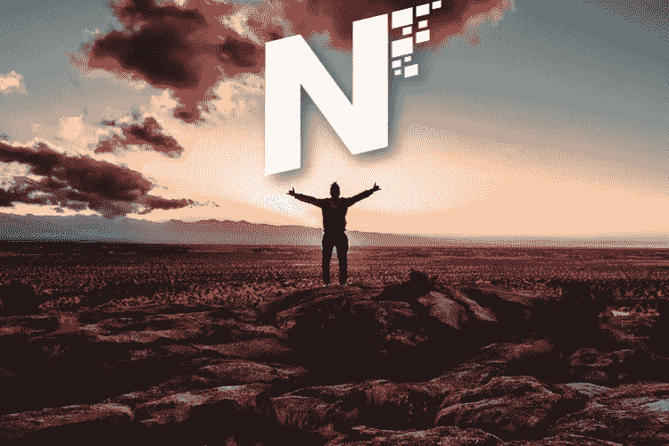

*Image from:* [*Unsplash*](https://unsplash.com/photos/eA2t5EvcxU4)*, by* [*Xan Griffin*](https://unsplash.com/@xangriffin) *(modified)*

*【编辑:Noise 已经移入 noise.app，一个目前只有邀请才能使用的应用。BCH 提示仍然适用。阅读下面我的 noise.app 评论]:*

 [## 新版 Noise (noise.app)准备上线啦！

### 使用加密货币的社交媒体货币化

medium.com](/coinmonks/the-new-version-of-noise-noise-app-is-ready-to-launch-63d03e4775d7) 

*(以下不适用于今天。noise.cash 仍然存在，但 devs 团队支持用户迁移到 noise.app)*

想象一下从你的推文中赚钱。想象一下，有朋友投票支持你最近的《脸书邮报》,每得到一个“赞”,你就能赚几分钱！

我从来不相信会有这么一天，那一刻我了解到了[和**的噪音。我觉得可疑，不相信这是真的。**](https://noise.cash/u/Pantera99)

但这次是真的！

[噪音。现金](https://noise.cash/u/Pantera99)是支付用户的社交媒体加密革命！

[噪音。Cash](https://noise.cash/u/Pantera99) 是一个付费的社交媒体平台，以书面和图像的形式进行互动和创建内容(尚不支持视频)。你可以写一个更小或更长的帖子，没有限制，但有一个要求。

让它变得有用和有趣。让你的每一篇文章都有价值。

[噪音的使用者。Cash](https://noise.cash/u/Pantera99) 与平台互动的方式与他们与任何其他社交媒体互动的方式相同。他们提供链接和有用的信息，并在现代用户界面中享受互动的乐趣。

我知道，很难相信这一点，尤其是如果你还没有听说过[噪音。现金](https://noise.cash/u/Pantera99)之前。但是，如果你已经有了一个账户，但还没有，那么你就错过了奖励、娱乐、有价值的信息和即将到来的社交媒体网站，该网站正在重塑这个虚拟领域。

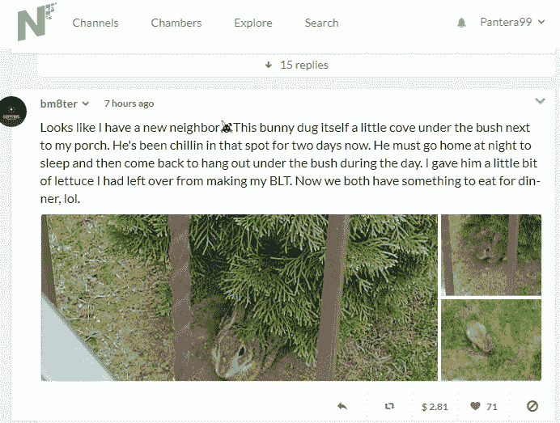

Example of a Noise.Cash post

最棒的是，它不仅限于加密货币。你不需要知道任何关于加密的知识来开始你的 [**噪音。现金**](https://noise.cash/u/Pantera99) 旅程。

这并不完全正确。你只需要学习最基本的，但是相信我，这很简单！

也许这需要你半个小时的时间，但这是值得的，你会因为你的社交媒体参与而得到回报。

数字革命从您开始，这次我们让它变得更容易！

# 让我们制造一些噪音！

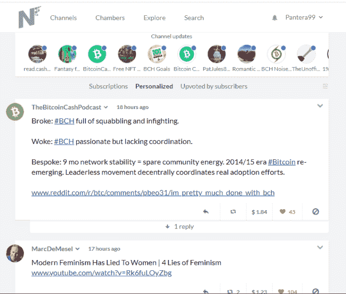

My personalized noise.cash frontpage

[**噪音。现金**](https://noise.cash/u/Pantera99) 非常用户友好，我们将在教程中一起讨论你需要了解的基本功能。

首先，重要的是提一下，没有抓到。你不需要支付任何东西或任何人。你从零开始，可以开始赚取密码没有任何风险。

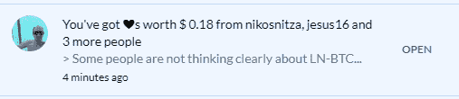

A notification of recent tips I received

我在 BCH 的帖子每天可获得 3-5 美元的奖励。让我们只说平均每月**120 美元**，尽管最近这个数字在增加，因为我的追随者越来越多，对我的“噪音”越来越感兴趣(这就是我们如何称呼 [**噪音的帖子)。现金**](https://noise.cash/u/Pantera99) )。

120 美元并不算多，但我分配的时间是在 [Noise。现金](https://read.cash/@Pantera/the-ultimate-guide-to-noisecash-the-bitcoin-cash-social-media-revolution-2f894e86#bad-link)也不算多。我没有在推特或脸书上浪费时间，而是使用噪音。兑现并从中创造一些东西。

通常，我每天只写一篇文章，虽然有时候我会写四五篇。我不会把我的帖子写得像文章一样冗长，但我会努力让它变得有意义。人们希望找到重要的信息，如果你始终如一、准确无误，那么你就会有很多追随者，就像任何其他平台一样。我会经常每天只发布一个噪音。我对此没有任何建议，也不试图最大化利润，因为我不容忍这种做法。

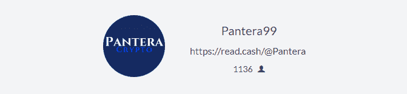

My profile image and stats at noise.cash

这不是关于提取资金，并为我找到最大限度的，它不应该像其他任何人一样。我喜欢这个平台，并一直像使用社交媒体一样使用它。我把 Twitter 换成了 [**噪音。现金**改为](https://noise.cash/u/Pantera99)。我屏蔽了一些垃圾邮件发送者，并试图让评论区远离它们。

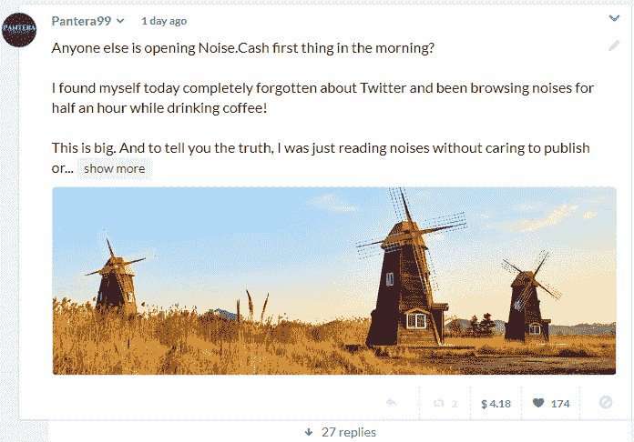

*One of my recent noises (*[*link*](https://noise.cash/post/wrzm97rs4nr8)*)*

支付的形式是比特币现金加密货币(BCH)。比特币现金是数字微交易的最佳选择之一，因为它非常便宜，收费(每笔交易约 0.01 美元)，速度几乎即时。稍后你会发现比特币现金，但这篇文章主要是关于平台本身。

# 您的第一个加密货币钱包！

如果您已经拥有一个加密货币(BCH)钱包，可以跳过这一部分，进入下一部分。这主要是针对没有加密货币知识和没有钱包的新手。

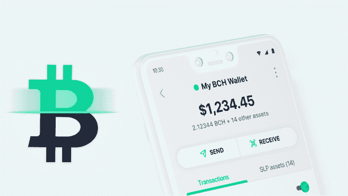

*Image from* [*Bitcoin.com*](https://static.news.bitcoin.com/wp-content/uploads/2020/05/6EnfyFDs-bchwalletcover.jpg)

设置好钱包后，您必须保存密码。这使你能够获得资金和加密货币的进入点。

如果你是初学者，不要灰心丧气。只需几分钟就能理解移动加密钱包的概念。crypto 的人很有帮助，会回答问题，所以不要害怕问任何让你困惑的问题。

## 第二步:保存你的密码

下载手机钱包后，花几分钟时间浏览各个选项，记得访问设置->备份和安全->手动备份。

在这里，一开始，你会发现有几个钱包可用。我强烈建议提取你创建的每个钱包的密码或私钥，并写在纸上。这取决于数量，但我建议不要以数字形式在文件上保存任何密码。

老实说，我怎么强调这一部分的重要性都不为过。其余的都很简单，按照说明你不会有任何问题。

你的钱包现在准备好了。但是，您现在还需要公钥。

这是您将在[T3 处提供的钱包地址。现金](https://noise.cash/u/Pantera99) ，这样你的收益就会交付到你的钱包里。

## 第三步:找到你的公钥(又名公共地址)

公钥是我们提供来接收资金的。它被称为 public，因为它不解锁区块链上的功能。只能用来接收资金。

因此，在加密世界中，公钥就是地址，就像我们的电子邮件地址一样。然而它的格式很复杂，例如，一个比特币现金公钥有这样的形式:*bitcoincash:QR 78 em 735 lktmx 70 TNP xpek 5 wfyfvqm 5 eujs 7 lqmhk。*

我们将公钥保存在设备上的文件中，并复制粘贴它们以接收付款。

在 bitcoin.com 钱包中，公钥位于以下路径:

我的 BCH 钱包(或者你用过的名字)->收到->BCH

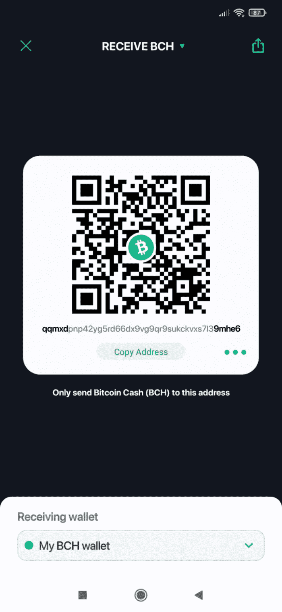

您将收到一个二维码，另一个移动钱包可以扫描该二维码，以便向您发送资金。[为**噪音。现金**](https://noise.cash/u/Pantera99) **，**您需要下面给出的地址。

按下“复制地址”，将复制地址，当粘贴它时，它也将有“bitcoincash”字开始。这就是你想要的 [**杂色格式。现金**](https://noise.cash/u/Pantera99) ，所以只需复制公开地址，并将其传输到您的台式机或笔记本电脑，并保存在一个文件中，因为这是您稍后提取资金的地方。

# 噪音。现金回顾和教程

*Image from* [*Unsplash*](https://unsplash.com/photos/9pjBx5uVBlg)*, by* [*Jodie Cook*](https://unsplash.com/@jodiecook)

*   **我的附属链接**

这是我的引荐链接:[【https://noise.cash/u/Pantera99】T21](https://noise.cash/u/Pantera99)

你可以跟着[https://noise.cash/](https://noise.cash/)直接链接到平台并注册，无需我的推荐。

目前，我没有任何附属机构，但我将能够看到谁使用我的附属链接加入。

我总是关注并奖励那些带来好内容和高价值的用户，然而，我也试图阻止任何垃圾评论。在任何情况下我都不保证。您可以继续使用我的附属网站，或者只使用 noise.cash 简单 URL，这始终由您决定。

*   **简介**

我们不能随意在平台里漫游，乱作一团。是的，许多人试图利用他们的[和**噪音而失败。现金**](https://noise.cash/u/Pantera99) 冒险。

但是如果你做得恰当，并且对这个平台诚实，你可以得到和其他人一样的结果。如果你是诚实的，只有一个帐户，不发垃圾邮件，你会得到奖励。

有些人可以在追随者数量中快速攀升，而其他人需要一些额外的时间。通常，当你写了一篇伟大的文章，你会发现你的一些追随者重新噪声。这将有助于你获得更多的知名度，并增加你的追随者基础。

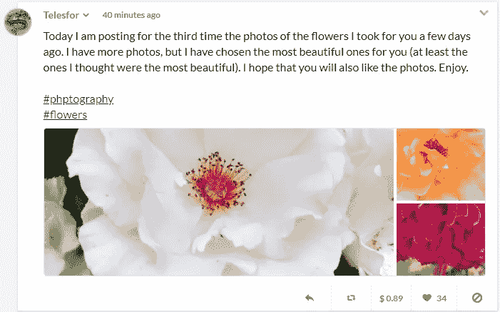

A Noise.Cash user publishing on the topic of Photography

最初，当我加入时，我觉得很难。我们发布的第一个帖子不会得到报酬，但在消息开始流动之前需要一些时间。

根据你文章的质量，你最终会找到追随者。大多数用户希望看到一致的内容并提供有用的信息。垃圾邮件或剽窃是没有报酬的。也许有些人会离开几天，但他们只会破坏以后获得更好回报的机会。

继续，我现在将一步一步地解释如何创建一个 [**噪声。现金**](https://noise.cash/u/Pantera99) 新账户。

# 噪音。现金教程

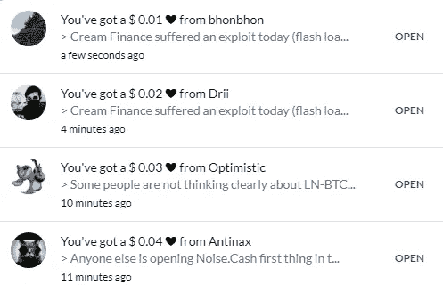

Someof the tips I received while writing this article

对于初学者来说，最难的部分已经过去了。您已经完成了比特币钱包的设置，并准备好了提供给 [**Noise 的公钥。现金**](https://noise.cash/u/Pantera99) 。现在简单的部分仍然存在，设置一个 [**噪声。现金**](https://noise.cash/u/Pantera99) 账户，提供一些非侵入性的细节，习惯平台。

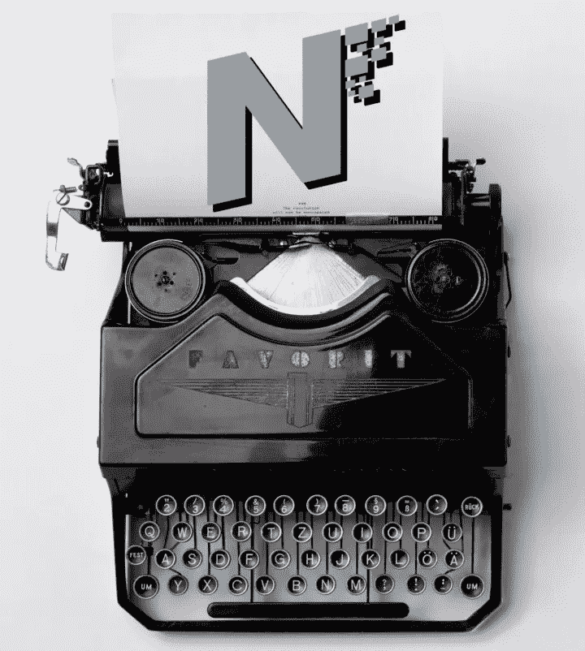

*Image from:* [*Unsplash*](https://unsplash.com/photos/mk7D-4UCfmg)*, by Florian-Klauer (modified)*

## 创建账户

你只需要注册一个电子邮件账户。不一定非得是谷歌；它也适用于其他电子邮件提供商。验证您的电子邮件订阅，然后您可以通过导入您的公钥开始您的旅程！

## 步骤 2:导入您的公钥(公共地址)

我们之前讨论过这个问题，如果正确遵循所有步骤，您将准备好比特币现金地址。

在我们的用户名旁边，当打开下拉菜单时，我们会发现“钱包”选项。点击它，我们进入我们的平台钱包页面。

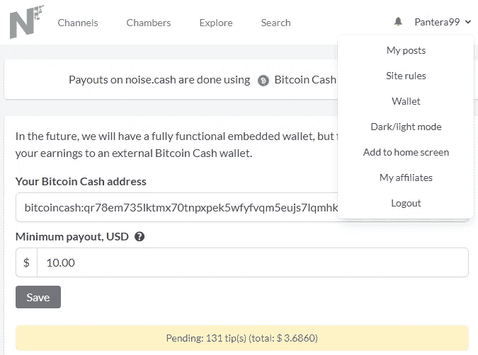

On-platform temporary wallet service

这是我们暂时存放小费的地方。在本页中，我们:

*   粘贴我们的比特币现金地址(公钥)
*   选择以美元为单位的最低支付额

这是一个重要的部分。如你所见，我已经将我的奖励设置为当奖励总额达到 10 美元时自动退出。目前，它低于这个数目，我收到的每一个新的小费都会加到这个数目上。

## 第三步:阅读规则

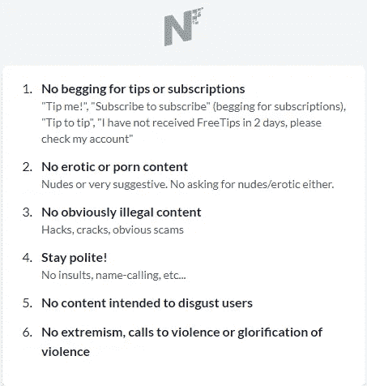

Basic Rules

常识。但对于一些用户来说，这更困难，他们试图绕过逻辑，所以 [**噪声。现金**](https://noise.cash/u/Pantera99) 提供更多详情。

开发者给出的一些方向:

> 如果你英语说得不好，请用你自己的语言写。
> 
> 不要发布类似“哇”、“有趣”、“谢谢”这样的泛泛回应
> 
> 不要复制粘贴东西
> 
> 不要贴一个笑脸和一个图像或者类似“一座教堂”或者“一棵树”和一个图像的东西。
> 
> 记得那个声音。现金不是工作。

更多的指示可以在这个帖子里找到:( [**必读**](https://noise.cash/post/22kn7q0s376j) **)**

[**噪音。Cash**](https://noise.cash/u/Pantera99) 对调皮用户进行垃圾邮件评级，准确率很高。很少有人逃脱，而且不会太久。

## 然而，什么是垃圾邮件呢？

如果你写帖子的时候没有什么有用的东西可以提供，那就干脆什么都不写。

没人愿意看废话或者完全没用的东西。它可能是告诉我们一些私人的、没有人关心的事情的帖子。就像你每天早上刷牙一样。然而，根据你提供的信息，这篇文章也会变得有用。

典型的无用的垃圾邮件帖子可能很小，如:“晚安”、“哇”、“谢谢你的信息”等。所有这些都是不需要的，它们是垃圾邮件，平台正在这样标记它们。

当你被标记为垃圾邮件发送者，平台将停止支付你。你会收到其他用户的心(喜欢)，但没有提示。

比垃圾邮件更糟糕的是抄袭。不知道确切的处罚[噪音**。现金征收，但这肯定会在很长一段时间内阻止他们付款。**](https://noise.cash/u/Pantera99)

## 什么是抄袭？

复制粘贴，或转述其他作家。这是一种疾病，最近随着整个网站在这种逻辑上的发展而大规模蔓延。你需要知道的是，如果你还不知道的话，剽窃就是盗窃。

作家们最近受够了这些利用我们的作品并试图从中赚钱的骗子。此外，它给平台带来了不好的形象，增加了管理员和开发人员必须面对的麻烦。

## 取消付款

有时你可能会犯一个错误，或者有人会错误判断你写的东西的意思。这种情况也发生在我和许多其他年长的成员身上。

如果你被发现违反了一些规则，将会有一段等待期来恢复支付。有时，有些人很激动，出于热情，可能会给出看起来像垃圾邮件或违反规则的回复。

通常，这种情况会在几天后消失。我被告知这是 3 天的处罚，但这不是标准或任何地方写的东西。如果有人从提示中被删除，我认为最好的行动是像以前一样继续发帖，也许考虑错误在哪里。

你没有得到通知，但你只能猜测可能发生了什么。只要保持活跃和诚实，改进你的帖子，使它们有用和有趣，你就会再次获得回报。

最后一条建议，不要复制粘贴任何东西，**甚至是你在其他平台的推文或帖子**。这将很难上诉，因为它需要一个非常漫长的过程来验证这是你的帐户原来。

如果你要这么做，最好使用引号，并给出你之前帖子的链接，解释这是你之前用过的引号。

## 规则太多？

是的，但是大部分，比如 99%，只是常识。你不能就这样闯进一个地方，要求付款，却不提供任何回报。

这不是一个严格的系统，管理员不想禁止任何人。 [**噪音。现金**](https://noise.cash/u/Pantera99) 背后有最明智的人，他们总是彬彬有礼，乐于助人。管理员希望平台成功，用户也是如此。

启动你的 [**噪音。Cash**](https://noise.cash/u/Pantera99) 旅程通过努力帮助平台成功。它可能不会变得比 Twitter 更大，但它已经是一个很好的选择。

它对字符数没有限制。你可以自由地表达自己，但要在文明的范围内，你甚至可以谈论你的经历、专业知识、事件，任何事情，只要你让它有趣。

## 第四步:习惯

这是你应该自己做的事情。我将大致说明如何使用 [**噪声。现金**](https://noise.cash/u/Pantera99) 但是我们每个人都有不同的偏好。最终，在很短的时间内，你将会使用噪音。现金没有问题。

*   **频道**

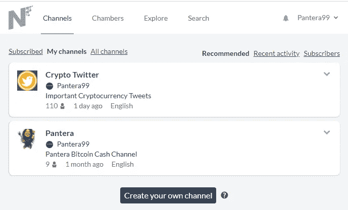

这是大约一个月前推出的附加功能。任何人都可以创建频道。正如你所看到的，我创建了一个名为 Crypto Twitter 的频道，我偶尔会在那里发布一些重要的加密货币推文。我有 100 个人追随，如果我给予更多的关注，它会变得更加成功。

无论如何，你明白了，你可以创建一个关于任何事情的频道，在你的帖子里做广告，解释这个概念，人们就会跟随。

频道有许多可用的设置，创建者可以控制帖子、发布前审核和许多其他选项。

*   **室**

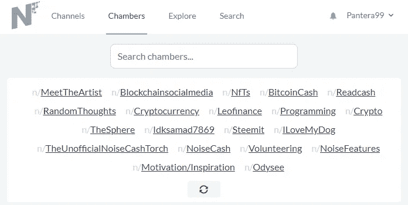

我认为钱伯斯最终会被移除。标签最近被整合到平台中，现在被用来取代 chambers。无论如何，商会是开放使用的地方，任何人都可以订阅感兴趣的。

*   **探索**

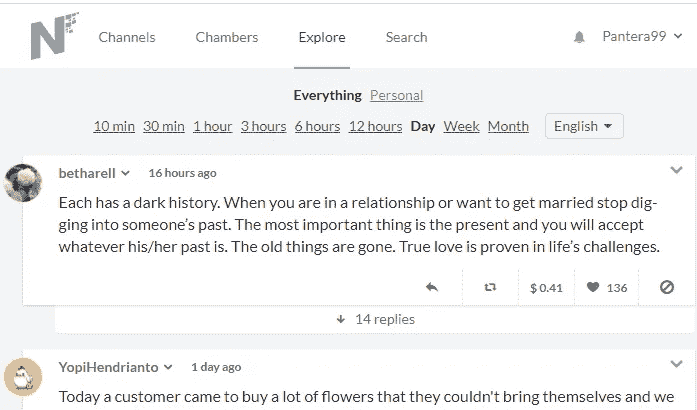

我很少使用这个功能，但我不得不说这是我迄今为止在社交媒体上看到的最令人惊讶的功能之一。

它将给出所选时间段内的顶级噪音列表，范围从过去 10 分钟到整个月。

它还提供了仅包含个性化功能的选项。

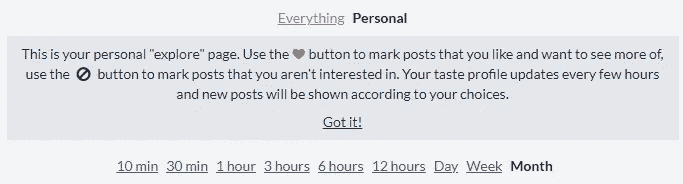

当我们阅读时，系统会根据我们对帖子的反应而行动。用“心”或“不感兴趣”的符号来标记它们将改变平台的行为，并向我们显示更符合我们个性化兴趣的结果。

*   **搜索**

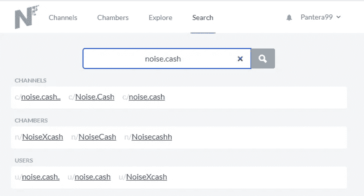

搜索引擎不会花超过一秒钟的时间来为我们的请求提供顶级搜索结果。

我们可以搜索一个用户名，商会，或渠道，并找到我们正在寻找的。

*   **通知铃声！**

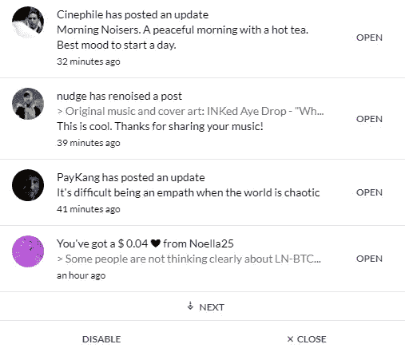

这是打开通知弹出菜单的选项，如上图所示。我们会收到来自我们关注的人的最新提示信息和新帖子的通知。

收到新的通知总是令人兴奋的，虽然你可以完全禁用这个选项，但我仍然建议你关闭那些你不想阅读的用户的通知。如果关闭此功能，您将会错过有价值的内容。

*   **下拉菜单**

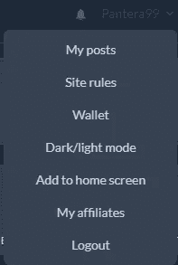

在这里，你可以访问你的文章，阅读网站规则，检查你的钱包细节，等等。

[**噪音。Cash**](https://noise.cash/u/Pantera99) 还带有黑暗模式，当我们在明亮的屏幕前时，这有助于放松我们的眼睛。

*   **主页**

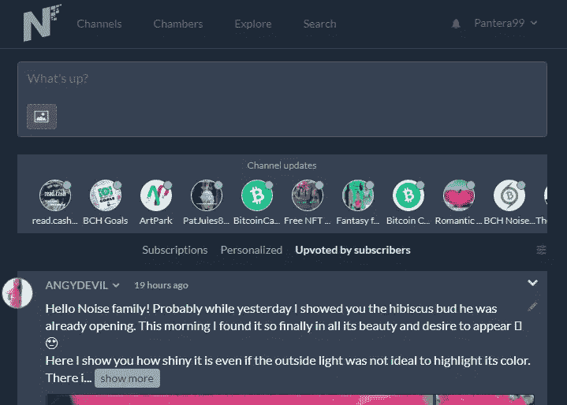

当我们加入时，我们发现自己在这一页。我们已经可以开始写我们的职位，也包括图像。

此外，我们可以在这里找到我们订阅的所有频道的更新。

试着熟悉一下平台，它界面友好，速度极快。

## 第五步:开始写作！

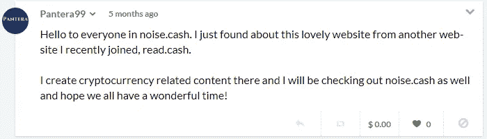

My first noise!

你肯定需要几天的时间来适应，而且在其他用户找到你和你的内容之前也需要一些时间。当你与其他用户互动并发表积极和建设性的评论时，你的追随者会增加得更快。

我的前两个帖子收到的赞为零，只有我的第三个噪音有一颗心。后来开始收到提示，四五个帖子之后。现在，坦率地说，我相信你可以马上开始收到小费。我只是在开始的时候投入了很少的时间。

如你所见，[我的第一个噪音](https://noise.cash/post/7rxkkzwakrpw)一点喜欢都没有！那时没人认识我，当你加入的时候，你没有追随者。尽管如此，通过时间和耐心，我已经拥有了 1000 多名粉丝，我的一些文章获得了数百个赞。

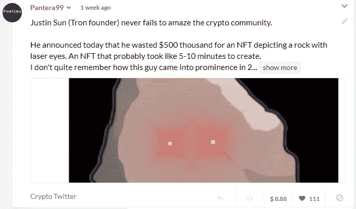

上图中这个特殊的[噪音](https://noise.cash/post/8vp08m4f4r9p)收到了 888 美元的小费！点击提示会给我们一些额外的细节:

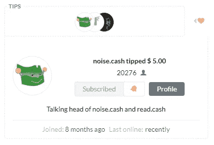

首先，我要感谢所有偶尔给我内容提示的人( **Marc De Mesel，Noise。现金、**和其他所有人)。这对内容创作者来说意义重大，并能增强他们的信心。

这是坚持和品质的结果。最终，你的工作将反映在更多的追随者和更多的“心”和更多的提示上。

# 更多高级功能

## 使用二维码选项支付小费

作为一个初学者，你的钱包里可能没有 BCH 给小费。一些人会使用二维码选项，如果他们发现你的内容非常有用，就会给他们提示。

你也可以用二维码和你的手机钱包给别人小费。

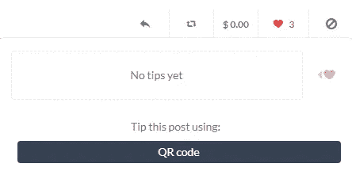

在这种情况下，我们只需要用手机钱包扫描二维码，并给选定的金额小费。我们可以从 0.01 美元开始给小费，因为比特币费用非常低，是微交易的首选。

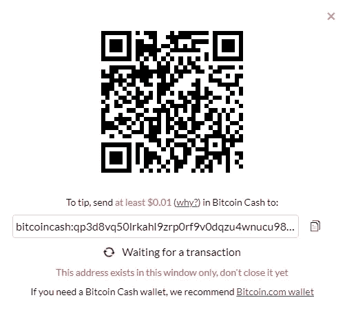

在比特币钱包中，我们将使用发送选项，然后选择通过二维码发送的选项。完成后，提示将在一两秒钟后开始。

## 重名

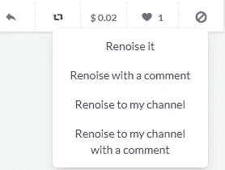

我们可以选择在我们的个人资料上重新发布一篇有评论或没有评论的帖子，我们也可以选择在我们的频道上重新发布。

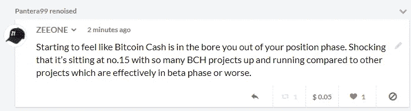

例如，我刚刚读了 ZEEONE 的这篇精彩的文章，我想我的粉丝们也能读读这篇文章并做出相应的反应会很棒。

通常，这对原作者很有帮助，因为这将增加知名度和追随者。

## 创建您自己的频道

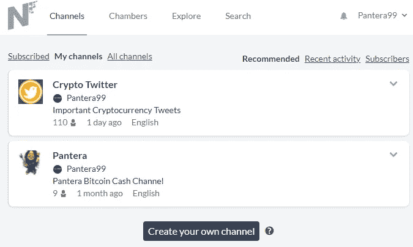

My Channels

这是为平台增加价值的另一个特性。如果你发现一个讨论的主题在平台上缺失或没有被充分探讨，你可以创建一个关于它的频道，在 Noise 中做广告。兑现并邀请其他用户订阅并在其中创建内容。

将有许多选项可供选择，您可以在以后编辑它们。

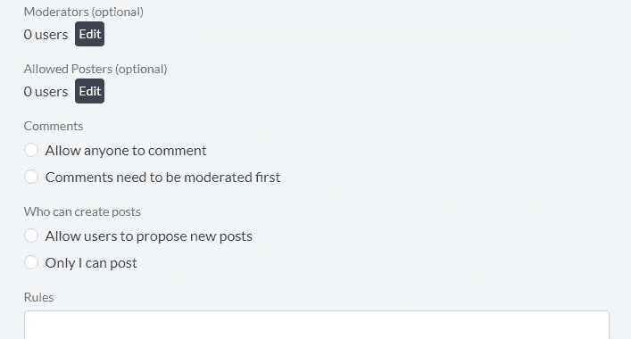

Part of the channel settings

定制对于您的渠道的成功至关重要。这是一个更高级的功能，作为初学者，您不需要立即开始创建频道。

## **关联公司**

一个新的加盟计划现在可用于噪音。现金用户提供了一个很好的机会。

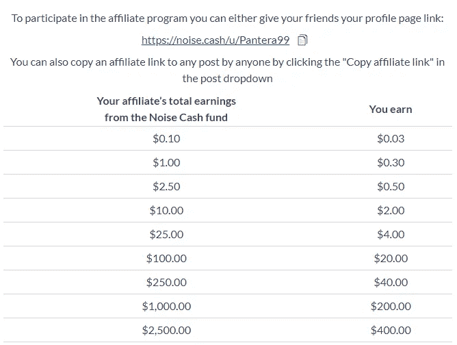

Affiliate program

你可以使用加盟商页面上给你的链接，做广告吸引更多人加入 [Noise。现金](https://noise.cash/u/Pantera99)。推荐费如上图所示。这是一个旨在帮助平台增加用户基础的功能，我们应该小心使用它。我们应该始终向用户解释应该避免垃圾邮件，以及原创性和创造性的评论如何能够得到奖励。

当其他人报名参加[的时候，喧闹声四起。现金](https://noise.cash/u/Pantera99)通过我们的会员链接，我们也将获得奖励。这些不是从用户身上扣除的奖励，而是作为推荐的奖励。

# 为什么是噪音。现金支付给用户吗？(结论)

早期比特币采用者和比特币现金传播者 [**马克·德·梅塞尔**](https://noise.cash/u/MarcDeMesel) 是这两个 Read 的主要恩人。现金和 [**噪音。现金**](https://noise.cash/u/Pantera99) 。

最终，如果有更多的 BCH 鲸鱼继续向这项帮助比特币现金生态系统达到意想不到的用户基数的事业捐款，那将是理想的。

加密货币的价值部分基于网络效应，但这是一个不同主题的讨论。

本指南旨在向 Cryptoverse 之外的人介绍 [**噪音的优点。现金**](https://noise.cash/u/Pantera99) 。我希望它能帮助那些互联网用户找到一个伟大的社交媒体平台，并因其帖子的质量而获得回报。

在我们生活的这个前所未有的时代， [**噪音。Cash**](https://noise.cash/u/Pantera99) 向前迈了一步，帮助这个社交媒体的用户从他们的互动中获利。

随着不断的发展和不断增加的用户群 [**噪音。现金**](https://noise.cash/u/Pantera99) 是加密货币领域进步的光辉典范。它拥有约 30 万用户，但仍处于认知阶段，其数量和质量肯定会继续增长。

*相关文章:*

*   [**进化的噪音。现金——比特币现金的旗舰！**](https://read.cash/@Pantera/evolution-of-noisecash-the-flagship-of-bitcoin-cash-25c48bab)
*   [**喧闹。现金——完美的 BCH 营销工具**](https://read.cash/@Pantera/noisecash-a-perfect-bch-marketing-tool-63ddb93a)
*   噪音。现金推介:[**https://noise.cash/u/Pantera99**](https://noise.cash/u/Pantera99)

跟我来:

*●*[***read cash***](https://read.cash/@Pantera)*●*[***noise cash***](https://noise.cash/u/Pantera99)*●*[***Medium***](/@panterabch)*●*[***蜂巢***](https://hive.blog/@pantera1) *●*

*●*[***Twitter***](https://twitter.com/Panterabch)*●*[***LinkedIn***](https://www.linkedin.com/in/panterabch/)**●*[***Reddit***](https://www.reddit.com/user/PanteraBCH)*

**原发布于*[*https://read . cash*](https://read.cash/@Pantera/the-ultimate-guide-to-noisecash-the-bitcoin-cash-social-media-revolution-2f894e86)*。**