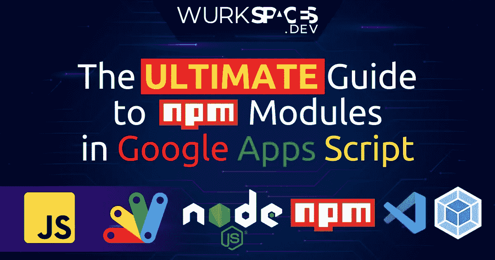

# 谷歌应用程序脚本中 NPM 模块的最终指南

> 原文：<https://medium.com/geekculture/the-ultimate-guide-to-npm-modules-in-google-apps-script-a84545c3f57c?source=collection_archive---------0----------------------->

## 最后，为您的应用程序脚本项目获得最佳工具

# NPM 模块的内容和原因

谷歌应用程序脚本有一些惊人的内置东西。它让我们可以原生访问所有谷歌应用程序，如 Sheets 和 Gmail，无缝集成 GCP 服务，如 BigQuery，允许…