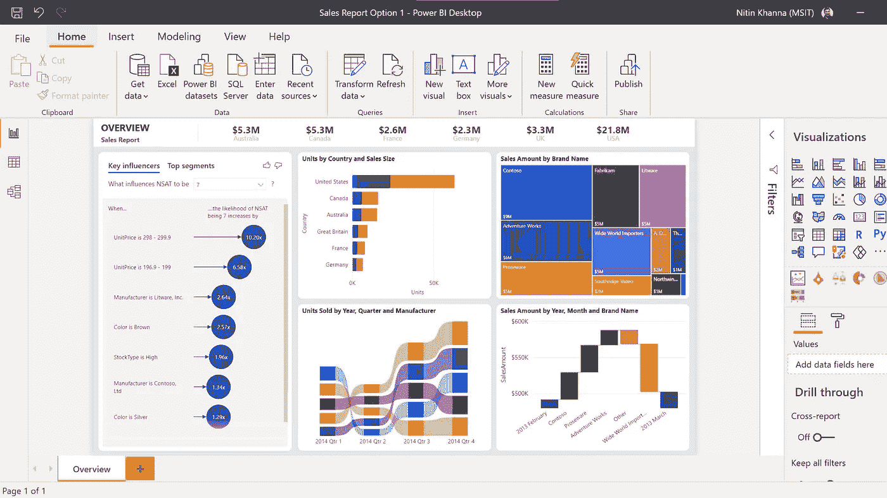
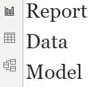
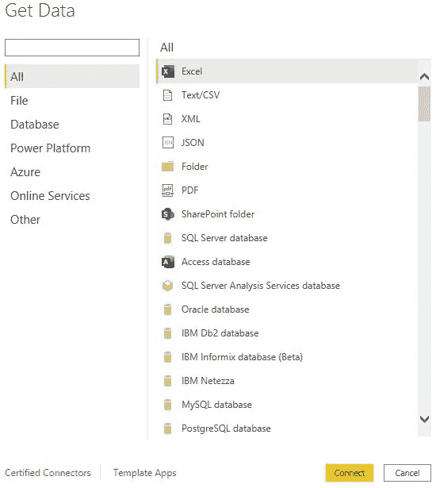
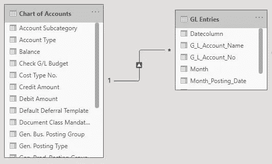
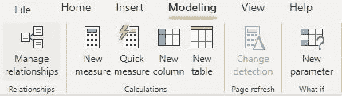
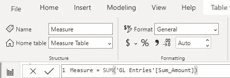
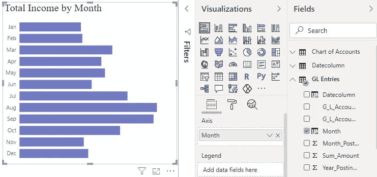

# 初学者的超级商务智能终极指南

> 原文：<https://medium.com/geekculture/the-ultimate-guide-to-power-bi-for-beginners-de9e1e5f290b?source=collection_archive---------22----------------------->

## 了解 Power BI 中涉及的步骤

Image via Microsoft

您想从原始数据中获得有意义的商业见解吗？如果是这样，我强烈推荐你使用 Power BI 和 Tableau 等强大的数据可视化工具。今天我就来展示一下**微软 Power BI** 的简介。

Microsoft Power BI 是一款数据可视化工具，提供高级分析，允许用户从数据中生成有价值的信息来解决业务问题。

以下是使用 Microsoft Power BI 可视化数据的总结步骤:

1.  **安装 Power BI 桌面**

点击链接，下载免费的 [Power BI 桌面](https://powerbi.microsoft.com/en-us/desktop/)。

**2。Power BI 的三大构建模块**

Report-Create Visualizations, Data-Data loaded from different sources, Model-Show relationship between tables

**3。获取数据**

从不同的数据源导入数据，从基本的 excel 文件到在线服务，如 [Microsoft Dataverse](https://docs.microsoft.com/en-us/powerapps/maker/data-platform/data-platform-intro) 。

Power BI Data Sources

**4。电力查询编辑器中的数据整形**

从各个数据源获取数据后，我们需要根据收集到的需求，通过在 power query 编辑器中实现以下步骤来转换数据。

*   数据清理-删除不必要的列和行
*   为列或表指定正确的名称
*   创建自定义列并执行字符串操作，如大写、小写、拆分。
*   重新格式化数据类型-将文本转换为数字，反之亦然
*   组合数据——有时，单个数据源不足以满足指定的需求。因此，在这种情况下，我们需要合并和追加来自独立的不相关数据源的查询。

Power Query Editor in Power BI. Image via Power BI Desktop

**5。数据建模**

默认情况下，Power BI 识别表之间的关系，并在模型和关系视图中显示它们。但是，我们有时需要演示部分模型中的表之间的关系以及数据转换后的关系，因为高效的数据建模会导致简单有效的数据分析。

Model and Relationship Section in Power BI (One to Many Relationship)

**6。使用 DAX 计算度量值**

度量、计算列和计算表都使用 DAX 公式进行高级计算。必须使用 [DAX(数据分析表达式)](https://docs.microsoft.com/en-us/dax/dax-overview)从原始数据中计算出必要的 KPI 指标。我将在下一篇博客中进一步解释在创建度量和计算列时使用的 DAX 操作符。

Images via Power BI Desktop

7。使用可视化窗格中的视觉效果构建报告

Power BI 提供了许多可定制的图表、表格、图形和地图，用于可视化窗格中的可视化。首先选择报告所需的视觉效果，然后选择您想要说明的字段。添加 Power BI slicers 以深入查看数据，使您的报告更加灵活。

Visualization using Stacked Bar Chart. Image via Power BI Desktop

**8。将其发布到 Power BI web 服务**

完成报告后，单击“发布”按钮，这样报告将到达 Power BI 帐户，您可以通过电子邮件或连接共享报告。

## 结论

这是一个面向初学者的 Power BI 桌面教程。我希望这个指南能帮助你理解 Power BI 的基本概念。在这里，我们将学习一些基本概念，如从各种来源加载数据、数据转换、数据建模和数据可视化。此外，下面的文章将帮助您了解更多关于数据可视化的知识。

## 推荐文章

*   [微软 Power BI 指导文档](https://docs.microsoft.com/en-us/power-bi/guidance/)
*   [克里斯·韦伯的商务智能博客](https://blog.crossjoin.co.uk/category/power-bi/)
*   [Power BI 桌面教程](https://mindmajix.com/power-bi-desktop-tutorial)
*   【Power BI 入门
*   [初学者综合电力 BI 教程系列](https://data-flair.training/blogs/learn-power-bi/)