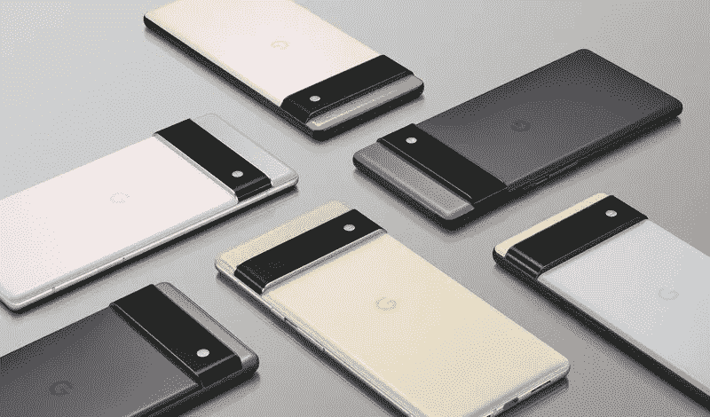

# 智能手机隐私终极指南

> 原文：<https://medium.com/geekculture/the-ultimate-guide-to-smartphone-privacy-d31d5e275069?source=collection_archive---------0----------------------->

## 利用零知识加密和开源软件夺回控制权

Source: Google

现在，你可能已经知道所有人和他们的狗是如何被他们的技术人员全天候监视的。如果你正在读这篇文章，你可能[对此不太高兴](https://news.harvard.edu/gazette/story/2019/03/harvard-professor-says-surveillance-capitalism-is-undermining-democracy/)。但我们都需要手机，我们都需要访问基于云的服务来保存和同步我们的数据；所以…