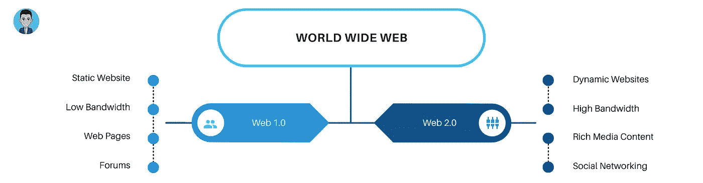

# Web 3.0 的终极指南——学习 Web 3.0 之前你需要知道的一切

> 原文：<https://medium.com/geekculture/the-ultimate-guide-to-web-3-0-everything-you-need-to-know-about-web-3-0-before-learning-it-3cfa25a1ef14?source=collection_archive---------16----------------------->

Photo by [Oskar Yildiz](https://unsplash.com/@oskaryil?utm_source=medium&utm_medium=referral) on [Unsplash](https://unsplash.com?utm_source=medium&utm_medium=referral)

你可能听说过 Web3，除非你一直生活在岩石下。Web 3.0 是网络发展的下一步，它的目标是让互联网更加智能。在学习更多关于 Web3 的知识之前，让我们先了解一下 Web 的发展。

在过去的几年里，万维网得到了发展，带来了新的工具和策略。Web 1.0、2.0 和 3.0 是这些阶段的典型名称。现在让我们来了解他们的每一个阶段。

# Web 1.0

这是网络发展的第一阶段，也称为只读网络。Web 1.0 网站不像现在这样动态和互动。网站的主要目标是向公众提供信息。随着服务器的改进，平均连接速度的提高，以及开发人员获得新的技能和技术，从 Web 1.0 到 2.0 的转变需要时间。

# Web 2.0

这是网络发展的第二个阶段，也被称为读写网络。这只是第一个全球网络的更好版本，其标志是从静态到动态或用户生成内容的转变，以及社交媒体的兴起。

> Web 2.0 是计算机行业的商业革命，它是由向互联网平台的转移以及任何试图理解在这个新平台上取得成功的规则而引起的。蒂姆·奥莱利。

一些著名的 Web 2.0 应用程序有谷歌地图、脸书、推特、YouTube、WordPress 等。HTML5、CSS3 等 Web 技术和 ReactJs、AngularJs、VueJs 等 Javascript 框架使用户能够提出新的概念，允许用户为这个社交网络做出更多贡献。

现在你已经很好的理解了 web 的演变和它的旧阶段，让我们来理解一下，这个 Web 3.0 到底是个什么地狱。

# Web 3.0

这是网络发展的第三个阶段，也称为读写执行，代表了网络的未来。在这个时代，人工智能和机器学习使计算机能够像人一样理解数据。

Web3 应用程序或 DApps 是在以太坊和 IPFS 这样的分散式对等网络上开发的。这些网络是由其用户开发、运营和维护的，而不是由企业开发、运营和维护的。它们自我组织，没有单点故障。

你会注意到，当你听说 Web3 时，加密货币被频繁提及。这是因为这些协议中有许多包含加密货币。任何希望帮助创建、控制或改进其中一个项目的人都会得到现金奖励(代币)。

这些协议经常提供各种各样的服务，包括计算、存储、带宽、识别、托管和其他以前由云提供商提供的在线服务。

# 是什么让 Web 3.0 如此独特？

Web 3 的主要好处是，它试图解决 Web 2 带来的最严重的问题:通过私人网络收集个人数据，这些数据随后被出售给营销人员或可能被黑客窃取。

Web 3 的网络是分散的，这意味着它不是由单个组织控制的，在它上面创建的分散的应用程序是开放的。

# Web 3.0 的属性

以下是可以帮助我们定义 Web 3.0 的三个关键特征:

## 语义万维网

Web 3.0 的关键要素之一是“语义网”。。语义网增强了在线技术，允许用户通过基于理解单词而不是关键字或数字的能力的搜索和分析来创建、共享和连接内容。

## 3D 图形

3D 图形被广泛应用于 Web 3.0 中的网站和服务，如在线游戏、电子商务和投资组合网站。这里是布鲁诺·西蒙的 3d 网站的最好例子。

## 人工智能

语义网和人工智能是 web 3.0 的两大基石。通过将这种能力与自然语言处理相结合，Web 3.0 允许计算机像人一样理解材料，从而产生更快、更相关的结果。为了满足用户的需求，他们变得越来越聪明。

# 什么是 Web3.js

Web3.js 库是创建 Web3 应用程序时使用的主要 JavaScript 库。web3.js 是一组库，允许您使用 HTTP 或 IPC 连接与本地或远程以太坊节点通信。

以太坊区块链通过 web3 JavaScript 库访问。它可以访问用户帐户、发送交易、与智能合约通信等。事实上，Web3.js 是设计 dApps 时使用的主要框架之一。

# 结论

这就是本文的全部内容。我希望这篇文章对你有用，如果你需要任何帮助，请在评论区告诉我。

你想请我喝杯咖啡，你可以在这里[做](https://www.buymeacoffee.com/suhailkakar)。

让我们在[推特](https://twitter.com/suhailkakar)和 [LinkedIn](https://www.linkedin.com/in/suhailkakar/) 上连线。

👋感谢阅读，下次见