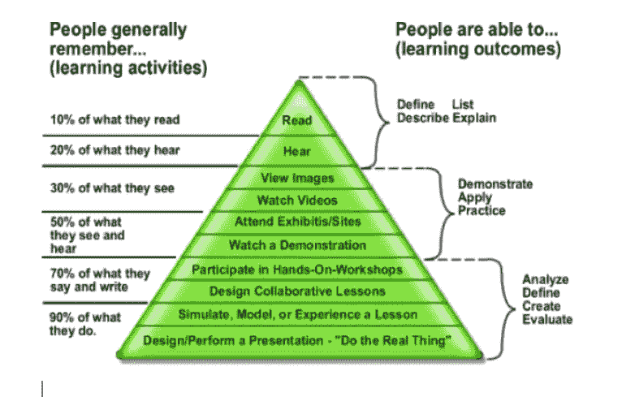

# 学习编码的终极方法

> 原文：<https://medium.com/geekculture/the-ultimate-methodology-for-learning-to-code-4e0a241f9adf?source=collection_archive---------14----------------------->

最近，我和几个学生谈论了他们如何开始自学编码的经历。

这也让我回想起我是如何做到这一点的，后来又得到了谷歌和微软的邀请。同样，他们的故事也展现了我今天想和大家分享的一些模式。

# 最有效的学习方法不是读书

我喜欢看书，不是为了学习如何编码。我喜欢读故事，享受脑海中飞舞的想象场景。

但是，说到编码，那是一种更实际的学习体验。它遵循边做边学的模式。

我给自己定了一个规矩——只有需要系统学习的时候，才开始看书。一本书的主要目的是让用户查找一些东西，而不是逐页阅读。

只读书不即时反馈，会耗尽我们大部分最初的学习动力和兴趣。

一本书就像一本字典。大多数书籍几乎超过 1 英寸高，看起来像一个厚块——相当明显。

# **最好的学习方式是通过教学**

如果你能在没有上下文的情况下很好地向一个人解释事情，说明你真的理解了题目。

> 如果你无法解释清楚，那也没关系。你不需要为此感到羞耻。你只是需要更多的时间来更好、更深入地消化这些信息。没有必要抱怨你是一个假的学习者。

接下来，你唯一需要做的就是回去加深理解，尤其是那些你没有理解清楚的点，这些你之前很可能没有意识到，现在它为你揭开了面纱。

然后再回去跟你的观众解释一遍。你会对自己的学习能力更有信心。

# 带着具体问题学习

自从调到产品经理后，我有一段时间没有编码了。有意思的是，我经常怀念当工程师的时候，造东西的时候。我觉得我对事情有了更多的控制。

所以上周，我开始学习一个新的 python 框架，至少对我来说是这样的——Python flask。

我从一个非常简单但直观的教程开始。这里可以找到[。](https://blog.miguelgrinberg.com/post/the-flask-mega-tutorial-part-xx-some-javascript-magic)

我马上打开 VS，开始敲代码。当我遇到不懂的东西时，我会去谷歌搜索，看看其他专家是如何解释的。

这比从头到尾通读一本书更有效率和效果。

这包括我积极参与解决问题，并了解我需要改进的地方。

最终的作品是一个可以工作的应用程序，我可以展示给我可爱的猫看。

希望我的方法可以帮助你——无论是大学生还是公司职员。

回头再聊，

在 twitter 上关注我，了解更多关于 SaaS、自学编码、创业和我最近的生活故事！

邪恶的笑（Evil Grin 的缩写）