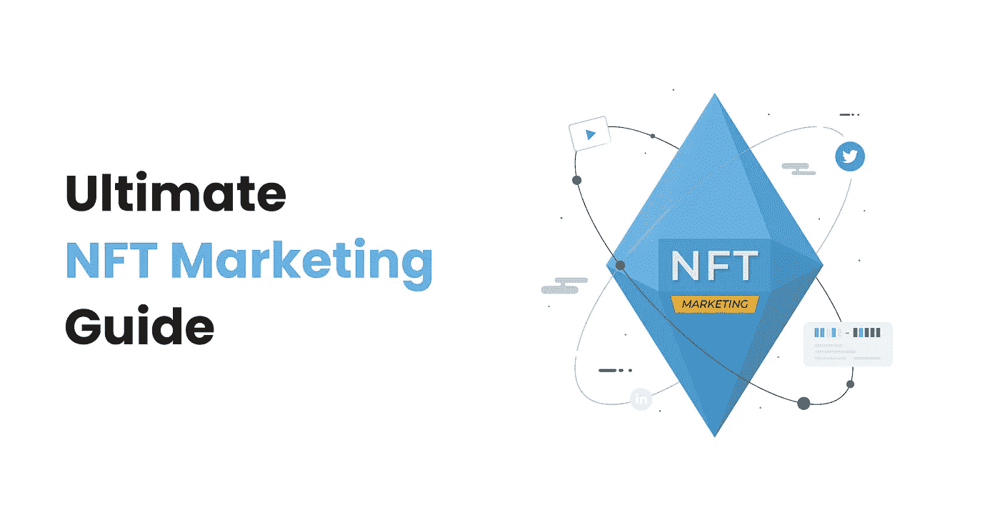

# 2022 年 NFT 营销终极指南

> 原文：<https://medium.com/geekculture/the-ultimate-nft-marketing-guide-in-2022-79a0d29dd994?source=collection_archive---------12----------------------->

## 如何推广你的 NFTs？

2022 年已经过去了将近一半的时间，到目前为止，有两种东西一直处于趋势中，那就是 NFTs(不可替代的代币)和加密货币。整个世界都见证了 NFTs 的快速增长，加密世界中的许多人通过交易和投资 NFTs 赚了数百万。

根据我的观察，非功能性数字技术并不是未来，因为它已经掌控了世界，千禧一代已经表现出对数字资产的巨大热爱。NFT 市场并不是所有新 NFT 创作者的安乐窝，因为让你的新 NFT 项目取得成功是相当具有挑战性的。

那么，你能做些什么来为你的 NFTs 创造宣传和建立价值呢？

你认为“NFT 营销”是正确的答案吗？是的，你是对的，因为一个好的营销策略可以让你从所有其他项目中脱颖而出，并帮助你在 NFT 世界赚到数百万。

我已经决定创建这个博客，在这里我将分享最终的 NFT 营销指南，它将帮助你在你的 NFTs 中引起注意和认知。

***那么，我们开始吧！！***

## **1:公关营销:**

随着如此多的人进入 NFT 空间，对 NFT 世界的炒作也在增加。许多人想知道 NFT 是如何工作的，而现有的投资者和交易者渴望获得即将到来的项目的信息。当启动你的第一个 NFT 项目时，你必须让你的媒体了解你的项目。我建议雇佣一家在 NFT 公共关系管理方面有丰富经验的 NFT 营销公司。

## **2:内容营销:**

在数字时代，如果你想在竞争激烈的世界里推广任何产品，你将不得不选择讲故事，这将使人们对你的 NFTs 产生兴趣。无论是一件艺术品，一个 NFT，还是一首歌，它需要背后有一个成功的故事。你雇佣的 NFT 营销代理将帮助你为你的品牌创造一个强大的账户，这将带动一大批 BFT 观众。

> “内容建立关系。关系建立在信任的基础上。信任推动收入。”—安德鲁·戴维斯

## **3:社区建设:**

当你想推广你的 NFTs 时，社区建设是非常必要的。正如一句名言所说，“单独行动，我们什么也做不了，但我们可以一起做很多事情。”当关注的是促进你的 NFTs 和为你的 NFT 项目建立价值时，同样的概念意味着社区建设。

以下是 discord 和 telegram 上一些最好的平台。

## **答:不和电报:**

当关注的是建立你的社区时，没有比不和谐更好的平台了。这个平台是为游戏玩家建立的，目的是讨论游戏相关的问题，但它已经成为建立 NFT 社区的强大平台。您可以集成 discord 机器人，并使用各种自动化功能来创建一个交互式 NFT 社区。

另一方面，telegram 也为您提供了多种积极的功能来构建您的社区。我个人建议你去 NFT 社区营销机构，因为他们可以帮助你创建一个专业的 NFT 不和谐服务器。

## **B: NFT 影响者营销:**

有影响力的人有能力对你的 NFT 进行大肆宣传，并增加他们在竞争激烈的世界中的影响力。在 NFT 领域，影响者是各种项目成功背后的原因。你的 NFT 营销公司可以帮助你在市场上找到一个理想的 NFT 影响者。

## **C:赠品和赏金计划:**

根据最近的研究，赠品和促销有着无可挑剔的 34%的转化率，比其他各种广告计划都要好。你可以在你的 NFT 社区内举办赠品或奖金计划，以确保你可以扩大你的社区的跨越式发展。

## **D)多媒体营销:**

不可否认的是，在数字世界中有各种各样的平台可供推广。同时，很多人在寻找不同的多媒体平台时，认为没有太多的多媒体平台。

## **4:社交媒体营销:**

社交媒体不再是一个与人联系的平台，因为它已经成为企业推广产品和服务的中心枢纽。没有比社交媒体更好的方式来推销你的 NFT。

大多数 NFT 投资者和交易者都活跃在 Twitter、Instagram 和 Youtube 等社交媒体平台上，寻找市场上最新的 NFT 项目。但是，你不可能一键实现社会化媒体营销。你必须有耐心，因为成长需要时间。

## **5:数字广告:**

无论你是想推广你的 NFT 还是鼓励你的传统业务，广告对于推广你的非传统业务都是必不可少的。基于智能手机的世界增加了对数字广告的需求。专业的营销机构可以通过制作引人入胜的创新广告，帮助您建立 NFT 项目的品牌知名度。

## **6:创建一个强大且用户友好的网站:**

当你推广你的 NFTs 时，一个强大的网站是必不可少的，因为它将引导你的人了解 NFT 项目。你可以把你的路线图，公用事业，铸币率，以及你的 NFT 项目的概况介绍给你的潜在观众。你也可以要求你的 NF 营销公司创建你的 NFT 市场网站，在那里你的目标受众可以交易你的 NFTs。

## **7: SEO 或搜索引擎优化:**

当我们在上一点中讨论过网站时，不可能让 SEO 脱离上下文。SEO 或搜索引擎优化增加了你的有机流量，提高了你在搜索引擎上的排名。你可以找到一家遵循最佳 SEO 实践的成功的 [NFT 营销机构](https://www.eon8.com/nft-marketing-services/)。

## **8:视频创作:**

如前所述，NFT 对商业世界来说相对较新，所以你需要运用创造力来教育你的目标受众关于你的 NFT 项目。你必须定期在 YouTube 和你的社区上发布关于你的项目及其进展的视频，以增加你的追随者。我以前说过，现在我再重复一遍:找一家 NFT 的营销代理公司来帮助你为你的 NFTs 创作独特的 NFT 电影。

## **总结:**

天下没有不散的宴席，这篇博客也是如此，因为 NFT 有很多营销策略，我们无法在这篇博客中一一提及。

我将提出一些最好的 NFT 营销计划，这些计划将在你的 NFTs 中推动你的观众，并用我的 web 3 引导你。o 经验。