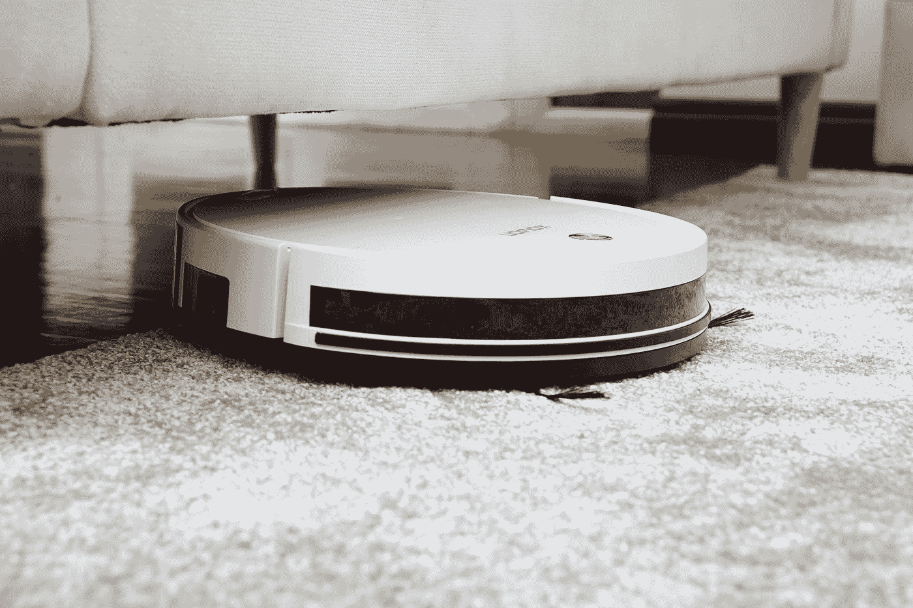

# 黑客的终极开源自动文件管理器

> 原文：<https://medium.com/geekculture/the-ultimate-open-source-automated-file-organizer-for-hackers-646e588641f?source=collection_archive---------18----------------------->

## Maid 提供了两个世界的精华:易用性和基于代码的接口带来的灵活性。

Photo by [Kowon vn](https://unsplash.com/@kowon?utm_source=medium&utm_medium=referral) on [Unsplash](https://unsplash.com?utm_source=medium&utm_medium=referral)

我在使用电脑的日常实践中遇到的一个主要问题是缺乏组织纪律性。对我来说，拥有所有不同的文件相当复杂…