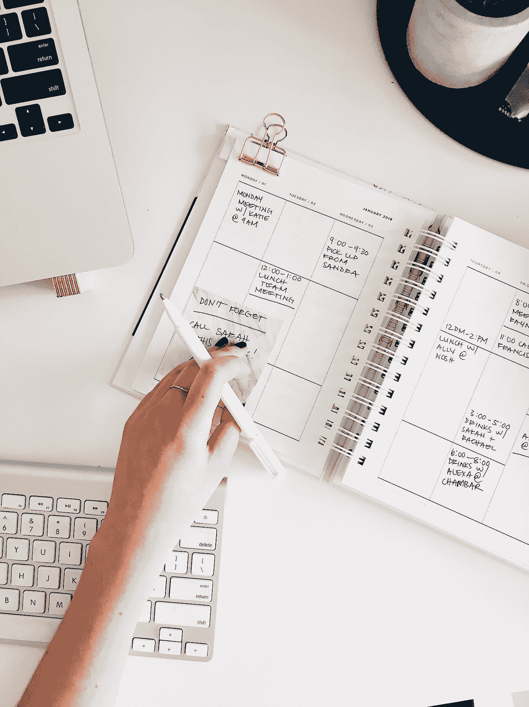

# 终极生产力黑客是说不

> 原文：<https://medium.com/geekculture/the-ultimate-productivity-hack-is-saying-no-e5c8c7f9594a?source=collection_archive---------8----------------------->

## 如果你想最大化你的生产力，最好的生产力诀窍之一就是说“不”。这可能很难做到，但是说“不”可以帮助你实现目标。通过对任务、干扰和你不想帮助的人说不，你可以释放你的时间和精力。

Photo by [Marissa Grootes](https://unsplash.com/@stilclassis?utm_source=medium&utm_medium=referral) on [Unsplash](https://unsplash.com?utm_source=medium&utm_medium=referral)