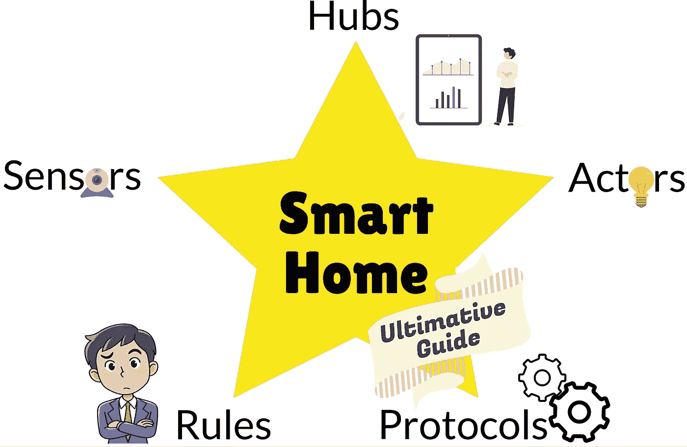

# 终极智能家居入门指南

> 原文：<https://medium.com/geekculture/the-ultimate-smart-home-starter-guide-9e94c76447cd?source=collection_archive---------3----------------------->

## 智能家居 101:传感器、参与者、规则、协议和集线器

The five big components of Smart Homes are Sensors, Actors, Protocols, Rules, and Interfaces. Don’t worry, I’ll explain that! Image by Martin Thoma

我最近开始研究智能家居话题，感到不知所措。有太多不同的设备、制造商和系统。读完这篇文章后，你会明白什么是重要的组成部分，并有一个把一切放在上下文中的概述。开始吧！