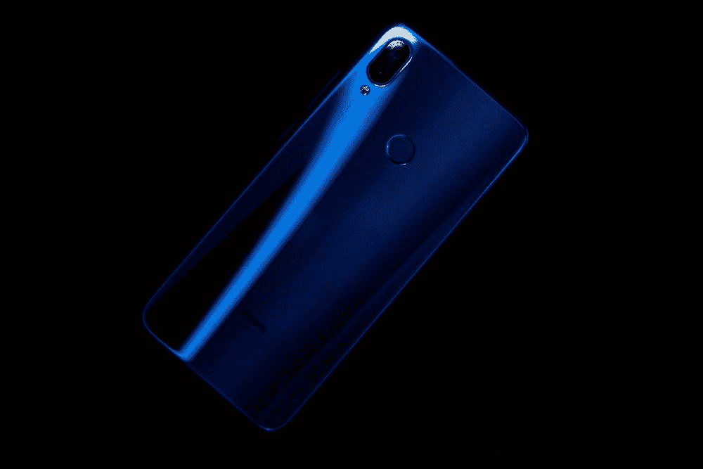

# 现代中档智能手机被低估的灵活性

> 原文：<https://medium.com/geekculture/the-underappreciated-flexibility-of-the-modern-mid-range-smartphone-f09dc85d322e?source=collection_archive---------31----------------------->

Image Credit: [Mohit Pathak via Unsplash](https://unsplash.com/@mohitpathak)

当苹果宣布 iPhone 12 系列及其 [MagSafe 配件](https://www.thurrott.com/apple/242604/apple-introduces-new-magsafe-wireless-charger-for-iphone-12)时，我感觉到了不祥之兆。多年来，似乎越来越多的人认为苹果将会制造一款没有[端口](https://www.macworld.com/article/233887/portless-iphone.html)的 iPhone。MagSafe 的推出似乎解决了这一现实的最后一个障碍，它提供了一种新的充电方式来取代插入避雷线。无论你认为…