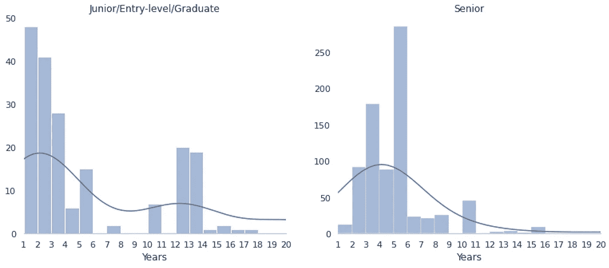
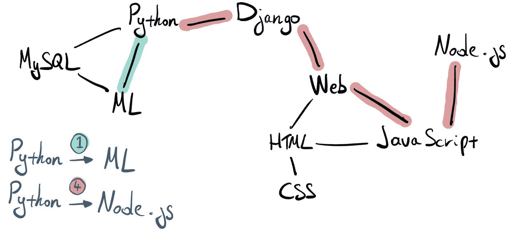
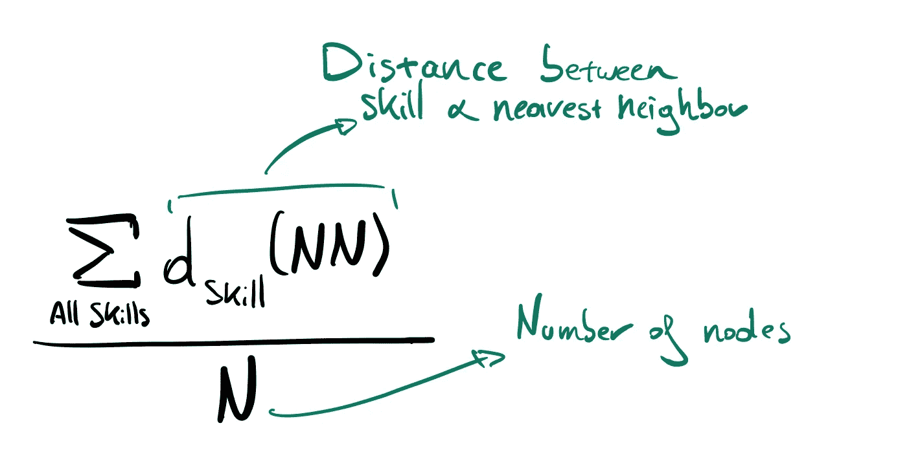
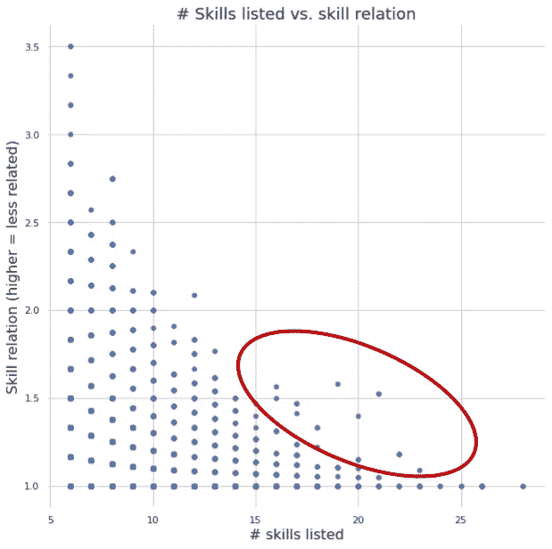

# IT 招聘者不切实际的期望:数据分析

> 原文：<https://medium.com/geekculture/the-unrealistic-expectations-of-it-recruiters-a-data-analysis-17a8da945d39?source=collection_archive---------1----------------------->

## 使用数据分析探究 IT 职位描述及其缺陷。

Image source: Pexels.com

# 介绍

几周前，我分享了一张[互动网络图](https://www.zhongtron.me/itjobs_fullscreen.html)，它描绘了职位描述中提到的 IT 技能的前景。最初的想法是分析 IT 职位描述，并量化他们有多少不切实际的期望。由于第一步是提取特征(IT 技能的列表)，将它放在图表中并分享结果似乎很有趣。继续[那篇文章](https://towardsdatascience.com/building-a-network-of-related-it-skills-cfc6e1827261)，我现在就来看看(不现实？IT 职位描述通常包含的期望。

Network graph for IT-skills (image by author)

在工作描述中写下不切实际的期望的想法已经困扰我一段时间了。你经常可以在 Twitter 或 Reddit 上找到人们分享荒谬职位描述截图的帖子。甚至还有[这个家伙](https://www.reddit.com/r/ProgrammerHumor/comments/6llocd/my_linkedin_profile/)把口袋妖怪加到了他的 LinkedIn 个人资料里，只是为了看看招聘人员是否会注意到。然后去年，我通过一个共同的朋友认识了一个招聘人员。我问她是否觉得写关于她知识有限的事情的工作描述很有挑战性，她回答说“*哈哈，是的，我们不知道，但没关系*”。这很难用语言表达，但她说话的方式有一种错位的自豪感，这让我觉得有必要开始查看数据，试图量化这个问题。

在我们深入讨论这个问题之前，我想澄清一下，我知道绝大多数招聘人员在帮助我们和我们的雇主找到合适人选方面做了大量工作。这个分析是针对那些做事…与众不同的招聘者中的少数人。

# 数据

在本次分析中，我使用了与网络分析不同的数据集。由于网络分析主要集中在特征提取上，结构良好的数据非常有用。一旦完成，我就有了我的特征列表，我就可以使用一个包含更多定性信息的数据集，比如完整的工作描述和薪水。

在 Kaggle 上，我找到了这个数据集，它是基于一个旧的竞争对手，Adzuna(一个英国的工作搜索引擎)为其提供了数据。数据集包含 244768 个职位描述，我从中筛选出了 38483 个 IT 职位。

每个记录由一个工作描述组成，各列提供以下信息:

*   位置
*   公司
*   完整描述
*   薪水
*   合同类型/时间
*   来源

Sample for the dataset (image by author)

# 分析

在此分析中，我们将重点关注三件事:

*   多年的经验
*   所需技能
*   典型的“危险信号”

先说多年的经历。

## 多年的经验

这是从数据中的一个职位描述中摘录的:

*“Unix 你是初级测试员吗？你有 12 年的测试经验吗？”*

或者这个怎么样:

*“你将拥有 12 年与 SAP FI/CO 在技术层面合作的经验。你将作为初级顾问提供一级和二级支持。他们要求申请人会说英语、荷兰语和法语"*

尤其是你们当中经验不足的人，看到过很多这样的招聘启事。公司寻找毕业生，初级或入门级的职位，然后要求大量的经验。

我结合使用 NLTK 和 regex，试图从每份工作中提取所需的经验。一旦我得到这个信息，我就看了看标题，以确定初级和高级职位。这相当简单，因为我只是将所有在职位名称中带有“高级”一词的工作标注为高级，对于初级，我使用了关键字“初级”、“入门级”和/或“研究生”。

绘制此信息会显示以下内容:

Experience required by type of position (image by author)

结果似乎很合理。大多数初级工作几乎不需要经验。尽管有些描述确实要求两年以上的不合理经验，但这似乎是相当特殊的。此外，我还必须补充的是，这种分析存在一些偏见。一些职位描述会提到他们公司的经验，比如“我们在……方面有 15 年的经验”，这也是脚本中的内容。我运行了一些样本，这些错误识别似乎并不经常发生，但它确实占了数字的一小部分。

从相对数字来看(总样本由 3.8 万份职位描述组成)，不合理的经验要求数量有限，但仍令人惊讶的是，近 100 个初级职位要求至少 5 年的经验。

## 所需技能

Image source: LinkedIn.com

有些招聘人员喜欢用大网捕鱼。他们列出了一堆与该功能有着模糊联系的技术，并希望这将有助于找到候选技术。但是这种懒惰的方法多久发生一次呢？我使用了两种不同的度量来量化这一点；

**总技能数**；用这个相当简单的标准，我计算了我的网络图中有多少特征(IT 技能)出现在一份工作描述中。

**技能分离**；网络图由通过边连接的节点组成。如果技能密切相关，距离(形成连接的边数)将会很短。但是，如果技能彼此无关，比如说 MongoDB 和 Photoshop，覆盖的距离就会长很多。

Network paths lenghts and skill relation (image by author)

利用这个原则(和一些额外的参数)，我通过使用最短路径中使用的边与总节点数的比率来计算不同技能实际上是如何分布的。

简而言之；值为 1 表示所有技能密切相关。数字越大，意味着技能之间的相关性越小。

结合这两个指标得出以下结果:

Detecting job description with high number of unrelated skills (image by author)

总的来说，结果还不错。大多数职位描述并没有列出过多的技能，对于那些列出的人来说，这些技能是高度相关的。然而，在红色区域，有些职位描述既包含大量技能(超过 15 项)，也包含不密切相关的技能。在这里，你可以找到一个红色区域的数据点的例子；

*Java/Spring 开发人员[…]所需的关键技能:敏捷工作实践现代操作系统(内核和用户空间、内存管理、文件系统、基本网络服务、用户)消息驱动架构(最好使用 JMS 和/或 AMQP) ANSI SQL(最好由大型 RDBMS 之一实现:Oracle 数据库、MS SQL Server、PostgreSQL) Java EE Servlet 容器或应用程序服务器(例如 Tomcat)所需技能:Spring Framework UNIX / Linux / OS X(良好的命令行技能(例如找出昨天修改的包含以下内容的所有文件 Grails Scala(函数式编程，Scala actors)；将 Scala 与 Spring 应用程序集成 ObjectiveC(特别针对 iOS 编程)CSS、JavaScript(首选 jQuery)Ajax Ruby on Rails[…]*

我必须承认我的 Java 能力至少是基本的，这让我更难理解这些技能需求。但是 Java、Oracle、SQL、PostgresQL、ObjectiveC、Linux、Scala、Javascript、CSS、Ruby on Rails 等等似乎是一个开发人员需要的广泛技能。

在我们进入“危险信号”之前，记住这个分析是基于我对[网络图](https://www.zhongtron.me/itjobs_fullscreen)使用的技巧。这意味着许多不在网络图中的其他 IT 技能在这个分析中没有被考虑进去。实际上，这个数字会更高。

## 典型的“危险信号”

许多社交媒体在职位描述中提到典型的“危险信号”。危险信号被认为是像关键词一样的东西，预示着低工资或糟糕的工作环境。在浏览了 [r/recruitinghell](https://www.reddit.com/r/recruitinghell/) 之后，我能够起草一份可能成为危险信号的关键词列表。利用这个列表，我查看了包含这些关键词的职位描述的平均工资与总体平均工资的对比。

Buzzwords & average salary (image by author)

对于这些关键词中的很多来说，似乎与工资有着明显的关系，尤其是对于*忍者*、*戈杰特*和*临时职责*。但正如你所知，相关性并不总是因果关系。可能还有许多其他因素在起作用。例如，这些流行语经常被那些众所周知薪水较低的创业公司使用。

其中一个有趣的关键词是“激情”或“热衷于”。使用一些正则表达式和 NLTK，我可视化了雇主希望你充满热情的最常见的事情。

Things you should be passionate about according to recruiters (image by author)

你可能会说，生活中有更多令人兴奋的事情值得你充满激情，但话说回来，我是一个在空闲时间为这种分析编写代码的人，所以我有什么资格评判\_(ツ)_/。

# 结论

## 总体来说还不错

总的来说，没那么糟糕。绝大多数的职位描述看起来都有现实的需求(或者至少从这个分析的指标来看)并且写得很好。所需的经验似乎与标题相匹配，“危险信号”或流行词的数量有限，所需技能的数量合理且相关。

与许多数据问题一样，有一个曝光偏差，坏的例子得到了很多关注，这产生了一个想法，即前景并不好。

## 但是当它变坏的时候，它真的变坏了

如前所述，总的来说事情没有那么糟糕。然而，当事情变糟时，往往会变得非常糟糕。初级职位需要长达 15 年的工作经验，职位描述中列出了 15 种以上的技能，而这些技能之间甚至互不相关，..像这样的例子对招聘行业来说并不太好。在找工作时，看到这样的广告可能会非常令人泄气，所以我们可以把它们列为例外是一件好事。此外，在当今这个社交媒体的时代，这些可怕的例子经常在各种平台上分享，这对撰写职位描述的人产生了反效果。

## 形势正在逆转

Image source: giphy.com

事情正在发生变化。技术正在颠覆许多行业，招聘当然是其中之一。这种颠覆性运动的趋势之一通常是取消中间商，用数字流程取代他/她。缺乏对角色和技能理解的糟糕的职位描述通常是由第三方招聘人员撰写的。LinkedIn 等在线平台可以帮助雇主和候选人牵线搭桥，而不需要中间人撮合双方。对于求职者来说，找工作是一个累人的过程，对于公司来说，这是一个昂贵的过程。有很大的改进空间，所有相关方都将从中受益。

## 进一步研究和改进

一如既往，一些改进点和未来研究的课题。

*   **改进技能列表**:如上所述，技能列表基于我为网络图提取的特征。尽管我对这个列表很满意，但它还远远没有完成。缺少许多重要的框架/技术/库，这些框架/技术/库可以为所需技能的分析提供关键见解。
*   **包括其他变量**:薪水不是工作满意度的重要指标。如果我能够以某种方式得到一个包含职位描述的大型数据集，其中包括上述职位的留任率等数字，这将产生一个非常强大的分析。与职位的描述和候选人的经历有直接的联系，会提供一个关于措辞影响的非常清晰的观点。
*   **看看其他行业**:目前的分析只着眼于 IT 岗位的情况。对我来说，这是一个熟悉的领域，这使得查看数据更加容易。当然，这只是工作领域的一小部分，看看其他行业也不错。
*   更大更好的数据:我知道我倾向于在几乎任何分析/报告中这样说，但它(几乎)总是适用的。更多更好的数据会改善分析。不幸的是，在职位描述中找到大量(免费)的最新数据并不容易。

# 技术堆栈

**数据分析(Python)** :熊猫、numpy、regex、word2number、nltk、networkx

**数据可视化(Python)** : matplotlib、seaborn、wordcloud

*关于我:我叫布鲁诺，是一名数据科学顾问。如果你想看看我做的其他东西，比如咕哝说唱探测器，一定要看看我的个人资料。或者通过我的网站与我联系:*[*https://www . zhongtron . me*](https://www.zhongtron.me/)