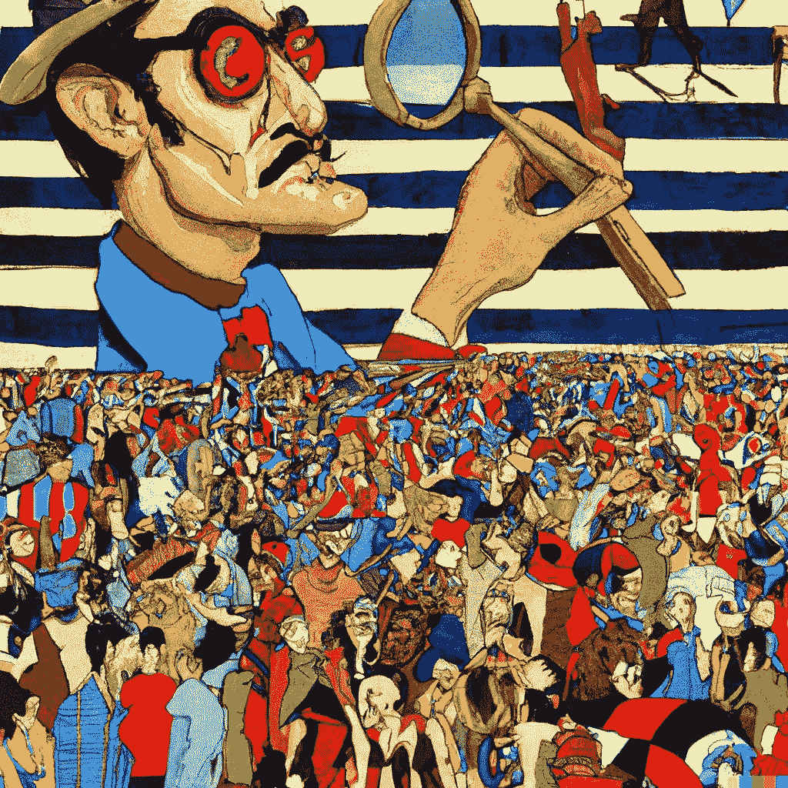

# 人工智能即将带来的社会经济影响

> 原文：<https://medium.com/geekculture/the-upcoming-socio-economic-impact-of-artificial-intelligence-f8851dcde11e?source=collection_archive---------6----------------------->

[“Where’s Waldo, in the style of Dali” by DALL-E 2 & Benjamin Hilton](https://twitter.com/benjamin_hilton/status/1521408549393420289/photo/1)

## 社会动荡、政治动荡和大规模失业只是我们不得不期待的几件事。我们如何准备？

随着人工智能变得越来越强大，人类的社会经济地位将很快发生巨大变化。